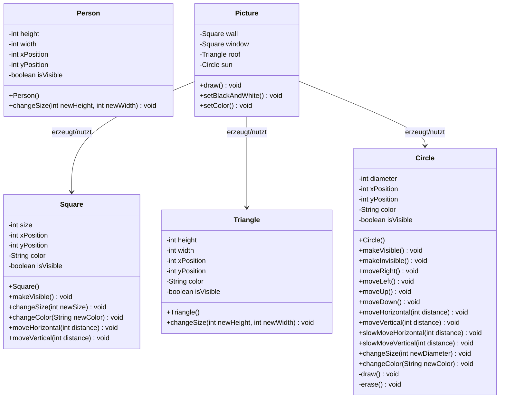
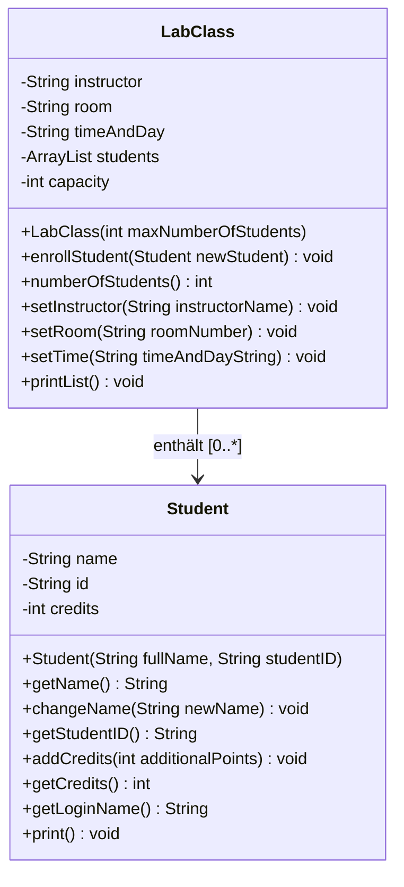

# OOP – SW 01 – Objekte und Klassen

> **Modul:** Objektorientierte Programmierung (OOP, HSLU)
> **Woche:** SW 01 (KW 08)
> **Thema:** Einführung in die Objektorientierung – Objekte und Klassen
> **Quellen:** Kapitel 01, O01_IP_Objektorientierung, A01_IP_Einfuehrung, U01_EX, OFWJ-chapter01 (inkl. Solutions)

---

## 🏫 Modulübersicht – Was du wissen musst

### Grunddaten

| Eigenschaft | Details |
|---|---|
| **Modulname** | Objektorientierte Programmierung (OOP) |
| **Sprache** | Java (nicht Python!) |
| **Java-Version** | **JDK 25 LTS** (25.0.2) |
| **Unterrichtsform** | Hybrid: Input (Dozent) + Übungen (Coaching) + Selbststudium |
| **IDE** | BlueJ (SW01–05, Lernumgebung), später **freie Wahl** (VS Code, IntelliJ, NetBeans, Eclipse) |
| **Lehrbuch** | *Objects First with Java* (Barnes & Kölling) – integriert mit BlueJ |

### Bewertung & Prüfungen

| Leistung | Gewicht | Format |
|----------|---------|--------|
| **Testate (Tests)** | Semesterbegleitend | Kleinere Tests im Unterricht |
| **MEP (Modulendprüfung)** | Hauptnote | **Elektronische Programmierprüfung** in IDE |

### MEP – Modulendprüfung (Programmierprüfung!)

> [!IMPORTANT]
> Die MEP ist eine **praktische Programmierprüfung** am eigenen Laptop!

| Aspekt | Details |
|--------|---------|
| **Dauer** | 105 Minuten |
| **Format** | Programmieren in eigener IDE (eigene Maschine!) |
| **Erlaubt** | Open-Book: alle eigenen Unterlagen, Bücher, lokale Dateien |
| **VERBOTEN** | ❌ KI-Tools (ChatGPT, Copilot, Antigravity etc.), ❌ Internet-Kommunikation, ❌ Austausch mit anderen |
| **Bewertung** | Lösungsansatz + Code-Qualität + **Refactoring** wird bewertet |
| **Wichtig** | Du bist selbst verantwortlich, dass dein Setup funktioniert! |

### Semesterplan (Überblick)

| Woche | Thema |
|-------|-------|
| SW01 | Objekte und Klassen (Einführung) |
| SW02 | Klassendefinitionen (Klassen selbst schreiben) |
| SW03 | Objektsammlungen (ArrayList etc.) |
| SW04 | Klassenkonzepte vertiefen |
| SW05 | Testen (JUnit) |
| SW06 | Entwurf (Kapselung, Kohäsion, Kopplung) |
| SW07 | Vererbung |
| SW08 | Polymorphie |
| SW09 | Fehlerbehandlung (Exceptions) |
| SW10 | Abstrakte Klassen & Interfaces |
| SW11–15 | Weiterführende Themen, Repetition, Prüfung |

### Goldene Regeln

- **Aktive Teilnahme** und **Selbststudium** sind entscheidend – OOP lernt man nur durch Üben!
- **Nicht auf KI verlassen** – in der Prüfung bist du alleine!
- Vorlesungsfolien, Buch und Übungen immer **vor der nächsten Woche** nacharbeiten.
- **Fragen stellen** – in der Übung oder per E-Mail an den Dozenten.

---

## 🛠️ Java-Setup für VS Code (Antigravity)

> Da das Modul auf **Java** basiert (nicht Python!), brauchst du ein funktionierendes Java-Setup.
> Die offizielle Empfehlung ist BlueJ für die ersten Wochen, aber **VS Code funktioniert genauso** – hier ist die Anleitung.

### Schritt 1: JDK 25 installieren

**Windows:**
1. JDK 25 LTS (25.0.2) herunterladen von [Oracle](http://www.oracle.com/technetwork/java/javase/downloads/index.html) oder vom Dozenten-Archiv auf [SWITCHdrive](http://bit.ly/2OH3Uhh)
2. Installieren nach: `C:\jdk-25.0.2` (kurzer Pfad ohne Leerzeichen!)
3. **Umgebungsvariable `JAVA_HOME`** setzen:
   - Startmenü → "Systemumgebungsvariablen bearbeiten" → Umgebungsvariablen
   - Neue Systemvariable: Name = `JAVA_HOME`, Wert = `C:\jdk-25.0.2`
4. **PATH ergänzen** (ganz oben!):
   - `C:\jdk-25.0.2\bin` als **ersten** Eintrag hinzufügen

**macOS:**
```bash
brew install openjdk@25
```

**Linux:**
```bash
sudo apt install openjdk-25-jdk   # oder jeweiliger Package-Manager
```

### Schritt 2: Installation testen

Öffne ein **neues** Terminal (nach PATH-Änderung!) und teste:

```bash
java -version
# Erwartete Ausgabe: java version "25.0.2" ...

javac -version
# Erwartete Ausgabe: javac 25.0.2
```

> [!WARNING]
> Falls "Befehl nicht gefunden": Terminal neu starten! Windows-Shells lesen Umgebungsvariablen erst nach Neustart ein.

### Schritt 3: VS Code für Java einrichten

In VS Code folgende **Extensions** installieren:

| Extension | ID | Zweck |
|---|---|---|
| **Extension Pack for Java** | `vscjava.vscode-java-pack` | Alles-in-einem: Language Support, Debugger, Test Runner, Maven, Project Manager |

Das Extension Pack enthält automatisch:
- Language Support for Java (Red Hat)
- Debugger for Java
- Test Runner for Java
- Maven for Java
- Project Manager for Java

**So installierst du es:**
1. `Ctrl+Shift+X` → Suche nach **"Extension Pack for Java"**
2. Installieren → VS Code neu laden
3. VS Code erkennt nun `.java`-Dateien, kompiliert automatisch und zeigt Fehler an

### Schritt 4: Erstes Java-Programm in VS Code

1. Neuen Ordner erstellen (z.B. `oop-uebungen`)
2. In VS Code öffnen: `File → Open Folder`
3. Neue Datei: `HelloWorld.java`

```java
public class HelloWorld {
    public static void main(String[] args) {
        System.out.println("Java läuft in VS Code!");
    }
}
```

4. **Ausführen:** Klick auf ▶️ oben rechts oder `F5` (Debugger starten)
5. **Alternativ im Terminal:**
```bash
javac HelloWorld.java
java HelloWorld
```

### Schritt 5: Maven installieren (für Projekttemplate, ab ~SW02)

Das Modul verwendet das **HSLU Maven Template** (`oop_maven_template`) für professionelle Projekte.

**Windows:**
1. Apache Maven herunterladen von [SWITCHdrive](http://bit.ly/2OH3Uhh) oder [maven.apache.org](https://maven.apache.org/download.cgi)
2. Entpacken nach: `C:\apache-maven-3.9.12`
3. `C:\apache-maven-3.9.12\bin` zum **PATH** hinzufügen
4. Testen: `mvn -version`

**macOS:** `brew install maven`

### Schritt 6: Maven-Projekt in VS Code öffnen

1. `oop_maven_template` ZIP entpacken und Verzeichnis umbenennen (z.B. `oop_exercises`)
2. In `pom.xml`: `artifactId` und `name` auf deinen Projektnamen anpassen
3. In VS Code: `File → Open Folder` → Projektverzeichnis wählen
4. VS Code erkennt das Maven-Projekt automatisch (dank Extension Pack)
5. Terminal öffnen (`Ctrl+Ö` oder `` Ctrl+` ``):

```bash
mvn compile    # Quellcode kompilieren
mvn test       # Unit-Tests ausführen
mvn site       # Projekt-Website generieren (./target/site/index.html)
```

### Projektstruktur (Maven Standard)

```
oop_exercises/
├── pom.xml                    ← Maven-Konfiguration (Blackbox für jetzt)
├── src/
│   ├── main/
│   │   ├── java/              ← Dein produktiver Java-Quellcode
│   │   └── resources/         ← Ressourcen (Bilder, Config etc.)
│   └── test/
│       ├── java/              ← JUnit-Tests (ab SW05)
│       └── resources/         ← Test-Ressourcen
└── target/                    ← Generierte Dateien (kann gelöscht werden)
```

### Schritt 7 (optional): BlueJ-Projekte in VS Code

Die BlueJ-Übungsprojekte (z.B. `OFWJ-chapter01.zip`) sind einfache Java-Projekte. So öffnest du sie in VS Code:
1. ZIP entpacken
2. Den Projektordner (z.B. `chapter01/figures/`) in VS Code öffnen
3. Die `.java`-Dateien sind direkt editier- und ausführbar
4. **Aber Achtung:** BlueJ-Projekte nutzen ein eigenes Canvas-System für die Grafik → die `figures`-Projekte laufen deshalb nur in BlueJ mit Grafik, der Code ist aber in VS Code lesbar und editierbar

> [!TIP]
> Für die **MEP (Prüfung)** kannst du eine beliebige IDE nutzen. VS Code ist eine gute Wahl, da du es bereits kennst! Stelle aber sicher, dass dein gesamtes Setup **offline** funktioniert (kein Internet in der Prüfung für Kommunikation).

---

## 🔄 Java vs. C# – Schnellvergleich für Umsteiger

Du kennst schon C#? Dann hast du einen **riesigen Vorteil** – Java und C# sind sich sehr ähnlich! Hier die wichtigsten Unterschiede:

### Syntax-Unterschiede (fast identisch!)

| Konzept | C# | Java |
|---------|-----|------|
| **Ausgabe** | `Console.WriteLine("Hi");` | `System.out.println("Hi");` |
| **Datentypen** | `string` (klein), `bool` | `String` (gross), `boolean` |
| **Properties** | `public int Age { get; set; }` | Getter/Setter-Methoden manuell |
| **Vererbung** | `class Dog : Animal` | `class Dog extends Animal` |
| **Interface** | `class Cat : IAnimal` | `class Cat implements Animal` |
| **Namespaces** | `namespace MyApp { }` | `package myapp;` |
| **Konstanten** | `const` / `readonly` | `final` |
| **Null-Check** | `?.` und `??` Operatoren | Kein equivalent (manuell prüfen) |
| **Main-Methode** | `static void Main(string[] args)` | `public static void main(String[] args)` |
| **Import** | `using System;` | `import java.util.*;` |

### Grösste Unterschiede

| Thema | C# | Java |
|-------|-----|------|
| **Plattform** | .NET (primär Windows) | JVM (überall: Win, Mac, Linux) |
| **IDE** | Visual Studio | BlueJ, IntelliJ, Eclipse, VS Code |
| **Kompilierung** | → IL (Intermediate Language) | → Bytecode (`.class`-Dateien) |
| **Properties** | Eingebaut (`{ get; set; }`) | ❌ Nicht vorhanden – manuelle `getX()`/`setX()` |
| **Operator Overloading** | ✅ Möglich | ❌ Nicht möglich |
| **Structs / Value Types** | ✅ `struct` verfügbar | ❌ Nur Klassen (Referenztypen) |
| **LINQ** | ✅ `list.Where(x => ...)` | Streams: `list.stream().filter(...)` |
| **Events/Delegates** | ✅ Eingebaut | ❌ Über Interfaces gelöst |

### Was gleich bleibt ✅

- Klassen, Objekte, Konstruktoren → **fast identisch**
- `if`, `for`, `while`, `switch` → **gleiche Syntax**
- `try-catch-finally` → **gleich**
- Arrays: `int[] arr = new int[10];` → **gleich**
- OOP-Konzepte (Vererbung, Polymorphie, Kapselung) → **gleich**
- Access Modifiers (`public`, `private`, `protected`) → **gleich**

> [!TIP]
> **Faustregel:** Wenn du C# kannst, kannst du ~80% von Java sofort lesen und schreiben. Die grössten Stolpersteine sind: kein `var` (erst ab Java 10 mit Einschränkungen), keine Properties, und `String` statt `string`.

---

## 🎯 Lernziele

- Erstes, einfaches Verständnis von **Objektorientierung (OO)** entwickeln.
- Wissen, was **Klassen** und **Objekte** sind und wie sie zusammenhängen.
- **Objekte identifizieren** und erste einfache Beispiele von Klassen entwerfen.
- Zwischen **Zustand** (Attribute) und **Verhalten** (Methoden) unterscheiden.
- Verstehen, dass es unterschiedliche **Abstraktionen** gibt (kontextabhängig).
- Wissen, was **Quellcode** (z.B. in Java) ist.
- Wissen, was ein **Programm** ist und wie **Kompilation** funktioniert.
- Erste Erfahrung mit der Lernumgebung **BlueJ** sammeln.
- **Methoden aufrufen**, **Parameter übergeben** und **Ergebniswerte** verstehen.
- Objekte als **Parameter** an andere Objekte übergeben können.

---

## 📖 Wichtigste Begriffe

| Begriff (DE) | Begriff (EN) | Definition |
|---|---|---|
| Objekt | Object | Ein konkretes Exemplar (Instanz) einer Klasse; repräsentiert ein "Ding" aus der realen oder abstrakten Welt im Programm |
| Klasse | Class | Ein "Bauplan" für Objekte; beschreibt Struktur (Attribute) und Verhalten (Methoden) aller Instanzen dieser Art |
| Instanz | Instance | Ein konkretes Objekt, das von einer Klasse erzeugt wurde; synonym zu "Objekt" (betont die Zugehörigkeit zur Klasse) |
| Methode | Method | Eine Operation/Funktion eines Objekts; definiert dessen Verhalten; wird durch Aufruf ausgeführt |
| Parameter | Parameter | Zusätzliche Information, die einer Methode beim Aufruf übergeben wird |
| Signatur | Signature | Name der Methode + Parametertypen (z.B. `void horizontalBewegen(int entfernung)`) |
| Datentyp / Typ | Data type / Type | Definiert, welche Art von Werten ein Parameter oder Attribut annehmen kann (z.B. `int`, `String`, `boolean`) |
| Zustand | State | Die Gesamtheit aller aktuellen Attributwerte eines Objekts |
| Datenfeld / Attribut | Field / Attribute | Variable innerhalb eines Objekts, die einen Teil seines Zustands speichert |
| Quelltext | Source code | Der in einer Programmiersprache (z.B. Java) geschriebene Text, der eine Klasse definiert |
| Ergebniswert / Rückgabewert | Return value | Ein Wert, den eine Methode nach dem Aufruf zurückliefert |
| Compiler / Kompiler | Compiler | Programm, das Quellcode in ausführbaren Bytecode übersetzt |
| Bytecode | Bytecode | Plattformunabhängiger, vom Compiler erzeugter Maschinencode für die JVM |
| JVM | JVM (Java Virtual Machine) | Laufzeitumgebung, die den Bytecode interpretiert und ausführt |

---

## 📐 Konzepte & Prinzipien

### Objekte und Klassen – Der Kern der OO

**Klasse = Bauplan**, **Objekt = konkretes Exemplar**

- **Analogie:** Ein Kuchenrezept (Klasse) → beliebig viele gleichartige Kuchen (Objekte) backen (erzeugen).
- Klassen werden zur **Entwicklungszeit** programmiert; Objekte entstehen erst zur **Laufzeit**.
- Von einer Klasse können **beliebig viele Instanzen** erzeugt werden (`new Klasse()`).
- Jede Instanz hat **eigene Attributwerte** (eigener Zustand), aber **dieselben Methoden**.

```
Klasse Kreis       →  kreis1 (blau, Ø68, pos 230/90)
                   →  kreis2 (rot, Ø30, pos 100/50)
                   →  kreis3 (gelb, Ø100, pos 0/0)
```

### Zustand und Verhalten

| Aspekt | Beschreibung | Beispiel (Klasse `Circle`) |
|--------|-------------|---------------------------|
| **Zustand** (State) | Aktuelle Werte der Attribute | `diameter=68, xPosition=230, color="blue", isVisible=true` |
| **Verhalten** (Behavior) | Durch Methoden definierte Operationen | `makeVisible()`, `moveRight()`, `changeColor("rot")` |

- **Attribute** werden in der Klasse definiert (Anzahl, Typ, Name), die **Werte** werden pro Objekt gespeichert.
- **Methoden** verändern den Zustand oder liefern Informationen über ihn zurück.

### Objektinteraktion

- Objekte kommunizieren durch **Methodenaufrufe** untereinander.
- Ein Objekt kann **andere Objekte erzeugen** und deren Methoden aufrufen.
- Beispiel: Die Klasse `Picture` erzeugt intern `Square`-, `Triangle`- und `Circle`-Objekte und ruft deren Methoden auf, um ein Hausbild zu zeichnen.

### Abstraktionsebenen (kontextabhängig!)

Ein reales Objekt wird je nach **Kontext** unterschiedlich modelliert:

| Kontext | Relevante Attribute eines Fahrrads |
|---------|-----------------------------------|
| Fahrradhändler | Preis, Marke, Lagerbestand, Modell |
| Fahrradproduzent | Bauteile, Materialkosten, Produktionszeit |
| Fahrraddieb | Schlosstyp, Standort, Wert |

→ **Objektorientierte Modellierung ist immer eine Vereinfachung** der Realität.

---

## ☕ Java-Syntax & Sprachkonstrukte

### Klassenstruktur (Grundgerüst)

```java
public class Circle {

    // === DATENFELDER (Attribute) ===
    private int diameter;
    private int xPosition;
    private int yPosition;
    private String color;
    private boolean isVisible;

    // === KONSTRUKTOR ===
    public Circle() {
        diameter = 68;
        xPosition = 230;
        yPosition = 90;
        color = "blue";
        isVisible = false;
    }

    // === METHODEN (Verhalten) ===
    public void makeVisible() {
        isVisible = true;
        draw();
    }

    public void moveHorizontal(int distance) {
        erase();
        xPosition += distance;
        draw();
    }

    public void changeColor(String newColor) {
        color = newColor;
        draw();
    }
}
```

### Wichtige Schlüsselwörter in SW01

| Schlüsselwort | Bedeutung |
|---|---|
| `public` | Zugriff von überall möglich (Sichtbarkeitsmodifikator) |
| `private` | Zugriff nur innerhalb der eigenen Klasse |
| `class` | Leitet eine Klassendefinition ein |
| `new` | Erzeugt eine neue Instanz (Objekt) einer Klasse |
| `void` | Methode liefert **keinen** Rückgabewert |
| `int` | Ganzzahl-Datentyp (Integer) |
| `boolean` | Wahrheitswert: `true` oder `false` |
| `String` | Zeichenkette (Text), immer mit grossem **S**! |
| `this` | Referenz auf das aktuelle Objekt selbst |
| `return` | Gibt einen Wert aus einer Methode zurück |

### Wichtige primitive Datentypen

| Typ | Beschreibung | Beispiel |
|-----|-------------|---------|
| `int` | Ganzzahl | `0`, `101`, `-1` |
| `double` | Fliesskommazahl | `3.1415` |
| `boolean` | Wahrheitswert | `true`, `false` |
| `char` | Einzelnes Zeichen | `'A'` |

> **Referenztyp:** `String` (Zeichenkette) – kein primitiver Typ, beginnt mit Grossbuchstabe!
> Werte in **doppelten Anführungszeichen**: `"hallo"`, `"rot"`

### Namenskonventionen

| Element | Konvention | Beispiel |
|---------|-----------|---------|
| Klasse | PascalCase (Grossbuchstabe) | `Circle`, `LabClass`, `Student` |
| Objekt/Variable | camelCase (Kleinbuchstabe) | `kreis1`, `xPosition`, `isVisible` |
| Methode | camelCase (Kleinbuchstabe) | `makeVisible()`, `moveRight()` |
| Konstante | UPPER_SNAKE_CASE | `MAX_SIZE` |

### Häufige Fehlerquellen

| Fehler | Ursache | Lösung |
|--------|---------|--------|
| `"Error: cannot resolve symbol – variable blau"` | String-Parameter ohne Anführungszeichen übergeben | `"blau"` statt `blau` |
| Klasse "gestreift" in BlueJ | Quellcode geändert, aber noch nicht kompiliert | ÜBERSETZEN-Knopf drücken |
| Methode ohne Wirkung | Methode auf falschem Objekt aufgerufen | Prüfen, an welcher Instanz aufgerufen wird |

---

## 📊 Vergleiche & Klassifizierungen

### Klasse vs. Objekt

| Eigenschaft | Klasse | Objekt (Instanz) |
|---|---|---|
| **Was?** | Bauplan / Beschreibung | Konkretes Exemplar |
| **Wann?** | Existiert zur Entwicklungszeit | Entsteht zur Laufzeit durch `new` |
| **Wie viele?** | Genau eine Definition | Beliebig viele Instanzen |
| **Attribute** | Definiert Anzahl, Typ & Name | Speichert konkrete Werte |
| **Methoden** | Definiert das Verhalten | Verhalten wird am Objekt aufgerufen |
| **Beispiel** | `Circle` | `kreis1` |
| **In BlueJ** | Rechteck oben (Diagramm) | Rotes Rechteck unten (Objektleiste) |

### Methoden mit vs. ohne Parameter vs. mit Rückgabewert

| Typ | Signatur-Beispiel | Bedeutung |
|-----|-------------------|-----------|
| Ohne Parameter, ohne Rückgabe | `void makeVisible()` | Führt Aktion aus, gibt nichts zurück |
| Mit Parameter, ohne Rückgabe | `void moveHorizontal(int distance)` | Benötigt Zusatzinfo, gibt nichts zurück |
| Mehrere Parameter | `void changeSize(int newHeight, int newWidth)` | Benötigt mehrere Zusatzinfos |
| Mit Rückgabewert | `String getName()` | Gibt Information über Zustand zurück |
| Mit Objektparameter | `void enrollStudent(Student student)` | Erwartet ein Objekt als Parameter |

### Prozedurale Programmierung vs. OOP

| Aspekt | Prozedural | Objektorientiert (OO) |
|--------|-----------|----------------------|
| Daten & Funktionen | Getrennt | In Objekten zusammengefasst |
| Kommunikation | Funktionsaufrufe | Methodenaufrufe auf Objekten |
| Modellierung | Daten + Operationen darauf | Objekte der realen Welt |
| Kapselung | Nicht erzwungen | Daten und Verhalten in Klassen gebündelt |

---

## 💻 Code-Beispiele (Java)

### Beispiel 1: HelloWorld – Erstes Java-Programm

```java
/**
 * OOP-Intro.
 */
public final class HelloWorld {
    /**
     * Einstiegspunkt des Programms.
     * @param args nicht verwendet.
     */
    public static void main(final String[] args) {
        // Textausgabe auf der Konsole
        System.out.println("Haben Sie Fragen?");
    }
}
```

**Kompilation & Ausführung in der Shell:**
```bash
javac HelloWorld.java    # Kompiliert zu HelloWorld.class
java HelloWorld          # Führt das Programm aus
```

### Beispiel 2: Circle – Klassenstruktur mit Attributen und Methoden

```java
/**
 * Ein Kreis, der sich selbst auf einer Leinwand zeichnet.
 */
public class Circle {

    // Datenfelder (Zustand) – private = nur innerhalb der Klasse zugänglich
    private int diameter;       // Durchmesser in Pixeln
    private int xPosition;      // Horizontale Position
    private int yPosition;      // Vertikale Position
    private String color;       // Farbe als Zeichenkette
    private boolean isVisible;  // Sichtbarkeitsstatus

    // Konstruktor – wird bei "new Circle()" aufgerufen
    public Circle() {
        diameter = 68;
        xPosition = 230;
        yPosition = 90;
        color = "blue";
        // isVisible ist standardmässig false (boolean-Defaultwert)
    }

    // Methode OHNE Parameter – feste Aktion
    public void makeVisible() {
        isVisible = true;
        draw();
    }

    // Methode MIT Parameter – flexible Aktion
    public void moveHorizontal(int distance) {
        erase();                    // Altes Bild löschen
        xPosition += distance;      // Position ändern (Zustandsänderung!)
        draw();                     // Neues Bild zeichnen
    }

    // Methode mit String-Parameter
    public void changeColor(String newColor) {
        color = newColor;
        draw();
    }

    // Methode mit einem Parameter – Grösse ändern
    public void changeSize(int newDiameter) {
        erase();
        diameter = newDiameter;
        draw();
    }

    // Private Methoden – nur intern verwendet (Kapselung!)
    private void draw() {
        if (isVisible) {
            Canvas canvas = Canvas.getCanvas();
            canvas.draw(this, color,
                new java.awt.geom.Ellipse2D.Double(
                    xPosition, yPosition, diameter, diameter));
            canvas.wait(10);
        }
    }

    private void erase() {
        if (isVisible) {
            Canvas canvas = Canvas.getCanvas();
            canvas.erase(this);
        }
    }
}
```

### Beispiel 3: Objekte erzeugen und Methoden aufrufen (Java-Code)

```java
// Objekt erzeugen und in Variable speichern
Person person1 = new Person();

// Methoden auf dem Objekt aufrufen (Punkt-Notation)
person1.sichtbarMachen();
person1.nachRechtsBewegen();

// Methode mit Parameter aufrufen
person1.horizontalBewegen(50);    // 50 Pixel nach rechts
person1.horizontalBewegen(-70);   // 70 Pixel nach links (negativer Wert!)

// Methode mit String-Parameter
person1.farbeAendern("rot");      // Anführungszeichen nicht vergessen!
```

### Beispiel 4: Objektinteraktion – Picture-Klasse (vereinfacht)

```java
/**
 * Zeichnet ein Bild aus mehreren geometrischen Figuren.
 * Zeigt, wie Objekte andere Objekte erzeugen und verwenden.
 */
public class Picture {

    // Datenfelder: Referenzen auf andere Objekte
    private Square wall;      // Wand des Hauses
    private Square window;    // Fenster
    private Triangle roof;    // Dach
    private Circle sun;       // Sonne

    // Methode erzeugt und positioniert alle Teilobjekte
    public void draw() {
        wall = new Square();
        wall.makeVisible();
        wall.changeSize(100);
        wall.moveVertical(80);

        window = new Square();
        window.makeVisible();
        window.changeColor("black");
        window.moveVertical(100);
        window.moveRight();

        roof = new Triangle();
        roof.makeVisible();
        roof.changeSize(50, 140);
        roof.moveVertical(70);
        roof.moveHorizontal(60);

        sun = new Circle();
        sun.makeVisible();
        sun.changeColor("yellow");
        sun.moveHorizontal(180);
    }

    // Zusätzliche Methode: Sonnenuntergang animieren
    public void sunset() {
        sun.slowMoveVertical(250);
    }
}
```

> **Kernkonzept:** Ein Objekt (`Picture`) erzeugt **andere Objekte** (`Square`, `Triangle`, `Circle`) und ruft deren Methoden auf → **Objektinteraktion**!

### Beispiel 5: Datentypen erkennen

```java
// Übung 1.31 – Welchen Typ haben diese Werte?
0           // int
"hallo"     // String
101         // int
-1          // int
true        // boolean
"33"        // String (in Anführungszeichen = Text, nicht Zahl!)
3.1415      // double
```

---

## 📋 UML-Diagramme

### Klassendiagramm: Projekt Figuren



### Klassendiagramm: Projekt Laborkurse



---

## ✏️ Übungsaufgaben-Zusammenfassung

### U01 – Aufgabenblock 1: Installation

| Nr. | Thema | Lösungsansatz | Stolpersteine |
|-----|-------|---------------|---------------|
| 1a | JDK 25 + BlueJ installieren | Anleitung in `OOP_JavaDevelopmentManual_jdk25.pdf` folgen | Richtige JDK-Version (25.0.2), PATH-Variable korrekt setzen |
| 1b | `java` und `javac` in Shell testen | `java --version` und `javac --version` ausführen | PATH nicht gesetzt → "Befehl nicht gefunden" |
| 1c | HelloWorld.java erstellen | Code ab `public final class…` kopieren (ohne `package`) | `package`-Zeile NICHT mitkopieren |
| 1d | Kompilieren mit `javac` | `javac HelloWorld.java` | Tippfehler im Quellcode → Compiler-Fehlermeldung |
| 1e | Ausführen mit `java` | `java HelloWorld` (ohne `.class`!) | `.class`-Erweiterung NICHT angeben |
| 1f | In BlueJ öffnen | Neues Projekt → Klasse importieren → `main()` ausführen | BlueJ-Projektstruktur beachten |

### U01 – Aufgabenblock 2: Klassen und Objekte in BlueJ

| Nr. | Thema | Lösungsansatz | Stolpersteine |
|-----|-------|---------------|---------------|
| 2a | Projekt `lab-classes` öffnen | In BlueJ chapter01/lab-classes öffnen | – |
| 2b | Code analysieren | Doppelklick auf Klassensymbol → Quellcode lesen | Das sind **Klassen**, keine Objekte! |
| 2c | Kompilieren & `new` | Kontextmenü → Compile → `new Student(…)` | Vor Kompilation kein `new` im Menü |
| 2d | Student erzeugen | `new Student("Hans Muster", "S01")` | Parameter in `"Anführungszeichen"` eingeben! |
| 2e | Objektleiste untersuchen | Rotes Rechteck = Objekt → Kontextmenü erkunden | – |
| 2f | Mehrere Studenten erzeugen | Mehrfach `new Student(…)` aufrufen | Jeder braucht andere Parameterwerte |
| 2g | LabClass-Objekt erzeugen | `new LabClass(10)` → repräsentiert einen Kurs | `enrollStudent()` erwartet ein Student-**Objekt** |

### U01 – Aufgabenblock 3: Reale Objekte modellieren

| Nr. | Thema | Lösungsansatz | Stolpersteine |
|-----|-------|---------------|---------------|
| 3a | Student als Objekt modellieren | Attribute: Name, Matrikelnr, Energie, Aufmerksamkeit; Methoden: lernen(), fragenStellen() | Zustand vs. Verhalten trennen |
| 3b | Fahrrad modellieren | Attribute: Farbe, Gangzahl, Geschwindigkeit; Methoden: fahren(), bremsen() | Verschiedene Personen → verschiedene Attribute relevant |
| 3c | Fahrrad in verschiedenen Kontexten | Händler: Preis, Marke; Produzent: Material, Kosten; Dieb: Schlosstyp, Wert | Kontext bestimmt die relevanten Attribute |
| 3d | Backofen modellieren | Attribute: Temperatur, Modus; Methoden: einschalten(), temperaturSetzen() | – |
| 3e | Backofen in Komponenten zerlegen | Heizelement, Türe, Uhr, Temperaturregler → je eigene Klasse | Zusammenspiel der Klassen erkennen |

### U01 – Aufgabenblock 4: Abstrakte Objekte modellieren

| Nr. | Thema | Lösungsansatz | Stolpersteine |
|-----|-------|---------------|---------------|
| 4a | Kassenzettel analysieren | Objekte: Produkt, Preis, Filiale, Quittung, MwSt | Bandbreite: konkret (Zigerbutter) bis abstrakt (MwSt) |
| 4b | Abstrakte Objekte erkennen | Preis, Mehrwertsteuer, Datum → sind auch Objekte! | Abstrakte Konzepte als Objekte zu denken ist ungewohnt |
| 4c | Beziehungen modellieren | Quittung hat 1..n Produkte, gehört zu 1 Filiale | Kardinalitäten: 1, 0..1, 0..n, 1..n |
| 4d | Attribute und Methoden zuordnen | Produkt: name, preis, menge; getPreis(), toString() | Methoden schwieriger als Attribute |

### Buchübungen (Kapitel 01) – Wichtigste Lösungen

| Übung | Thema | Lösung |
|-------|-------|--------|
| 1.3 | Kreis nach links bewegen | `horizontalBewegen(-70)` → negativer Wert! |
| 1.5 | Unbekannte Farbe | Kreis wird schwarz (Standardfarbe bei ungültigem Wert) |
| 1.6 | Farbe ohne Anführungszeichen | Fehlermeldung: `cannot resolve symbol – variable blau` |
| 1.31 | Datentypen erkennen | `0`→int, `"hallo"`→String, `true`→boolean, `3.1415`→double, `"33"`→String |
| 1.32 | Neues Feld hinzufügen | `private String name;` nach den bestehenden Feldern einfügen |
| 1.33 | Signatur schreiben | `public void send(String msg)` |
| 1.34 | Methodenkopf schreiben | `public int average(int firstNumber, int secondNumber)` |
| 1.35 | Buch: Klasse oder Objekt? | Das Buch ist ein **Objekt** (Instanz der Klasse "Buch") |

---

## ⚠️ Prüfungsrelevante Hinweise

### Typische Aufgabentypen (MEP = Programmierprüfung!)

1. **Klasse schreiben:** Attribute definieren, Konstruktor, Methoden (Getter/Setter, Verhaltensmethoden)
2. **Objekte erzeugen und verwenden:** `new Klasse(parameter)`, Methoden aufrufen
3. **Zustand vs. Verhalten unterscheiden:** Attribute identifizieren, Methoden definieren
4. **Datentypen zuordnen:** `int`, `String`, `boolean`, `double` korrekt wählen
5. **Signaturen/Methodenköpfe schreiben:** Richtige Syntax mit Parametern und Rückgabetyp

### Häufige Fehlerquellen

| Fallstrick | Vermeidung |
|-----------|-----------|
| `String` ohne Grossbuchstabe | `String` ist ein Referenztyp → immer gross! |
| String-Werte ohne `"Anführungszeichen"` | Immer `"rot"`, nie `rot` |
| Verwechslung Klasse ↔ Objekt | Klasse = Bauplan (gross), Objekt = Instanz (klein) |
| `void` vergessen / falsch verwenden | `void` = kein Rückgabewert; sonst Typ angeben |
| Semikolon vergessen | Jede Anweisung in Java endet mit `;` |
| `new` vergessen bei Objekterzeugung | `Circle c = new Circle();` – `new` ist Pflicht! |
| `private` vs. `public` verwechseln | Attribute `private`, Methoden meistens `public` |

### Refactoring-Tipps (prüfungsrelevant!)

- **Datenfelder immer `private`** → Kapselung (Information Hiding)
- **Methoden, die von aussen nutzbar sein sollen: `public`**
- Hilfsmethoden (z.B. `draw()`, `erase()`) → `private`
- Änderungen an einer Stelle (**z.B. Farbe ändern**) → an **allen relevanten Stellen** einsetzen (vgl. Übung 1.16: auch `setColor()` anpassen, nicht nur `draw()`)
- **Sprechende Namen** verwenden: `moveHorizontal` statt `mh`

### Java-Kompilation (Shell-Befehle)

```bash
javac MeineKlasse.java    # Kompiliert .java → .class (Bytecode)
java MeineKlasse           # Führt Bytecode in der JVM aus
```

> **Merke:** Java-Version im Modul = **JDK 25** (LTS)
> **IDE:** BlueJ (SW01–05), später NetBeans / IntelliJ / VS Code
> **MEP:** Programmierprüfung in IDE, 105 min, open-book, **OHNE KI!**

---

## 🔗 Verbindung zu vorherigen/folgenden Wochen

### Rückbezug
- SW01 ist der **Einstieg** – keine Vorkenntnisse in Java vorausgesetzt.
- Baut auf allgemeinem Programmierverständnis (z.B. aus PRG/PROG) auf.

### Vorausschau
- **SW02 (Klassendefinitionen):** Klassen **selbst schreiben** – Felder, Konstruktoren, Methoden im Detail.
- **SW03 (Objektsammlungen):** Mehrere Objekte in Sammlungen (z.B. `ArrayList`) verwalten – baut auf Objektinteraktion auf.
- **SW05 (Testen):** Unit-Tests mit JUnit schreiben – testet die in SW01 gelernten Methoden.
- **SW06 (Entwurf):** Kapselung, Kohäsion, Kopplung – vertieft die `private`/`public`-Unterscheidung aus SW01.
- **SW07 (Vererbung):** Klassenbeziehungen – baut auf dem Verständnis von Klasse/Objekt auf.

> **Wichtig:** Die Konzepte Objekt, Klasse, Methode, Parameter, Zustand und Typ werden in **jeder** folgenden Woche gebraucht. Sie sind das absolute Fundament!
