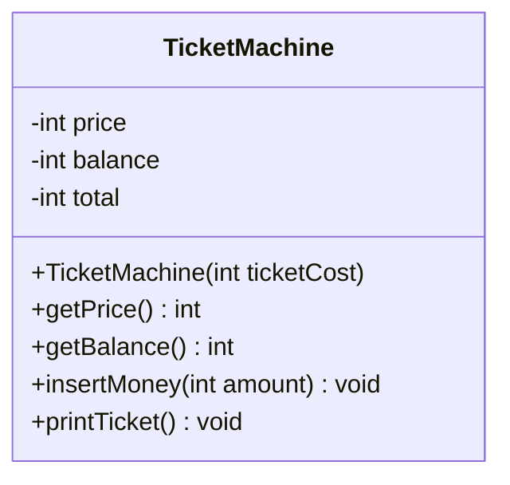
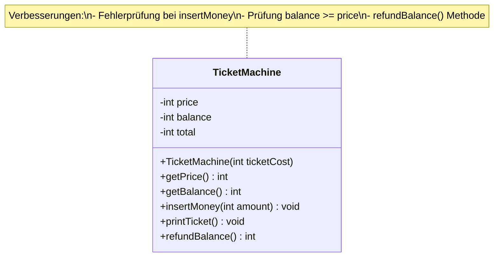
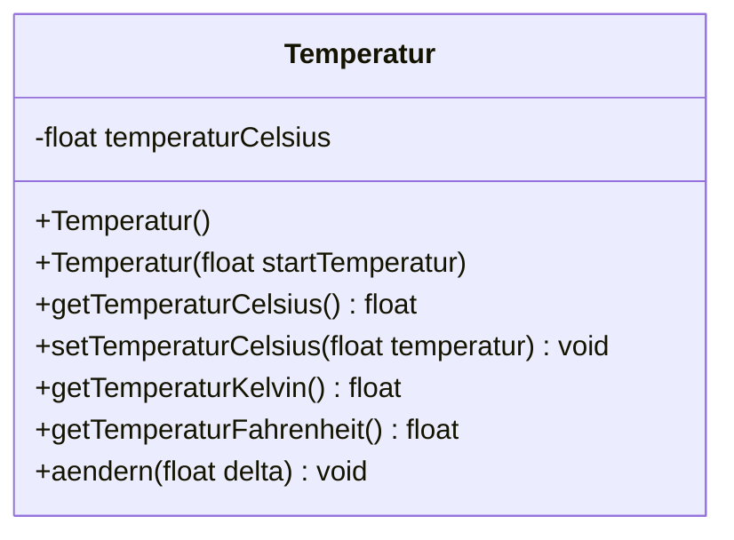

# OOP – SW 02 – Klassendefinitionen & Datentypen

> **Modul:** Objektorientierte Programmierung (OOP, HSLU)
> **Woche:** SW 02 (KW 09)
> **Thema:** Klassendefinitionen, elementare Datentypen und Operatoren
> **Quellen:** Kapitel 02, O02_IP_Klassen, O03_IP_Datentypen-Operatoren, U02_EX_KlassenDatentypen, OFWJ-chapter02 (inkl. Solutions)

---

## 🎯 Lernziele

- **Klassendefinitionen** lesen und selbst schreiben können.
- Den **Aufbau einer Klasse** verstehen: Attribute → Konstruktoren → Methoden.
- **Packages** und die Namenskonvention mit **reverse domain naming** kennen.
- Die **8 elementaren (primitiven) Datentypen** von Java kennen und korrekt einsetzen.
- Zwischen **Wertebereich** und **Genauigkeit** unterscheiden können.
- **Einfache Operatoren** (+, -, *, /, =) anwenden können.
- **Typumwandlungen** (implizit und explizit / Casting) verstehen und korrekt einsetzen.
- Die Falle der **Ganzzahldivision** kennen und vermeiden.
- **Getter- und Setter-Methoden** implementieren können.
- **Konstruktoren** mit und ohne Parameter schreiben können.
- **Bedingte Anweisungen** (`if`) einsetzen können.
- **Lokale Variablen** vs. **Instanzvariablen** (Felder) unterscheiden.
- **String-Konkatenation** mit dem `+`-Operator anwenden.

---

## 📖 Wichtigste Begriffe

| Begriff (DE) | Begriff (EN) | Definition |
|---|---|---|
| Klassendefinition | Class definition | Der vollständige Quellcode, der eine Klasse beschreibt (Attribute, Konstruktoren, Methoden) |
| Feld / Attribut / Instanzvariable | Field / Attribute / Instance variable | Variable, die innerhalb eines Objekts gespeichert wird und seinen Zustand beschreibt |
| Konstruktor | Constructor | Spezielle Methode, die beim Erzeugen eines Objekts (`new`) aufgerufen wird; initialisiert den Zustand |
| Package | Package | Gruppierung zusammengehöriger Klassen; entspricht einer Ordnerstruktur |
| Parameter | Parameter | Wert, der einer Methode oder einem Konstruktor beim Aufruf übergeben wird |
| Formaler Parameter | Formal parameter | Parametervariable in der Methodendeklaration (z.B. `int ticketPreis`) |
| Aktueller Parameter | Actual parameter / Argument | Konkreter Wert beim Methodenaufruf (z.B. `500`) |
| Zuweisung | Assignment | Speichern eines Wertes in einer Variablen mit `=` (rechts → links!) |
| Getter-Methode | Accessor method | Methode, die den Wert eines Attributs zurückliefert (z.B. `getPreis()`) |
| Setter-Methode | Mutator method | Methode, die den Wert eines Attributs verändert (z.B. `setPreis(int preis)`) |
| Bedingte Anweisung | Conditional statement | `if`-Anweisung: führt Code nur unter bestimmter Bedingung aus |
| Lokale Variable | Local variable | Variable, die nur innerhalb einer Methode existiert (kein `private`!) |
| String-Konkatenation | String concatenation | Aneinanderhängen von Strings mit dem `+`-Operator |
| Elementarer Datentyp | Primitive data type | Einfacher Wert (kein Objekt): `byte`, `short`, `int`, `long`, `float`, `double`, `char`, `boolean` |
| Bitmuster | Bit pattern | Die binäre Darstellung eines Wertes im Speicher |
| Typumwandlung / Casting | Type conversion / Casting | Konvertierung eines Wertes von einem Datentyp in einen anderen |
| Implizite Typumwandlung | Implicit type conversion | Automatische Konvertierung durch Java (z.B. `int` → `long`) |
| Explizite Typumwandlung | Explicit type conversion (cast) | Manuelle Konvertierung mit `(Typ)` (z.B. `(float) wert`) |

---

## 📐 Konzepte & Prinzipien

### Aufbau einer Klassendefinition

Eine Java-Klasse hat einen klar definierten Aufbau. Die **Reihenfolge** innerhalb des Klassenrumpfs ist **konventionell festgelegt**:

```
┌──────────────────────────────────┐
│  Äusserer Rahmen der Klasse      │
│  (class Name { ... })            │
│                                  │
│  1. Felder (Attribute)           │
│  2. Konstruktoren                │
│  3. Methoden                     │
│                                  │
│  → Reihenfolge ist Konvention!   │
│  → Innerer Rahmen = Klassenrumpf │
└──────────────────────────────────┘
```

> [!IMPORTANT]
> **Synonyme erkennen!** In der Vorlesung, im Buch und in der Prüfung werden verschiedene Begriffe für dieselben Dinge verwendet:
> - **Feld** = Attribut = Instanzvariable = Datenfeld (EN: field, attribute, instance variable)
> - **Konstruktor** = Erzeuger (EN: constructor)
> - **Methode** = Operation = Funktion (EN: method)

### Packages – Klassen organisieren

Packages gruppieren zusammengehörige Klassen und vermeiden Namenskonflikte.

- **Namenskonvention:** Reverse Domain Naming (umgekehrter Domainname)
- Beispiel: `ch.hslu.oop.sw02`
- Entspricht der **Ordnerstruktur:** `ch/hslu/oop/sw02/`

```java
package ch.hslu.oop.sw02;

public class Temperatur {
    // ...
}
```

### Felder (Attribute / Instanzvariablen)

Felder speichern den **Zustand** eines Objekts. Sie werden **am Anfang** der Klasse deklariert.

```java
public class TicketMachine {
    // Felder (Attribute) – private = Kapselung!
    private int price;       // Ticketpreis in Rappen
    private int balance;     // bisher eingeworfener Betrag
    private int total;       // gesammelte Gesamteinnahmen
}
```

**Eigenschaften von Feldern:**
- Haben einen **Datentyp**, **Namen** und einen **Sichtbarkeitsmodifikator** (`private`)
- Werden mit ihrem **Standardwert** initialisiert, falls nicht explizit gesetzt
- Existieren **so lange wie das Objekt** lebt
- Sind in **allen Methoden** der Klasse sichtbar

### Konstruktoren

Konstruktoren initialisieren ein neues Objekt. Sie haben **denselben Namen wie die Klasse** und **keinen Rückgabetyp**.

```java
public class TicketMachine {

    private int price;
    private int balance;
    private int total;

    // Konstruktor MIT Parameter
    public TicketMachine(int ticketCost) {
        price = ticketCost;    // Parameter → Feld
        balance = 0;
        total = 0;
    }
}
```

> [!WARNING]
> **Konstruktoren haben KEINEN Rückgabetyp!** Auch nicht `void`!
> - ✅ `public TicketMachine(int cost) { ... }`
> - ❌ `public void TicketMachine(int cost) { ... }` ← Das wäre eine Methode!

### Parameter und Zuweisungen

- **Formaler Parameter:** Der Name in der Methodendeklaration → `int ticketCost`
- **Aktueller Parameter (Argument):** Der Wert beim Aufruf → `new TicketMachine(500)`
- **Zuweisung:** `=` weist den Wert der rechten Seite der Variablen auf der linken Seite zu

```java
price = ticketCost;
// links ← rechts: Wert von ticketCost wird in price gespeichert
```

### Getter- und Setter-Methoden

| Art | Naming-Konvention | Rückgabetyp | Parameter | Beispiel |
|-----|-------------------|-------------|-----------|----------|
| **Getter** | `getAttributname()` | Typ des Attributs | keiner | `int getPrice()` |
| **Setter** | `setAttributname(Typ wert)` | `void` | Typ des Attributs | `void setPrice(int newPrice)` |

```java
// Getter – liest den Wert
public int getPrice() {
    return price;
}

// Getter – liefert berechneten Wert
public int getBalance() {
    return balance;
}

// Setter – verändert den Wert
public void setPrice(int newPrice) {
    price = newPrice;
}
```

### Bedingte Anweisungen (if)

```java
public void insertMoney(int amount) {
    if (amount > 0) {
        balance = balance + amount;
    } else {
        System.out.println("Verwenden Sie einen positiven Betrag: " + amount);
    }
}
```

### Lokale Variablen vs. Felder

| Eigenschaft | Feld (Instanzvariable) | Lokale Variable |
|---|---|---|
| **Deklariert in** | Klasse (ausserhalb von Methoden) | Innerhalb einer Methode |
| **Sichtbarkeit** | Alle Methoden der Klasse | Nur innerhalb der deklarierenden Methode |
| **Lebensdauer** | So lange wie das Objekt | Nur während der Methodenausführung |
| **Modifier** | `private` (oder `public`) | **Kein** Sichtbarkeitsmodifikator! |
| **Initialwert** | Standardwert (0, false, null) | **Muss** vor Nutzung initialisiert werden! |

```java
public class TicketMachine {

    private int price;      // ← Feld (lebt mit dem Objekt)

    public int refundBalance() {
        int amountToRefund;  // ← Lokale Variable (nur in dieser Methode)
        amountToRefund = balance;
        balance = 0;
        return amountToRefund;
    }
}
```

### String-Konkatenation und Ausgabe

Der `+`-Operator verkettet Strings miteinander. Auch Nicht-Strings werden dabei automatisch in Strings umgewandelt:

```java
// String-Konkatenation
System.out.println("# " + price + " Rappen.");
// Bei price = 500 → Ausgabe: "# 500 Rappen."

// println vs. print
System.out.println("Zeile 1");  // MIT Zeilenumbruch am Ende
System.out.print("Zeile 2");    // OHNE Zeilenumbruch
```

---

## 🔢 Elementare Datentypen (Primitive Types)

### Was sind elementare Datentypen?

- Elementare Datentypen speichern **einen einzelnen Wert** (keine Objekte!)
- Sie haben **keine Methoden** → eigentlich nicht objektorientiert
- Java hat genau **8 primitive Datentypen**
- Vorteil: **Effiziente, platzsparende Speicherung**, auch für grosse Datenmengen

### Ganzzahlige Datentypen

| Typ | Grösse | Wertebereich | Standardwert |
|-----|--------|-------------|--------------|
| `byte` | 8 Bit (1 Byte) | −128 bis 127 | `0` |
| `short` | 16 Bit (2 Bytes) | −32'768 bis 32'767 | `0` |
| `int` | 32 Bit (4 Bytes) | −2'147'483'648 bis 2'147'483'647 (~±2.1 Mrd.) | `0` |
| `long` | 64 Bit (8 Bytes) | −9'223'372'036'854'775'808 bis 9'223'372'036'854'775'807 | `0L` |

> **Standardtyp für Ganzzahlen:** Java verwendet **`int`** als Standard. Für `long`-Literale wird ein `L` angehängt: `long bigNum = 100L;`

### Gleitkomma-Datentypen

| Typ | Grösse | Genauigkeit | Wertebereich | Standardwert |
|-----|--------|-------------|-------------|--------------|
| `float` | 32 Bit (4 Bytes) | ~7 signifikante Stellen | ±3.4 × 10³⁸ | `0.0f` |
| `double` | 64 Bit (8 Bytes) | ~14–15 signifikante Stellen | ±1.7 × 10³⁰⁸ | `0.0` |

> **Standardtyp für Kommazahlen:** Java verwendet **`double`** als Standard. Für `float`-Literale wird ein `f` angehängt: `float pi = 3.14f;`

> [!IMPORTANT]
> **Wertebereich ≠ Genauigkeit!**
> - `float` hat einen riesigen Wertebereich (bis 10³⁸), aber nur ~7 signifikante Stellen
> - Beispiel: `3.4028235E38` hat 38 Stellen, aber nur die ersten ~7 sind "genau"
> - Bei Geldbeträgen: **Niemals `float` verwenden!** → `double` oder besser `BigDecimal`

### Weitere Datentypen

| Typ | Grösse | Beschreibung | Beispiel |
|-----|--------|-------------|---------|
| `char` | 16 Bit (2 Bytes) | Ein einzelnes Unicode-Zeichen | `'A'`, `'?'`, `'€'` |
| `boolean` | ~1 Bit* | Wahrheitswert | `true`, `false` |

*\* Die tatsächliche Speichergrösse von `boolean` ist JVM-abhängig (oft 1 Byte).*

### Standardwerte (Default Values)

| Datentyp | Standardwert |
|----------|-------------|
| `byte`, `short`, `int`, `long` | `0` |
| `float`, `double` | `0.0` |
| `char` | `'\u0000'` (Null-Zeichen) |
| `boolean` | `false` |
| Referenztypen (String, Objekte) | `null` |

### Bitmuster – Wie Daten gespeichert werden

Jeder Wert wird im Speicher als **Bitmuster** (Folge von 0 und 1) gespeichert:

```
Beispiel: int-Wert 42 als 32-Bit Bitmuster:
00000000 00000000 00000000 00101010

Beispiel: byte-Wert 42 als 8-Bit Bitmuster:
00101010
```

Die **gleichen Bits** können je nach Datentyp **unterschiedlich interpretiert** werden!

### Einfluss der Datentypwahl

| Kriterium | Kleinerer Typ (byte, short, float) | Grösserer Typ (int, long, double) |
|---|---|---|
| **Ressourcenbedarf** (Speicher) | ✅ Weniger Speicher | ❌ Mehr Speicher |
| **Geschwindigkeit** | ⚡ Tendentiell schneller | 🐢 Tendentiell langsamer |
| **Genauigkeit** | ⚠️ Weniger Genauigkeit / Wertebereich | ✅ Mehr Genauigkeit / Wertebereich |

> **Faustregel:** Im Zweifel `int` für Ganzzahlen und `double` für Kommazahlen verwenden. Nur bei grossen Datenmengen (Arrays mit Millionen Einträgen) lohnt sich die Optimierung.

---

## ➕ Einfache Operatoren

### Übersicht

| Operator | Bedeutung | Beispiel |
|----------|-----------|---------|
| `+` | Addition oder Vorzeichen oder String-Konkatenation | `3 + 4`, `+100`, `"a" + "b"` |
| `-` | Subtraktion oder Vorzeichen | `10 - 3`, `-5` |
| `*` | Multiplikation | `6 * 7` |
| `/` | Division | `10 / 3` |
| `=` | Zuweisung (rechts → links!) | `x = 5` |

> [!WARNING]
> **`=` ist KEINE Gleichheit!** Für einen Gleichheitstest verwendet man `==` (Doppelgleich).
> Mehr dazu in OOP04 und OOP05.

### Operatoren sind Polymorph!

Ein Operator hat je nach **Kontext** (Datentyp und Position) eine **unterschiedliche Bedeutung**:

| Kontext des `+`-Operators | Wirkung | Beispiel |
|---|---|---|
| **Vor** einer Zahl | Vorzeichen (positiv) | `+100` |
| **Zwischen** zwei **Zahlen** | Mathematische Addition | `100 + 200` → `300` |
| **Zwischen** zwei **Strings** | Konkatenation (Verkettung) | `"abc" + "def"` → `"abcdef"` |

```java
// Addition ganzer Zahlen
int summe = 128 + 132;    // → 260

// String-Konkatenation
String gericht = "Nude" + "lauf" + "lauf";  // → "Nudelauflauf"
```

> [!IMPORTANT]
> **`String` ist KEIN elementarer Datentyp!** `String` ist eine **Klasse** (Referenztyp).
> - Leicht erkennbar: Klassennamen beginnen **immer** mit einem **Grossbuchstaben**!
> - Primitive Typen beginnen mit **Kleinbuchstaben**: `int`, `double`, `boolean` etc.

---

## 🔄 Typumwandlungen (Casting)

### Implizite Typumwandlung (automatisch)

Java konvertiert automatisch, wenn der Zieltyp **grösser** ist (kein Datenverlust):

```java
long wert = 100;  // int → long: automatisch (implizit)
```

**Regeln für implizites Casting (von → nach):**

| Von | Nach |
|-----|------|
| `byte` | `short`, `int`, `long`, `float`, `double` |
| `char`, `short` | `int`, `long`, `float`, `double` |
| `int` | `long`, `float`, `double` |
| `long` | `float`, `double` |
| `float` | `double` |
| "alle" (x) | `String` bei Konkatenation mit String: `String s = s + x;` |

### Explizite Typumwandlung (manuelles Casting)

Wenn der Zieltyp **kleiner** ist, muss man Java explizit den Befehl geben:

```java
long wert = (long) 100;   // Expliziter Cast (hier unnötig, aber möglich)
int kleiner = (int) 100L;  // long → int: expliziter Cast nötig
```

### ⚠️ Die Ganzzahldivisions-Falle

Dies ist eine der **häufigsten Fehlerquellen** in Java:

```java
int i1 = 5;
int i2 = 2;
float f = i1 / i2;     // ❌ Ergebnis: 2.0f (NICHT 2.5!)
```

**Warum?**
1. Zuerst wird `i1 / i2` ausgeführt → **Ganzzahldivision** (beide sind `int`)
2. `5 / 2 = 2` (Dezimalstellen werden **abgeschnitten**, keine Rundung!)
3. Erst **danach** wird `2` implizit auf `float` gecastet → `2.0f`

**Korrekte Implementierung (zwei Varianten):**

```java
float f = (float) i1 / i2;    // Cast VOR der Division
// oder:
float f = i1 / (float) i2;    // Mindestens ein Operand muss float sein!
```

> [!CAUTION]
> **Beim expliziten Casting können Daten verloren gehen!**
> - **Fliesskomma → Ganzzahl:** Dezimalstellen werden **abgeschnitten** (keine Rundung!)
>   - `(int) 3.9` → `3` (nicht 4!)
> - **Grosser Typ → kleiner Typ:** Bits werden abgeschnitten → oft **unsinnige Ergebnisse**!
>   - `(byte) 300` → ergibt 44 (nur die unteren 8 Bits bleiben)

### Empfehlungen zu Datentypen und Castings

- Die Relevanz der **Typenwahl** bei mathematischen Berechnungen wird oft **unterschätzt**
- **Immer gut testen** mit sinnvollen Wertebereichen!
- Berechnungen immer mit **Randwerten** testen (min, max, 0, negative Werte)

### Praxisbeispiel: Wartezeit-Bug

Ein echtes Beispiel aus einer Schweizer Klinik: Die geschätzte Wartezeit wurde als **ca. 100.571428571429 Minuten** angezeigt – vermutlich wurde `double` statt `int` für die Minutenanzahl verwendet, oder eine Division wurde nicht gerundet!

---

## ☕ Java-Syntax & Sprachkonstrukte

### Vollständige Klassenstruktur (Improved TicketMachine)

```java
/**
 * Verbesserter Ticketautomat mit Fehlerprüfung.
 * Demonstriert: Felder, Konstruktoren, Getter, Setter, if-Anweisungen.
 */
public class TicketMachine {

    // ====== 1. FELDER (Attribute) ======
    private int price;       // Ticketpreis in Rappen
    private int balance;     // Aktuell eingeworfener Betrag
    private int total;       // Gesamteinnahmen

    // ====== 2. KONSTRUKTOR ======
    public TicketMachine(int ticketCost) {
        price = ticketCost;
        balance = 0;
        total = 0;
    }

    // ====== 3. METHODEN ======

    // --- Getter-Methoden (Accessor) ---
    public int getPrice() {
        return price;
    }

    public int getBalance() {
        return balance;
    }

    // --- Setter / Mutator-Methoden ---
    public void insertMoney(int amount) {
        if (amount > 0) {
            balance = balance + amount;
        } else {
            System.out.println("Verwenden Sie einen positiven Betrag: "
                               + amount);
        }
    }

    public void printTicket() {
        if (balance >= price) {
            // Ticket drucken
            System.out.println("##################");
            System.out.println("# OOP-Bahn");
            System.out.println("# Ticket");
            System.out.println("# " + price + " Rappen.");
            System.out.println("##################");
            System.out.println();

            // Restgeld und Buchung
            total = total + price;
            balance = balance - price;
        } else {
            System.out.println("Sie müssen noch "
                               + (price - balance)
                               + " Rappen einwerfen.");
        }
    }

    public int refundBalance() {
        int amountToRefund;     // Lokale Variable!
        amountToRefund = balance;
        balance = 0;
        return amountToRefund;
    }
}
```

### Wichtige neue Schlüsselwörter in SW02

| Schlüsselwort | Bedeutung |
|---|---|
| `package` | Definiert, zu welchem Package die Klasse gehört |
| `if` / `else` | Bedingte Anweisung: Code nur bei erfüllter Bedingung ausführen |
| `return` | Gibt einen Wert aus einer Methode zurück und beendet die Methode |
| `>=` | Vergleichsoperator: grösser oder gleich |
| `>` | Vergleichsoperator: grösser als |
| `==` | Vergleichsoperator: gleich (nicht verwechseln mit `=`!) |

### System.out.println vs. System.out.print

```java
System.out.println("Mit Zeilenumbruch");   // Danach: neue Zeile
System.out.print("Ohne Zeilenumbruch");     // Danach: auf gleicher Zeile
```

---

## 📊 Vergleiche & Klassifizierungen

### Primitive Datentypen vs. Referenztypen

| Eigenschaft | Primitive Datentypen | Referenztypen |
|---|---|---|
| **Beispiele** | `int`, `double`, `boolean`, `char` | `String`, `TicketMachine`, `Circle` |
| **Speichert** | Den Wert direkt | Eine Referenz (Zeiger) auf ein Objekt |
| **Methoden?** | ❌ Keine | ✅ Hat Methoden |
| **Namenskonvention** | **Kleinbuchstabe** (`int`, `boolean`) | **Grossbuchstabe** (`String`, `Scanner`) |
| **Standardwert** | `0`, `0.0`, `false`, `'\u0000'` | `null` |
| **new nötig?** | ❌ Nein | ✅ Ja (ausser String-Literale) |

### Naiver vs. Verbesserter Ticketautomat

| Aspekt | Naiver Automat | Verbesserter Automat |
|---|---|---|
| **Fehlerprüfung Geld** | ❌ Akzeptiert negativen Betrag | ✅ `if (amount > 0)` |
| **Fehlerprüfung Ticket** | ❌ Druckt immer (auch ohne Geld) | ✅ `if (balance >= price)` |
| **Wechselgeld** | ❌ Wird ignoriert | ✅ `refundBalance()` gibt Überschuss zurück |
| **Mehrere Tickets** | ❌ Nicht vorgesehen | ✅ Balance bleibt nach Ticket erhalten |

### Felder vs. Lokale Variablen vs. Parameter (Zusammenfassung)

| Eigenschaft | Feld | Lokale Variable | Parameter |
|---|---|---|---|
| **Deklariert** | In der Klasse | In einer Methode | In der Methodensignatur |
| **Sichtbarkeit** | Ganze Klasse | Nur die Methode | Nur die Methode |
| **Lebensdauer** | Objektlebensdauer | Methodenausführung | Methodenausführung |
| **`private`?** | Ja (sollte!) | Nein (darf nicht!) | Nein |
| **Initialwert** | Automatisch (default) | Muss explizit gesetzt werden | Wird beim Aufruf übergeben |

---

## 💻 Code-Beispiele (Java)

### Beispiel 1: Temperatur-Klasse (Übungsaufgabe U02)

```java
package ch.hslu.oop.sw02;

/**
 * Einfache Temperatur-Klasse.
 * Speichert eine Temperatur in Grad Celsius.
 */
public class Temperatur {

    // Feld – Datentyp: float (Nachkommastellen für Temperatur)
    private float temperaturCelsius;

    // Konstruktor OHNE Parameter → Default-Temperatur 20°C
    public Temperatur() {
        this.temperaturCelsius = 20.0f;
    }

    // Konstruktor MIT Parameter → individuelle Starttemperatur
    public Temperatur(float startTemperatur) {
        this.temperaturCelsius = startTemperatur;
    }

    // Getter
    public float getTemperaturCelsius() {
        return this.temperaturCelsius;
    }

    // Setter
    public void setTemperaturCelsius(float temperaturCelsius) {
        this.temperaturCelsius = temperaturCelsius;
    }

    // Umrechnung: Celsius → Kelvin
    // Formel: T_K = T_C + 273.15
    public float getTemperaturKelvin() {
        return this.temperaturCelsius + 273.15f;
    }

    // Umrechnung: Celsius → Fahrenheit
    // Formel: T_F = T_C * 1.8 + 32
    public float getTemperaturFahrenheit() {
        return this.temperaturCelsius * 1.8f + 32;
    }

    // Temperatur ändern um relativen Wert (positiv oder negativ)
    public void aendern(float delta) {
        this.temperaturCelsius += delta;
    }
}
```

### Beispiel 2: Datentypen-Experimente (aus Übung U02)

```java
// Experiment: Maximaler int-Wert
int maxInt = 2147483647;         // Integer.MAX_VALUE
System.out.println(maxInt);      // → 2147483647
System.out.println(maxInt + 1);  // → -2147483648 (Überlauf! Zweierkomplement!)

// ACHTUNG: Berechnung eines Werts jenseits des Wertebereichs
int overflow = 2147483647 + 1;   // → -2147483648 (kein Fehler, sondern Wrap-around!)

// Experiment: Maximaler float-Wert
float maxFloat = 3.4028235e38f;
System.out.println(maxFloat);            // → 3.4028235E38
System.out.println(maxFloat + 1.0f);     // → 3.4028235E38 (keine Änderung! Genauigkeitsproblem!)
System.out.println(3.4028235e38f + 1.0f); // → Infinity? → NEIN: Keine Änderung wegen Genauigkeit

// Experiment: Ganzzahldivision
int result = 2 + 5 / 2;
System.out.println(result);  // → 4 (NICHT 4.5! → 5/2=2, dann 2+2=4)

// Korrekt mit Cast:
float correctResult = 2 + 5 / (float) 2;
System.out.println(correctResult);  // → 4.5
```

### Beispiel 3: Codepad / Direkteingabe Experimente

```java
// Im BlueJ Code Pad (View → Show Code Pad / Ctrl+E):

// Ganzzahldivision
2 + 5 / 2       // → 4 (Punkt vor Strich, Ganzzahldivision!)

// Division mit float
2 + 5 / 2.0     // → 4.5 (2.0 macht es zur Gleitkommadivision)

// Float-Genauigkeit
3.4028235e38f + 1.0f   // → 3.4028235E38 (Wert ändert sich nicht!)
// Warum? float hat nur ~7 signifikante Stellen, +1 ist "zu klein"

// Typumwandlung
(float) 5 / 2    // → 2.5
5 / (float) 2    // → 2.5
(float)(5 / 2)   // → 2.0 (Cast NACH der Division → zu spät!)
```

---

## 📋 UML-Diagramme

### Klassendiagramm: Naive TicketMachine



### Klassendiagramm: Verbesserte TicketMachine



### Klassendiagramm: Temperatur (Übung SW02)



---

## ✏️ Übungsaufgaben-Zusammenfassung

### U02 Aufgabe 1: Temperatur – Eine erste, einfache Klasse

| Teilaufgabe | Thema | Lösungsansatz | Stolpersteine |
|---|---|---|---|
| a) | Klasse `Temperatur` erstellen | `float` oder `double` für Celsius-Werte, da Nachkommastellen nötig | Welcher Datentyp? → `float` reicht (mind. 2 Nachkommastellen) |
| b) | Einheit überlegen | Attribut benennen als `temperaturCelsius` → Einheit erkennbar aus Name | Naming-Konvention: Attributname soll Einheit zeigen |
| c) | Getter implementieren | `public float getTemperaturCelsius()` mit `return` | Getter hat Rückgabetyp (nicht `void`!) |
| d) | Setter implementieren | `public void setTemperaturCelsius(float t)` | Setter hat `void` und Parameter |
| e) | Celsius → Kelvin Umrechnung | `T_K = T_C + 273.15` – Methode gibt um, ändert aber nicht! | Attribut **nicht** verändern, nur berechnen und zurückgeben |
| f) | Celsius → Fahrenheit | `T_F = T_C * 1.8 + 32`, Wertebereich 0°K bis 1000°K prüfen | Passt `float` für den Fahrenheit-Bereich? Ja! |
| g) | Relative Temperaturänderung | `aendern(float delta)` → positiv oder negativ | Danach prüfen, ob Celsius, Kelvin und Fahrenheit korrekt |
| h) | Default-Temperatur 20°C | Konstruktor ohne Parameter: `this.temperaturCelsius = 20.0f;` | Alternative: Initialisierung direkt bei der Feld-Deklaration |
| i) | Konstruktor mit Parameter | `public Temperatur(float startTemp)` | Zwei Konstruktoren möglich (Überladung!) |
| k) | Default ohne Angabe = 20°C | Parameterloser Konstruktor muss weiterhin funktionieren | Beide Konstruktoren gleichzeitig definieren |

### U02 Aufgabe 2: Elementare Datentypen in Java

| Teilaufgabe | Thema | Lösungsansatz | Stolpersteine |
|---|---|---|---|
| a) | Anhang B lesen | Tabelle der Datentypen studieren (Grösse, Wertebereich) | – |
| b) | `int` Wertebereich testen | `2147483647 + 1` → Überlauf! Zweierkomplement-Wrap-around | Kein Fehler/Exception bei Überlauf! |
| c) | `float` Wertebereich testen | `3.4028235e38f + 1.0f` → keine Änderung (Genauigkeit!) | `f` nicht vergessen, sonst wird es `double` |
| d) | Division `2 + 5 / 2` | Ergibt `4` (nicht `4.5`!) → Ganzzahldivision + Punkt vor Strich | Cast verwenden: `(float)` oder `(double)` |
| e) | Reflexion über Datentyp-Fallen | Ariane-V88-Rakete explodierte wegen Datentyp-Fehler! | Reale Konsequenzen von falscher Typenwahl |

---

## ⚠️ Prüfungsrelevante Hinweise

### Typische Programmieraufgaben (MEP)

1. **Klasse schreiben:** Felder, Konstruktor(en), Getter, Setter implementieren
2. **Bedingte Logik:** `if`-Anweisungen für Validierung einbauen (z.B. negativer Betrag)
3. **Datentypen wählen:** Richtigen Typ für eine Aufgabe auswählen und begründen
4. **Casting-Aufgaben:** Ergebnis einer Division vorhersagen oder korrigieren
5. **Code lesen:** Ausgabe eines gegebenen Code-Snippets vorhersagen

### Häufige Fehlerquellen und Fallstricke

| Fehler | Problem | Lösung |
|--------|---------|--------|
| `float f = 5 / 2;` | Ergibt `2.0f` statt `2.5f` | `float f = (float) 5 / 2;` |
| `void getPrice()` | Getter ohne Rückgabetyp | `int getPrice()` mit `return` |
| `private int amount` in Methode | Lokale Variable braucht kein `private` | `int amount` (ohne Modifier) |
| `public void TicketMachine(int p)` | Konstruktor hat kein `void`! | `public TicketMachine(int p)` |
| `=` statt `==` | Zuweisung statt Vergleich im `if` | `if (x == 5)` für Vergleich |
| `int` Überlauf | `2147483647 + 1` → negativer Wert | `long` verwenden oder Grenzwerte prüfen |
| String ohne `""` | `blau` statt `"blau"` | Strings immer in doppelten Anführungszeichen |
| `float` ohne `f` | `3.14` wird als `double` interpretiert | `3.14f` für float-Literale |

### Refactoring-Tipps

- **Naiver → Verbesserter Ticketautomat:** Fehlerbehandlung hinzufügen ist ein typisches Refactoring
- **Duplizierten Code** in eigene Methoden auslagern
- **Magic Numbers** durch Konstanten oder Parameter ersetzen
- **Naming:** Attributnamen sollen die Einheit/Bedeutung zeigen (z.B. `temperaturCelsius` statt `temp`)

### Prüfungs-Checkliste: Klasse schreiben

```
□ package-Deklaration?
□ Felder mit private? (Kapselung!)
□ Sinnvoller Datentyp für jedes Feld?
□ Konstruktor (gleicher Name wie Klasse, KEIN Rückgabetyp)?
□ Felder im Konstruktor initialisiert?
□ Getter für alle relevanten Attribute?
□ Setter mit Validierung wo nötig?
□ Sinnvolle Methoden-Namen (camelCase)?
□ return-Statement bei Getter-Methoden?
```

---

## 🔗 Verbindung zu vorherigen/folgenden Wochen

### Rückbezug auf SW01

- **SW01:** Objekte und Klassen von aussen benutzt (Methoden aufrufen, Objekte erzeugen)
- **SW02:** Jetzt schauen wir **in die Klasse hinein** und schreiben sie **selbst**
- Die Datentypen `int`, `String`, `boolean` aus SW01 werden jetzt systematisch erklärt
- Konzepte wie `new`, Konstruktoren und Methoden werden nun **formal** eingeführt

### Vorausschau auf SW03

- **SW03:** Objektsammlungen (ArrayList, Arrays) → Mehrere Objekte verwalten
- Die `Temperatur`-Klasse wird weiterentwickelt und verbessert
- **Schleifen** (`for`, `while`) kommen hinzu → Wiederholungen
- **Iteratoren** zum Durchlaufen von Sammlungen

### Roter Faden: Temperatur-Klasse

Die `Temperatur`-Klasse aus U02 wird **das ganze Semester** weiterentwickelt:
- SW02: Erste Version (Attribute, Getter/Setter, Umrechnung)
- SW03: Sammlung von Temperaturen
- SW05: Tests mit JUnit
- SW06: Refactoring und Design-Verbesserung
- SW07+: Vererbung und Polymorphie anwenden

> [!TIP]
> **Lösung der Temperatur-Übung aufbewahren!** Sie wird in späteren Wochen immer wieder gebraucht und erweitert.
