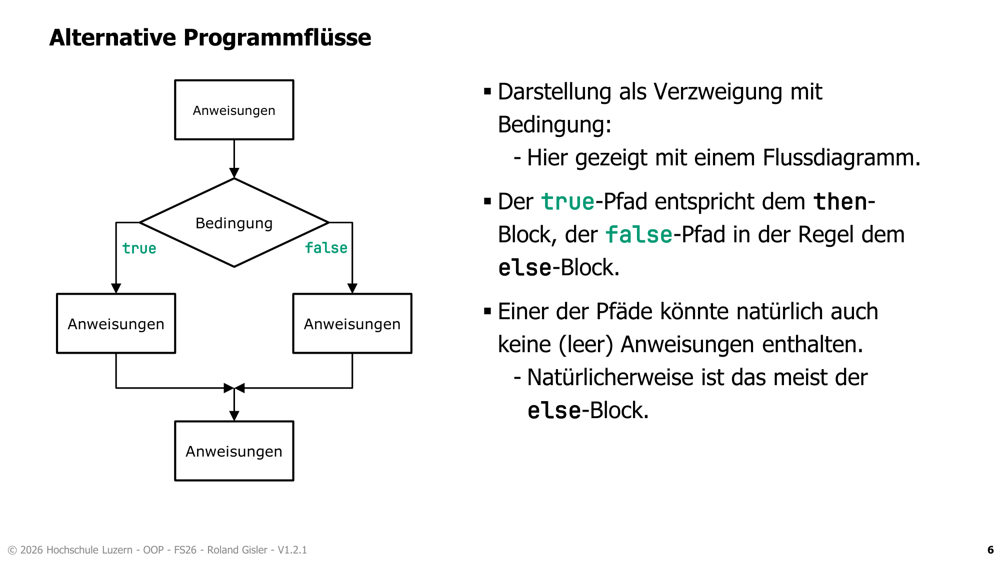
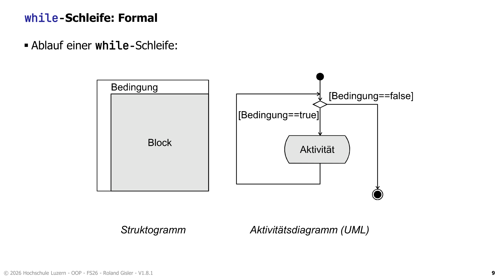
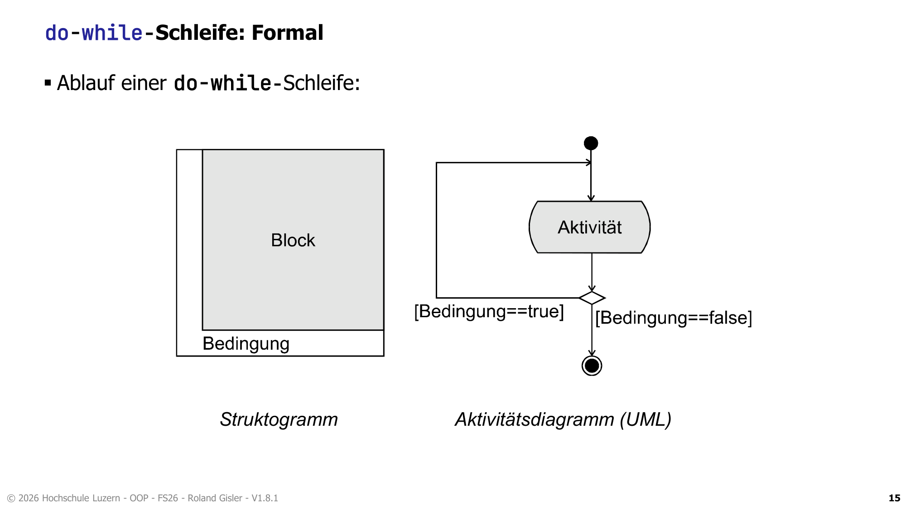
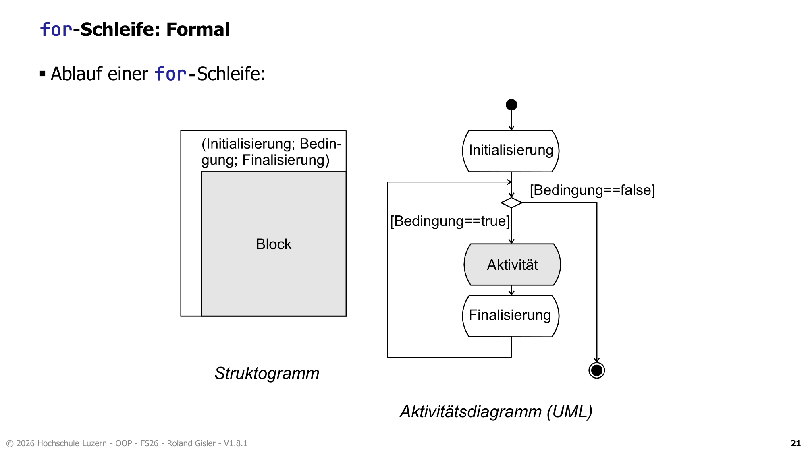
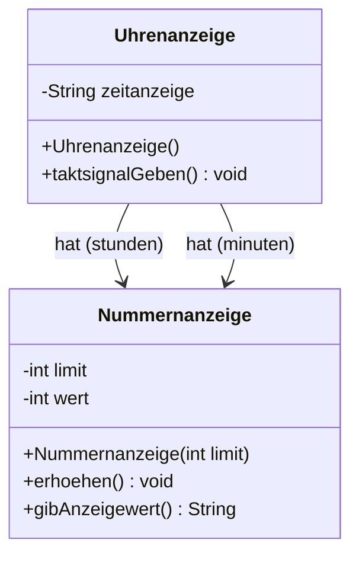

# OOP – SW 03 – Selektion, Iteration & Objektinteraktion

> **Modul:** Objektorientierte Programmierung (OOP, HSLU)
> **Woche:** SW 03 (KW 10)
> **Thema:** Steuerung des Kontrollflusses: Selektionen (if, switch), Iterationen (while, do-while, for) und Objektinteraktion
> **Quellen:** Kapitel 03, O04_IP_Selektion, O05_IP_Iteration, U03_EX_Kontrollstrukturen, OFWJ-chapter03-solution

---

## 🎯 Lernziele

- Sie können **einfache Bedingungen und bool'sche Ausdrücke** formulieren.
- Sie kennen das **if-Statement** und das **else-if-Statement** und wissen, wann man diese einsetzt.
- Sie kennen das **switch-Statement** und die moderne **switch-Expression** (ab Java 14).
- Sie kennen die verschiedenen **Schleifen-Typen** (`while`, `do-while`, `for`, `foreach`) mit ihren individuellen Eigenschaften.
- Sie können für die jeweilige Situation den geeigneten Schleifentyp auswählen und implementieren.
- Sie sind in der Lage, sichere **Abbruchbedingungen** zu formulieren und Endlosschleifen zu vermeiden.
- Sie verstehen das Konzept der **Modularisierung und Abstraktion** (Objekte aus Objekten aufbauen).
- Sie wissen, wie **Objekte andere Objekte erzeugen** (mit dem `new`-Operator) und wie Objekte interagieren.

---

## 📖 Wichtigste Begriffe

| Begriff (DE) | Begriff (EN) | Definition |
|---|---|---|
| Selektion | Selection | Auswahl/Verzweigung im Programmablauf basierend auf einer logischen Bedingung (`if`, `switch`) |
| Iteration / Schleife | Iteration / Loop | Wiederholte Ausführung eines Codeblocks, solange eine Bedingung erfüllt ist (`while`, `for`) |
| Bedingung | Condition / Expression | Ein Ausdruck, der ein boolesches Resultat (`true` oder `false`) liefert |
| Logische Operatoren | Logical Operators | Verknüpfen von booleschen Ausdrücken: AND (`&&`), OR (`||`), XOR (`^`), NOT (`!`) |
| Objektinteraktion | Object Interaction | Objekte rufen Methoden anderer Objekte auf, um zusammen eine Aufgabe zu lösen |
| Abstraktion | Abstraction | Details ignorieren, um das Gesamtbild zu erfassen (z.B. eine Uhr besteht aus zwei Ziffernanzeigen) |
| Modularisierung | Modularization | Zerlegen eines grossen Problems in kleinere, unabhängige Teile (Klassen/Objekte) |
| Objektreferenz | Object reference | Variable eines Objekttyps speichert nicht das Objekt selbst, sondern einen Verweis (Zeiger/Referenz) darauf |
| Modulo-Operator | Modulo operator | Berechnet den Rest einer Ganzzahldivision (`%`) |
| String-Verkettung | String concatenation | Das Verbinden von Zeichenketten mit dem `+`-Operator |

---

## 📐 Konzepte & Prinzipien

### Selektion (Auswahl)

Selektionen steuern den Programmfluss in Abhängigkeit von Bedingungen.

#### 1. Einfache Selektion (`if` / `else`)
- **`if`**: Führt den Block aus, wenn die Bedingung `true` ist.
- **`else`**: (Optional) Führt den Block aus, wenn die Bedingung `false` ist.
- **`else if`**: Erlaubt die Verkettung mehrerer, sich gegenseitig ausschliessender Optionen auf einer Einrückungsebene.

#### 2. Das `switch`-Statement
- Vergleicht absolute Werte statt boolescher Bedingungen.
- Unterstützte Typen: `byte`, `short`, `char`, `int`, `String`, Enums.
- **Wichtig:** Benötigt zwingend `break;` am Ende jedes Blocks, sonst kommt es zum "Fall-through" (Ausführen der nachfolgenden Cases).

#### 3. Die `switch`-Expression (ab Java 14)
- Liefert direkt einen Rückgabewert.
- Schreibweise mit Arrow-Labels (`->`), bei der **kein** `fall-through` passiert.
- `default` ist zwingend erforderlich, wenn nicht alle Fälle abgedeckt sind.
- Bei mehrzeiligen Codeblöcken wird das Schlüsselwort `yield` zur Rückgabe verwendet.

### Logische Operatoren & De Morgan

Um komplexe Bedingungen zu formulieren, verknüpft man boolean-Werte:
- **`&&` (AND):** Beide `true` → Resultat `true`. (Short-Circuit: bricht ab, wenn der erste Teil `false` ist).
- **`||` (OR):** Mindestens eins `true` → Resultat `true`. (Short-Circuit: bricht ab, wenn der erste Teil `true` ist).
- **`!` (NOT):** Kehrt den Wahrheitswert um.

> [!TIP]
> **Das Gesetz von De Morgan:**  
> `!(a && b)` ist logisch äquivalent zu `!a || !b`  
> `!(a || b)` ist logisch äquivalent zu `!a && !b`  
> Dies hilft oft, unleserliche, stark verschachtelte Negationen zu vereinfachen!

### Iteration (Schleifen)

| Schleifentyp | Konzept | Charakteristik |
|---|---|---|
| **`while`-Schleife** | **Eingangstest** | Anzahl Durchläufe oft unbekannt. Bedingung wird *vor* der Ausführung geprüft. Es kann 0 Durchläufe geben. |
| **`do-while`-Schleife** | **Ausgangstest** | Bedingung wird *nach* der Ausführung geprüft. Mindestens **1 Durchlauf** ist garantiert! |
| **`for`-Schleife** | **Eingangstest** | Ideal für zählende Schleifen. `for(Init; Bedingung; Update)`. Anzahl Durchläufe im Voraus bekannt. |

> [!WARNING]
> **Robuste Abbruchbedingungen:** Vermeiden Sie Prüfungen auf absolute Werte bei Fliesskommazahlen (`x == 1.0f`)! Durch Rundungsfehler kann das zu Endlosschleifen führen. Nutzen Sie Bereichsprüfungen (`x >= 1.0f`).

### Laufzeit vs. Kompilierungszeit (Statisch vs. Dynamisch)
- **Klassendiagramm:** Statische Sicht (zur Kompilierzeit). Zeigt, welche Klassen existieren und welche sich kennen.
- **Objektdiagramm:** Dynamische Sicht (zur Laufzeit). Zeigt konkrete Instanzen und deren Referenzen aufeinander im Speicher.

### Objektinteraktion & Objekterzeugung
- Ein Objekt kann Felder vom Typ einer *anderen* Klasse haben (z.B. `Uhrenanzeige` hat Felder vom Typ `Nummernanzeige`).
- Diese Felder enthalten **Objektreferenzen**.
- Das äussere Objekt muss die inneren Objekte explizit herstellen mit `new Klassenname()`.

---

## ☕ Java-Syntax & Sprachkonstrukte

### 1. Selektionen in Java



**Das if-Statement**
```java
if (divisor != 0) {
    quotient = dividend / divisor;
} else if (divisor == 0) {
    System.out.println("Fehler");
} else {
    // optionaler Else-Block
}
```

**Das switch-Statement (klassisch)**
```java
switch (tagNummer) {
    case 1:
        tag = "Montag";
        break; // Verhindert Fall-Through!
    case 6:
    case 7:
        tag = "Wochenende";
        break;
    default:
        tag = "Ungültig";
}
```

**Die switch-Expression (ab Java 14)**
```java
String daytype = switch (value) {
   case 1, 2, 3, 4, 5 -> "Arbeitstag";
   case 6, 7          -> "Wochenende";
   default            -> "Unerlaubte Tagnummer";
}; // Semikolon am Ende!
```

### 2. Iterationen (Schleifen) in Java

**while-Schleife**



```java
int summe = 0;
while (summe < 100) {
    summe += 10;
}
```

**do-while-Schleife**



```java
int wuerfelWurf;
do {
    wuerfelWurf = (int) (Math.random() * 6) + 1;
} while (wuerfelWurf != 6); // Mindestens einmal wird gewürfelt!
```

**for-Schleife**



```java
for (int i = 1; i <= 10; i++) {
    System.out.println("Wert: " + i);
} // Variable i existiert nur innerhalb der Schleife
```

---

## 📊 Vergleiche & Klassifizierungen

### `while` vs. `do-while` vs. `for`

| Aspekt | `while` | `do-while` | `for` |
|--------|---------|------------|-------|
| **Art des Tests** | Eingangstest | Ausgangstest | Eingangstest |
| **Mindestanzahl Durchläufe** | **0** | **1** | **0** |
| **Bester Einsatzzweck** | Laufbedingung abhängig von externen Ereignissen / Abbruchbedingung. | Wenn die Aktion zwingend mindestens einmal erfolgen muss (z.B. Benutzereingabe prüfen). | Wenn die **Anzahl der Durchläufe** oder die Laufvariable im Voraus bekannt ist. |

---

## 💻 Code-Beispiele (Java)

### Beispiel 1: `Nummernanzeige` (NumberDisplay)
Dieses Beispiel zeigt den Modulo-Operator und wie man führende Nullen bei der String-Ausgabe (Konkatenation) einbaut.

```java
public class Nummernanzeige {
    private int limit;
    private int wert;

    public Nummernanzeige(int anzeigeGrenze) {
        limit = anzeigeGrenze;
        wert = 0;
    }

    public int gibWert() {
        return wert;
    }

    /**
     * Erklärung: String-Verkettung erzwingt, dass "0" und int verkettet werden.
     */
    public String gibAnzeigewert() {
        if(wert < 10) {
            return "0" + wert;
        } else {
            return "" + wert;
        }
    }

    public void setzeWert(int ersatzwert) {
        // Sichere Bedingung prüfen
        if((ersatzwert >= 0) && (ersatzwert < limit)) {
            wert = ersatzwert;
        }
    }

    /**
     * Erklärung: Modulo-Operator (%) berechnet den Rest der Division.
     * Erreicht wert das Limit (z.B. 60), wird 60 % 60 gerechnet -> 0!
     */
    public void erhoehen() {
        wert = (wert + 1) % limit;
    }
}
```

### Beispiel 2: `Uhrenanzeige` (ClockDisplay)
Zeigt, wie eine Klasse **mehrere Objekte anderer Klassen** (`Nummernanzeige`) erzeugt und verwendet (Modularisierung/Objektinteraktion).

```java
public class Uhrenanzeige {
    private Nummernanzeige stunden;
    private Nummernanzeige minuten;
    private String zeitanzeige;
    
    // Konstruktor OHNE Parameter (Standard: 00:00)
    public Uhrenanzeige() {
        stunden = new Nummernanzeige(24);
        minuten = new Nummernanzeige(60);
        anzeigeAktualisieren();
    }

    // Konstruktor MIT Parameter (Startzeit setzen) - Überladung!
    public Uhrenanzeige(int stunde, int minute) {
        stunden = new Nummernanzeige(24);
        minuten = new Nummernanzeige(60);
        setzeUhrzeit(stunde, minute);
    }

    // Minuten erhöhen, bei 0-Überlauf der Minuten die Stunden erhöhen
    public void taktsignalGeben() {
        minuten.erhoehen();
        
        // Interagiert mit dem Rückgabewert der anderen Klasse
        if(minuten.gibWert() == 0) {
            stunden.erhoehen();
        }
        anzeigeAktualisieren();
    }

    private void anzeigeAktualisieren() {
        // String Konkatenation für die Darstellung der Uhrzeit (z.B. "03:45")
        zeitanzeige = stunden.gibAnzeigewert() + ":" + minuten.gibAnzeigewert();
    }
}
```

---

## 📋 UML-Diagramme

### Objektdiagramm vs. Klassendiagramm zur Laufzeit



> Ein **Objektdiagramm** der `Uhrenanzeige` würde **drei** Objekte zeigen: 
> 1. Die `Uhrenanzeige` Instanz
> 2. Eine `Nummernanzeige` Instanz für Stunden
> 3. Eine `Nummernanzeige` Instanz für Minuten.

---

## ✏️ Übungsaufgaben-Zusammenfassung

| Aufgabe | Thema | Lösungsansatz / Kern | Stolpersteine |
|---|---|---|---|
| **`max(int a, int b, int c)`** | Verschachtelte `if` | Bester Ansatz: `return max(a, max(b, c));` | Zu viele Einrückungsebenen machen den Code unleserlich. Wiederverwendung von Funktionen spart Code! |
| **Kassenzettel / Periodensystem** | `switch`-Statements | Statt endlosen if-else-if Ketten für bestimmte Werte ein `switch(element)` nehmen. | Ein `break` im Switch zu vergessen (Fall-Through Bug!). Modern: `switch`-Expression! |
| **Float Endlosschleife** | `while(f != 1.0f)` | Die Bedingung wird nie `false` weil `0.9f + 0.000025f` nie genau `1.0f` ergibt. *Lösung:* `while(f < 1.0f)` | Auf Gleitkomma-Gleichheit prüfen (`==` / `!=`) ist extrem fehleranfällig! |
| **ASCII Box Print** | `for`-Schleifen verschachtelt | Zwei verschachtelte for-Schleifen (`for(height)` > `for(width)`). | Variable `i` und `j` sauber trennen; `println()` für die neue Zeile am Ende der inneren Schleife nicht vergessen. |

---

## ⚠️ Prüfungsrelevante Hinweise

1. **Typische Programmieraufgaben:**
   - Verschachtelte Schleifen implementieren (z.B. Text-Aufgaben oder Box printen).
   - Objektinteraktion programmieren: z.B., eine Klasse (Auto) besitzt Reifen, rufen Sie eine Funktion auf dem Reifen auf.
2. **Endlosschleifen:** Bei `float` Werten nie auf `==` testen (Rundungsfehler!). Immer `>=` oder `<=` verwenden.
3. **Modulo (`%`)** richtig anwenden können – z.B. für "jeden 5. Tick etwas machen": `if(tick % 5 == 0) {...}`.
4. **Refactoring-Tipps (Wichtig für Bewertung):**
   - **`break;` und `continue;`** in Schleifen wenn möglich vermeiden. (Oft "Code-Smell", besser als boolean Flags oder im `while` schreiben).
   - Sehr **tiefe `if`-Schachtelungen** in kleine, benannte Methoden extrahieren. (`if / else if / else` > `else { if { ... } }`).
   - Leere `else { }` Blöcke weglassen.

---

## 🔗 Verbindung zu vorherigen/folgenden Wochen

- **Rückbezug auf SW01 / SW02:** Datentypen (`int`, `boolean`) sind die Basis für jede Schleife und Selektion. Die `+` Konkatenation wurde formalisiert.
- **Vorausschau SW04 / SW06:** Komplexe Arrays (Sammlungen) benötigen `for`- und `foreach`-Schleifen (Iterator). Gutes Klassendesign bedeutet, dass Klassen (z.B. Uhrenanzeige) nicht alles selbst berechnen, sondern "Wissen verteilen" (Modularisierung, Kopplung/Kohäsion in SW06).
