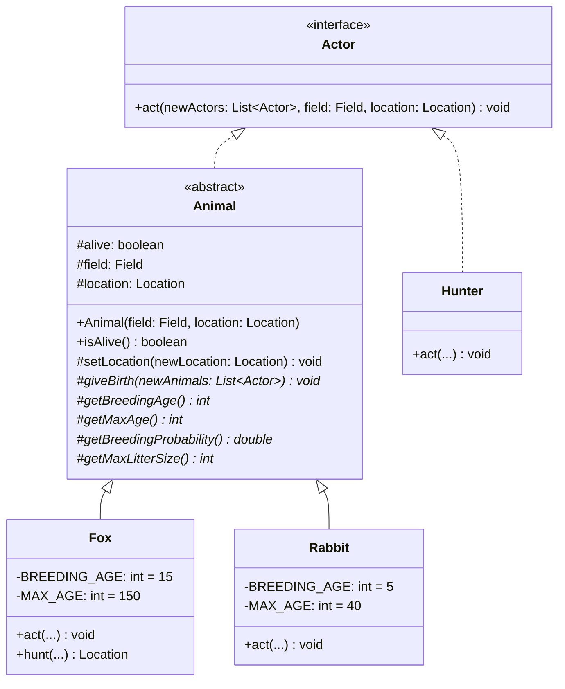
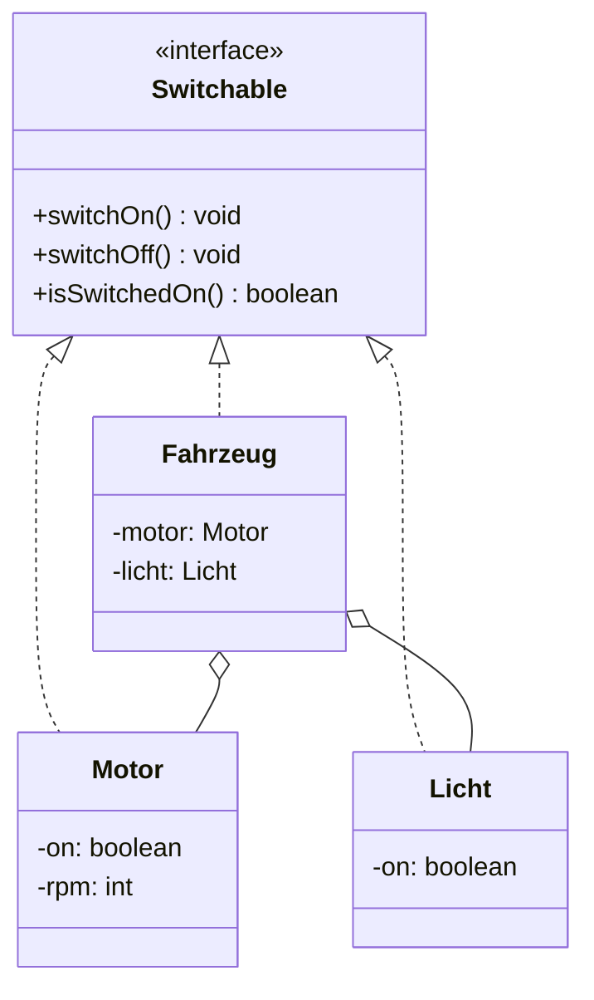
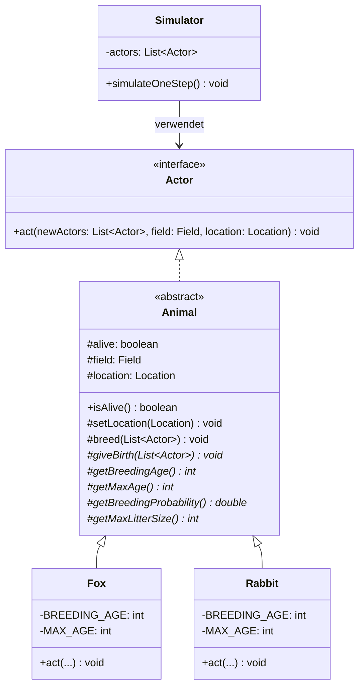

# 📘 OOP – SW04: Schnittstellen & Datenkapselung

> **Modul:** Objektorientierte Programmierung (OOP) · HSLU  
> **Woche:** SW04 – KW11  
> **Themen:** Schnittstellen (O06), Datenkapselung (P01), JavaDoc, Modularisierung  
> **Quellen:** `O06_IP_Schnittstellen.pdf`, `P01_IP_Datenkapselung.pdf`, `U04_EX_SchnittstellenDatenkapselung.pdf`

---

## 🎯 Lernziele

### Aus O06 – Schnittstellen
- Abstraktion und ihren Nutzen für die Softwareentwicklung verstehen
- Abstrakte Klassen definieren und einsetzen können
- Interfaces (Schnittstellen) definieren und implementieren können
- Unterschied zwischen Interface und abstrakter Klasse kennen
- Polymorphie im Zusammenhang mit Interfaces anwenden
- JavaDoc als Dokumentationswerkzeug korrekt einsetzen

### Aus P01 – Datenkapselung
- Prinzip der Datenkapselung und des Information Hiding verstehen
- Zugriffsmodifizierer (`public`, `private`, `protected`, *package default*) korrekt einsetzen
- Getter- und Setter-Methoden nach Konvention implementieren
- Unterschied zwischen Datenkapselung und Information Hiding erklären
- Erkennen, wann unerwünscht interne Repräsentation nach aussen gelangt
- Verschiedene Design-Varianten entwerfen und beurteilen

### Aus U04 – Übungen
- JavaDoc-Dokumentation schreiben und generieren (Tags: `@param`, `@return`)
- Schnittstelle `Switchable` definieren und implementieren (Motor, Fahrzeug)
- Klasse `Line` mit verschiedenen Designvarianten für Datenkapselung/Information Hiding entwerfen

---

## 📖 Wichtigste Begriffe

| Begriff | Definition |
|---|---|
| **Interface** (Schnittstelle) | Definiert einen Vertrag: Menge von Methodensignaturen ohne Implementierung. Klassen *implementieren* (`implements`) das Interface. |
| **Abstrakte Klasse** | Klasse mit `abstract`-Keyword, die nicht instanziiert werden kann. Kann sowohl abstrakte als auch konkrete Methoden enthalten. |
| **Abstrakte Methode** | Methode ohne Body (`abstract`), muss in Subklassen implementiert werden. |
| **Polymorphie** | Objekte verschiedener Klassen können über einen gemeinsamen Typ (Interface/Superklasse) einheitlich behandelt werden. |
| **Datenkapselung** | Zusammenfassung von Daten (Attributen) und Methoden (Verhalten) in einer Klasse. Zugriff auf Daten *ausschliesslich über Methoden*. |
| **Information Hiding** | Bewusstes Abstrahieren/Verstecken der internen Repräsentation eines Objektes von aussen. Geht über reine Datenkapselung hinaus. |
| **Zugriffsmodifizierer** | Keywords (`public`, `private`, `protected`, *package default*), die die Sichtbarkeit von Klassen, Attributen und Methoden steuern. |
| **Getter-Methode** | Öffentliche Methode, die den Wert eines privaten Attributs zurückgibt (z.B. `getName()`). |
| **Setter-Methode** | Öffentliche Methode, die den Wert eines privaten Attributs setzt (z.B. `setName(String name)`). |
| **Kopplung** (Coupling) | Mass für die Abhängigkeit zwischen Klassen. **Lose Kopplung** ist erwünscht. |
| **Kohäsion** (Cohesion) | Mass für den inneren Zusammenhalt einer Klasse. **Hohe Kohäsion** ist erwünscht. |
| **JavaDoc** | Standardisierte Dokumentation im Java-Quellcode mit `/** ... */`-Kommentaren und Tags. |
| **Immutable Object** | Objekt, dessen Zustand nach der Erzeugung nicht mehr verändert werden kann (z.B. `String`). |

---

## 🧠 Konzepte & Theorie

### 1. Abstraktion im Fox-Rabbit-Projekt (O06)

Das Fox-Rabbit-Simulationsprojekt zeigt die **Evolution von Design durch Abstraktion**:

**Problem:** Code-Duplizierung zwischen `Fox` und `Rabbit` – beide haben ähnliche Felder (`alive`, `location`, `field`) und ähnliches Verhalten (`act()`).

**Lösung in 3 Stufen:**



| Stufe | Mechanismus | Vorteil |
|---|---|---|
| 1️⃣ Abstrakte Klasse `Animal` | Gemeinsame Felder/Methoden hochziehen | Eliminiert Code-Duplizierung |
| 2️⃣ Abstrakte Methoden | `abstract protected` für tierspezifisches Verhalten | Erzwingt Implementierung in Subklassen |
| 3️⃣ Interface `Actor` | Schnittstelle für alle «handelnden» Objekte | Ermöglicht nicht-tierische Akteure (z.B. `Hunter`) |

**Schlüssel-Einsicht:** Der `Simulator` arbeitet nur noch mit `List<Actor>` → **Polymorphie!**

```java
// Simulator kennt nur die Schnittstelle Actor
for (Actor actor : actors) {
    actor.act(newActors, field, currentLocation);
}
```

---

### 2. Interface vs. Abstrakte Klasse (O06)

| Eigenschaft | Interface | Abstrakte Klasse |
|---|---|---|
| Keyword | `interface` | `abstract class` |
| Instanziierung | ❌ Nein | ❌ Nein |
| Methodenimplementierung | ❌ Nur Signaturen (bis Java 7) | ✅ Abstrakte + konkrete Methoden |
| Attribute | Nur `static final` Konstanten | Normale Attribute möglich |
| Konstruktor | ❌ Nein | ✅ Ja |
| Mehrfachvererbung | ✅ Klasse kann mehrere Interfaces implementieren | ❌ Nur eine Superklasse |
| Verwendung | Definiert eine **Rolle/Fähigkeit** (»kann...«) | Definiert eine **Ist-ein-Beziehung** |
| Beispiel | `Switchable`, `Actor`, `Drawable` | `Animal`, `Shape` |
| Java-Syntax | `class Foo implements Bar` | `class Foo extends Bar` |

> ⚠️ **Prüfungsrelevant:** Eine Klasse kann **mehrere Interfaces** implementieren, aber nur **eine Klasse** erweitern!

```java
// Interface definieren
public interface Actor {
    void act(List<Actor> newActors, Field field, Location location);
}

// Interface implementieren
public class Fox extends Animal implements Actor {
    @Override
    public void act(List<Actor> newActors, Field field, Location location) {
        // Fox-spezifisches Verhalten
    }
}
```

---

### 3. Zugriffsmodifizierer (P01)

#### UML-Symbole und Sichtbarkeit

| Modifier | Java-Keyword | UML-Symbol | Sichtbarkeit |
|---|---|---|---|
| **public** | `public` | `+` | Überall sichtbar |
| **private** | `private` | `-` | Nur innerhalb eigener Klasse |
| **protected** | `protected` | `#` | Eigene Klasse + Subklassen + gleiches Package |
| **package default** | *(kein Keyword)* | `~` | Nur innerhalb desselben Packages |

#### Sichtbarkeitsmatrix

| Zugriff von... | `public` | `protected` | *package* | `private` |
|---|:---:|:---:|:---:|:---:|
| Eigene Klasse | ✅ | ✅ | ✅ | ✅ |
| Andere Klasse, gleiches Package | ✅ | ✅ | ✅ | ❌ |
| Subklasse, anderes Package | ✅ | ✅ | ❌ | ❌ |
| Andere Klasse, anderes Package | ✅ | ❌ | ❌ | ❌ |

> 💡 **Faustregel:** So verschlossen wie möglich, so offen wie nötig – aber **immer bewusst**!

---

### 4. Getter- und Setter-Methoden (P01)

#### Konventionen

| Aspekt | Getter | Setter |
|---|---|---|
| **Namenskonvention** | `get` + Attributname (z.B. `getName()`) | `set` + Attributname (z.B. `setName(...)`) |
| **Rückgabetyp** | Typ des Attributs | Immer `void` |
| **Parameter** | Keine | Einer (Typ des Attributs) |
| **Sichtbarkeit** | Meist `public` | Meist `public` (kann eingeschränkter sein!) |
| **`boolean`-Sonderfall** | `is` + Attributname (z.B. `isAlive()`) | Normal: `setAlive(boolean)` |

#### Beispiel mit UML

```java
public final class Person {

    private String name;

    public String getName() {
        return this.name;
    }

    public void setName(final String name) {
        this.name = name;
    }
}
```

```
┌────────────────────────────┐
│         Person             │
├────────────────────────────┤
│ - name : String            │
├────────────────────────────┤
│ + getName() : String       │
│ + setName(name: String)    │
│   : void                   │
└────────────────────────────┘
```

#### Empfehlungen

- ✅ Getter/Setter als `final` deklarieren (verhindert Überschreiben in Subklassen)
- ✅ Parameter von Settern als `final` deklarieren
- ✅ Namensgebung **einheitlich** halten (z.B. immer `this.name = name` mit `this`)
- ✅ Einfache Getter/Setter durch **IDE generieren** lassen (NetBeans: *Insert Code…*, Eclipse: *Source → Generate Setter/Getter…*)
- ⚠️ Nicht automatisch für jedes Attribut Getter **und** Setter erzeugen → **wohlüberlegt** entscheiden!

---

### 5. Datenkapselung vs. Information Hiding (P01)

> ⚠️ **Verwandte, aber NICHT identische Konzepte!**

| | Datenkapselung | Information Hiding |
|---|---|---|
| **Definition** | Zusammenfassung von Daten + Methoden; Zugriff auf Daten *ausschliesslich über Methoden* | Bewusstes Verstecken der **internen Repräsentation** |
| **Fokus** | *Wie* man auf Daten zugreift | *Was* man nach aussen zeigt |
| **Mechanismus** | `private` Attribute + `public` Getter/Setter | Schnittstelle entkoppelt von interner Darstellung |
| **Analogie** | Tür mit Schlüssel (Zugang kontrolliert) | Black Box (Inneres unsichtbar) |

#### 🔴 Temperatur-Beispiel: 3 Stufen

**Stufe 1 – Schlecht (keine Kapselung):**
```java
public class Temperatur {
    public float celsius = 20.0f;  // Direkt zugänglich!
}
// Problem: Keine Kontrolle, keine Änderung möglich
```
```
┌──────────────────────────┐
│       Temperatur         │
├──────────────────────────┤
│ + celsius : float = 20.0f│
└──────────────────────────┘
```

**Stufe 2 – Gut (Datenkapselung):**
```java
public class Temperatur {
    private float celsius;
    
    public Temperatur(float celsius) {
        this.celsius = celsius;
    }
    
    public float getCelsius() { 
        return this.celsius; 
    }
    
    public void setCelsius(float celsius) { 
        this.celsius = celsius; 
    }
}
```
```
┌────────────────────────────────────┐
│           Temperatur               │
├────────────────────────────────────┤
│ - celsius : float                  │
├────────────────────────────────────┤
│ + Temperatur(celsius : float)      │
│ + getCelsius() : float             │
│ + setCelsius(celsius : float):void │
└────────────────────────────────────┘
```
→ Attribut privat, Lese-/Schreibzugriff getrennt kontrollierbar. **Aber:** Schnittstelle verrät die interne Darstellung (`float`, Celsius).

**Stufe 3 – Noch besser (Information Hiding):**
```java
public class Temperatur {
    private static final float KELVIN_OFFSET = 273.15f;
    private float kelvin;  // Intern in Kelvin gespeichert!
    
    public Temperatur(float celsius) {
        this.kelvin = celsius + KELVIN_OFFSET;
    }
    
    public float getCelsius() { 
        return this.kelvin - KELVIN_OFFSET; 
    }
    
    public void setCelsius(float celsius) { 
        this.kelvin = celsius + KELVIN_OFFSET; 
    }
    
    // Erweiterbar um getFahrenheit(), setFahrenheit() etc.
}
```
```
┌────────────────────────────────────────────┐
│              Temperatur                    │
├────────────────────────────────────────────┤
│ - KELVIN_OFFSET : float = 273.15f         │
│ - kelvin : float                           │
├────────────────────────────────────────────┤
│ + Temperatur(celsius : float)              │
│ + getCelsius() : float                     │
│ + setCelsius(celsius : float) : void       │
└────────────────────────────────────────────┘
```
→ Schnittstelle **unverändert**, aber intern in Kelvin gespeichert! Erweiterung um Fahrenheit möglich, **ohne dass externe Klassen etwas merken**.

> 🎯 **Kernaussage:** Allein `private` + Getter/Setter reicht für Datenkapselung, aber **nicht für gutes Design**. Information Hiding geht weiter: Die interne Darstellung von der Schnittstelle **entkoppeln**.

---

### 6. Empfehlungen zur Datenkapselung/Information Hiding (P01)

1. **So verschlossen wie möglich, so offen wie nötig**
2. **Keine OOP mit der «Brechstange»** – Nicht blindlings für jedes Attribut Getter + Setter
3. Bei Rückgabe von **Objektreferenzen** → Defensive Kopie erstellen!
   - Bei elementaren Datentypen (`int`, `float` etc.) geschieht das automatisch (Call-by-Value)
   - Bei Objekten wird nur die **Referenz** kopiert → Veränderungen wirken auf das Original!
4. Alternative: **Immutable Objects** verwenden (z.B. `String` in Java)
5. Schmale Schnittstelle → Nur das Nötigste nach aussen geben
6. Parameter/Rückgabewerte sollen keine Rückschlüsse auf die interne Darstellung erlauben

---

### 7. JavaDoc (O06 / U04)

JavaDoc ist die Standard-Dokumentation für Java-Quellcode:

```java
/**
 * Repräsentiert eine einfache Person mit Name.
 * 
 * @author Roland Gisler
 * @version 1.0
 */
public final class Person {

    private String name;
    
    /**
     * Liefert den Namen der Person.
     * @return Name der Person als String.
     */
    public String getName() {
        return this.name;
    }
    
    /**
     * Setzt den Namen der Person.
     * @param name Der neue Name (darf nicht null sein).
     */
    public void setName(final String name) {
        this.name = name;
    }
}
```

**Wichtige JavaDoc-Tags:**

| Tag | Verwendung |
|---|---|
| `@param name` | Beschreibt einen Parameter |
| `@return` | Beschreibt den Rückgabewert |
| `@author` | Autor der Klasse |
| `@version` | Versionsnummer |
| `@throws` / `@exception` | Beschreibt geworfene Exceptions |
| `@see` | Verweis auf verwandte Klasse/Methode |
| `@deprecated` | Markiert veraltete Elemente |

> 💡 Bei Standard-Getter/Setter ist JavaDoc selten nötig, aber bei komplexeren Methoden **immer** verwenden!

---

## 🔬 Übungsaufgaben (U04)

### Aufgabe 1: JavaDoc
- API-Dokumentation von `java.lang.String` studieren
- Quellcode von `String.java` aus `src.zip` im JDK analysieren
- Eigene Klassen mit `@param` und `@return` dokumentieren
- In BlueJ: `Werkzeuge → Dokumentation erzeugen`
- **Lernziel:** Mindestens Interfaces und Klassen (inkl. aller öffentlichen Methoden) **immer** dokumentieren – **kurz und prägnant**

### Aufgabe 2: Schnittstellen (`Switchable`)
- Interface `Switchable` aus dem Input kopieren und implementieren
- Klasse `Motor` implementiert `Switchable`: ein-/ausschalten, Betriebszustand (`rpm`) festhalten
- Klasse `Fahrzeug` als Ganzes ebenfalls `Switchable` (enthält Motor, Licht, Scheibenwischer etc.)
- **Polymorphie-Frage:** Kann man den Typ des Interfaces für Motor, Licht etc. wiederverwenden?

```java
public interface Switchable {
    void switchOn();
    void switchOff();
    boolean isSwitchedOn();
}

public class Motor implements Switchable {
    private boolean on;
    private int rpm;
    
    @Override
    public void switchOn() { this.on = true; }
    
    @Override
    public void switchOff() { this.on = false; this.rpm = 0; }
    
    @Override
    public boolean isSwitchedOn() { return this.on; }
}
```



### Aufgabe 3: `Line`-Klasse (Datenkapselung & Information Hiding)

Modellierung einer Linie (Start- bis Endpunkt im 2D-Raum):

**Zwei Designvarianten:**
1. **4 `int`-Attribute:** `x1`, `y1`, `x2`, `y2`
2. **2 `Point`-Attribute:** `start`, `end` (objektorientierter!)

**Schrittweise Vertiefung:**
- c) Getter für Start-/Endpunkt hinzufügen → Welche Variante einfacher?
- d) Setter für Endpunkt hinzufügen → Wieder 2 bzw. 4 Varianten
- e) Interne Darstellung ändern (Refactoring) → **Hier zeigt sich Information Hiding!**
   - Man kann intern die Darstellung wechseln, **ohne** dass die Schnittstelle sich ändert
- f) **Überraschung:** Wenn Getter ein `Point`-Objekt zurückgibt, kann der Aufrufer den Punkt **direkt verändern** → Verletzung der Kapselung! 
   - Lösung: **Defensive Kopie** zurückgeben oder **Immutable Point** verwenden

> 🎯 Diese Übung demonstriert live, warum Information Hiding wichtig ist!

---

## 📊 UML-Klassendiagramm: Gesamtübersicht Fox-Rabbit (O06)



---

## 🧪 Prüfungstipps

### Typische Prüfungsfragen

1. **«Erklären Sie den Unterschied zwischen Datenkapselung und Information Hiding.»**
   - Datenkapselung = Zugriff nur über Methoden (private + Getter/Setter)
   - Information Hiding = Interne Darstellung von Schnittstelle entkoppelt (z.B. intern Kelvin, extern Celsius)

2. **«Was ist der Unterschied zwischen einer abstrakten Klasse und einem Interface?»**
   - Tabelle oben verwenden! Betonung auf: Mehrfachvererbung, Konstruktoren, Attribute

3. **«Zeichnen Sie ein UML-Klassendiagramm mit korrekten Zugriffsmodifizierer-Symbolen.»**
   - `+` = public, `-` = private, `#` = protected, `~` = package

4. **«Warum sollte man nicht für jedes Attribut automatisch Getter und Setter erzeugen?»**
   - Verletzt das Prinzip des Information Hiding
   - Gibt unnötige interne Details preis
   - Schnittstelle wird unnötig breit

5. **«Erklären Sie das Problem bei der Rückgabe von Objektreferenzen in Gettern.»**
   - Referenz wird kopiert, nicht das Objekt → Aufrufer kann internes Objekt verändern
   - Lösungen: Defensive Kopie oder Immutable Objects

### Häufige Fehler

| Fehler | Korrektur |
|---|---|
| Alle Attribute `public` | Attribute **immer** `private`, Zugriff über Getter/Setter |
| Getter gibt Referenz auf internes Objekt zurück | **Defensive Kopie** erstellen |
| Für jedes Attribut blind Getter + Setter | Nur was **wirklich nötig** ist |
| Interface und abstrakte Klasse verwechselt | Interface = Vertrag (»can-do«), Abstract = Ist-ein (»is-a«) |
| `protected` mit `private` verwechselt | `protected` erlaubt Zugriff aus **Subklassen** |

---

## 🔗 Verbindungen zu vorherigen Wochen

| Woche | Verbindung |
|---|---|
| **SW01–SW02** | Grundlagen: Klassen, Objekte, Methoden, `this`-Keyword |
| **SW03** | Vererbung (`extends`), `super`-Keyword, Polymorphie-Grundlagen |
| **SW04** | Abstraktion (abstrakte Klassen + Interfaces), Datenkapselung, Information Hiding |

**Progression:** SW03 Vererbung → SW04 Abstraktion durch Interfaces & Datenkapselung → Grundlage für Kapitel 12 (Weitere Abstraktionstechniken)

---

## 📝 Checkliste für die Prüfungsvorbereitung

- [ ] Kann ich ein Interface definieren und implementieren?
- [ ] Kann ich erklären, wann Interface vs. abstrakte Klasse?
- [ ] Kenne ich alle 4 Zugriffsmodifizierer mit UML-Symbolen?
- [ ] Kann ich die Sichtbarkeitsmatrix auswendig?
- [ ] Kann ich Getter/Setter nach Konvention schreiben?
- [ ] Kann ich den Unterschied Datenkapselung vs. Information Hiding am Temperatur-Beispiel erklären?
- [ ] Weiss ich, warum Defensive Kopien bei Objektreferenzen nötig sind?
- [ ] Kann ich das Fox-Rabbit-Refactoring (3 Stufen) erklären?
- [ ] Kann ich JavaDoc-Tags (`@param`, `@return`) korrekt verwenden?
