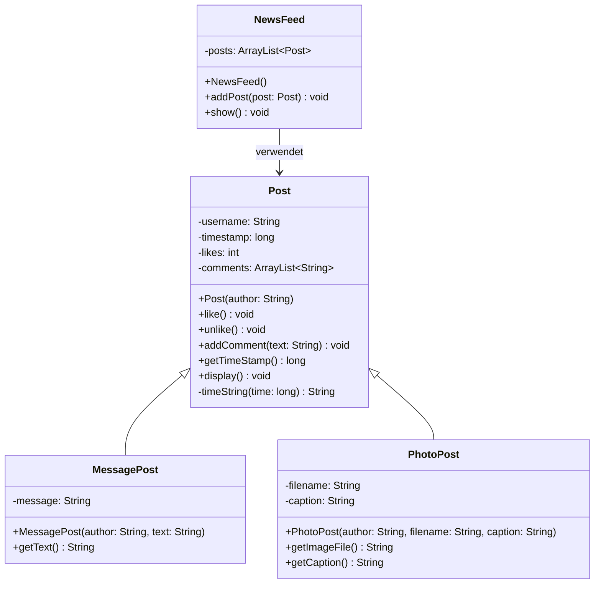
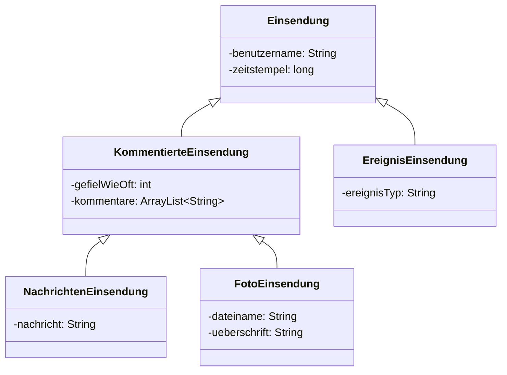
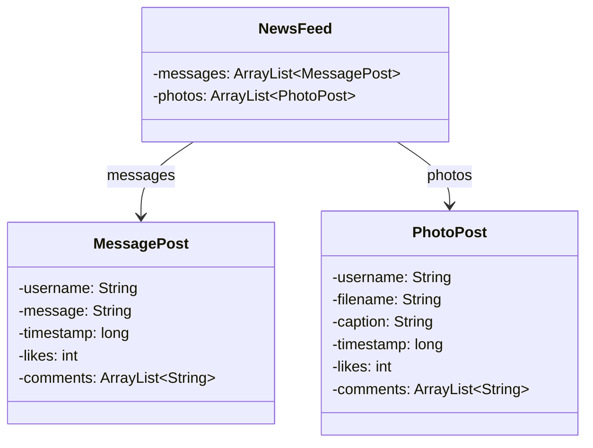
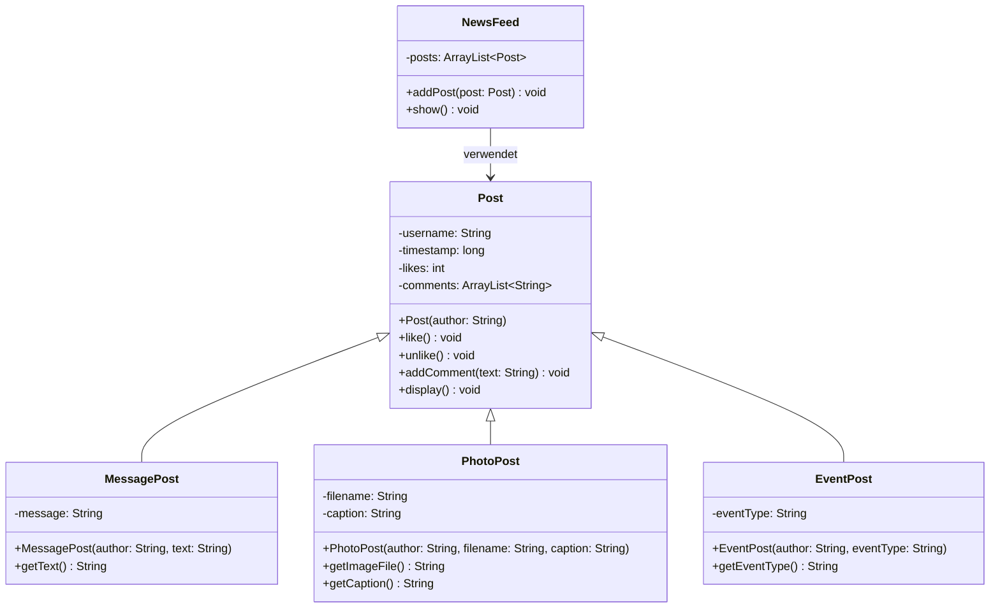
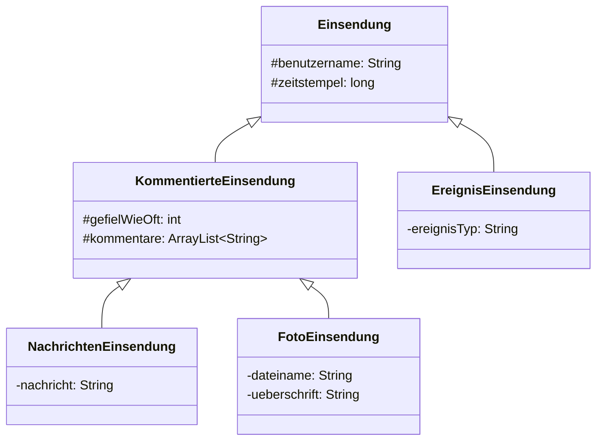
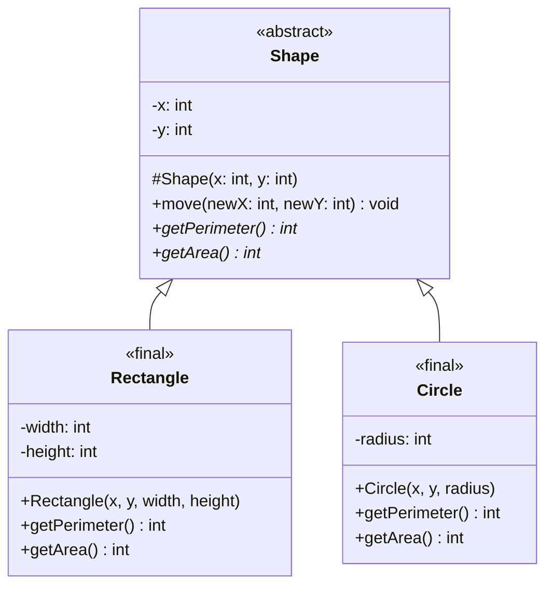
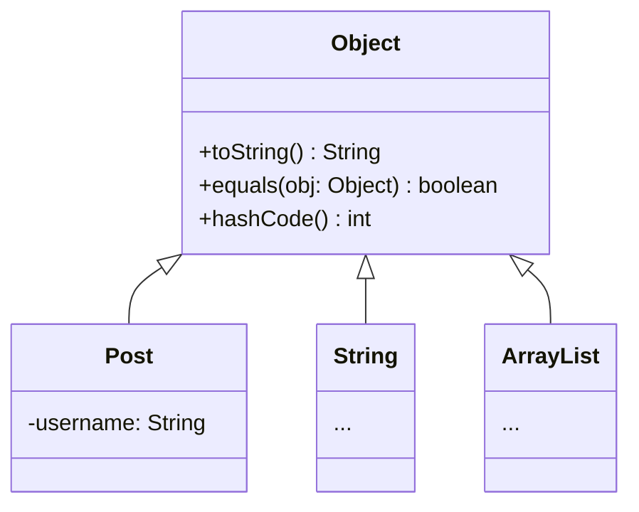

# 📘 OOP – SW05: Vererbung & Entwicklungsumgebung

> **Modul:** Objektorientierte Programmierung (OOP) · HSLU  
> **Woche:** SW05 – KW12  
> **Themen:** Vererbung (O07, Kapitel 10), Entwicklungsumgebung (E01)  
> **Quellen:** `Kapitel 10 - Bessere Struktur durch Vererbung.pdf`, `O07_IP_Vererbung.pdf`, `E01_IP_Entwicklungsumgebung.pdf`, `U05_EX_VererbungEntwicklungsumgebung.pdf`, `OFWJ-chapter10.zip`, `OFWJ-chapter10-solutions.zip`

---

## 🎯 Lernziele

### Aus O07 – Vererbung
- Das Konzept der Vererbung verstehen und anwenden
- Zwischen Vererbung von Interfaces und Klassen unterscheiden können
- Unterschied zwischen Einfach- und Mehrfachvererbung kennen
- Gute und schlechte Vererbungsbeziehungen identifizieren können
- Methoden in Spezialisierungen überschreiben und die Implementierung der Basisklasse wiederverwenden können

### Aus Kapitel 10 – Bessere Struktur durch Vererbung
- Code-Duplizierung durch Vererbung eliminieren
- Vererbungshierarchien entwerfen und umgestalten (Refactoring)
- Subtyping und Ersetzbarkeit (Substitution) verstehen
- Polymorphe Variablen und deren Vorteile anwenden
- Den Cast-Operator kennen und wissen, warum er vermieden werden sollte
- Die Rolle der Klasse `Object` als universelle Superklasse kennen

### Aus E01 – Entwicklungsumgebung
- Wissen, was eine IDE ist und welchem Zweck sie dient
- Die wichtigsten Aufgaben einer IDE kennen
- Mit einer IDE grundlegende Programmieraufgaben erledigen
- Eine für Java-Projekte adäquate Projekt-/Verzeichnisstruktur kennen

### Aus U05 – Übungen
- Vererbungsbeziehungen in Java umsetzen
- Merkmale von guter und schlechter Vererbung erkennen
- Abstrakte Klassen im Vererbungskontext einsetzen
- Arbeit mit einer professionellen IDE (statt BlueJ)
- Java-Packages verwenden und Projekte strukturieren

---

## 📖 Wichtigste Begriffe

| Begriff (DE) | Begriff (EN) | Definition |
|---|---|---|
| **Vererbung** | Inheritance | Mechanismus, bei dem eine Klasse (Subklasse) die Eigenschaften (Attribute und Methoden) einer anderen Klasse (Superklasse) übernimmt. Erlaubt Code-Wiederverwendung und Hierarchiebildung. |
| **Superklasse / Oberklasse** | Superclass | Die Klasse, von der geerbt wird. Auch: Basisklasse, Generalisierung. |
| **Subklasse / Unterklasse** | Subclass | Die Klasse, die erbt. Auch: Spezialisierung, Ableitung. Sie erbt **alle** Attribute und Methoden der Superklasse. |
| **Ist-ein-Beziehung** | Is-a Relationship | Die Vererbungsbeziehung: »Eine Nachrichteneinsendung **ist eine** Einsendung.« |
| **Vererbungshierarchie** | Inheritance Hierarchy | Baumstruktur von Klassen, die über Vererbung miteinander verknüpft sind. |
| **`extends`** | extends | Java-Schlüsselwort zur Deklaration einer Vererbungsbeziehung: `class Sub extends Super`. |
| **`super`** | super | Schlüsselwort zum Aufruf des Konstruktors oder von Methoden der Superklasse. |
| **Subtyp** | Subtype | Der durch eine Subklasse definierte Typ ist Subtyp des Superklassentyps. |
| **Ersetzbarkeit** | Substitutability | Objekte von Subtypen können überall verwendet werden, wo ein Supertyp erwartet wird. |
| **Polymorphe Variable** | Polymorphic Variable | Variable, die Objekte verschiedener Typen (deklarierter Typ + dessen Subtypen) halten kann. |
| **Cast-Operator** | Cast Operator | Explizite Typumwandlung: `(Typ) variable`. Sollte vermieden werden! |
| **Object** | Object | Universelle Superklasse aller Java-Klassen. Jede Klasse erbt direkt oder indirekt von `Object`. |
| **Abstrakte Klasse** | Abstract Class | Klasse, die nur als Superklasse dient und nicht direkt instanziiert werden soll (→ Kapitel 12). |
| **Code-Duplizierung** | Code Duplication | Anti-Pattern: Gleicher oder fast identischer Code an mehreren Stellen. Durch Vererbung vermeidbar. |
| **Einfachvererbung** | Single Inheritance | Java erlaubt bei Klassen nur **eine** Superklasse. |
| **Mehrfachvererbung** | Multiple Inheritance | Erben von mehreren Klassen – in Java **nur bei Interfaces** möglich. |
| **Komposition** | Composition | Alternative zu Vererbung: Objekt *enthält* (has-a) ein anderes Objekt. |
| **IDE** | Integrated Development Environment | Integrierte Entwicklungsumgebung: Editor + Compiler + Debugger + Build-Tools in einem Programm. |

---

## 📐 Konzepte & Prinzipien

### 1. Das Problem: Code-Duplizierung ohne Vererbung (Netzwerk V1)

Das Netzwerk-Projekt zeigt ein soziales Netzwerk mit zwei Post-Typen: `MessagePost` und `PhotoPost`.

**Ohne Vererbung (V1)** haben beide Klassen fast identischen Code:
- Gemeinsame Felder: `username`, `timestamp`, `likes`, `comments`
- Gemeinsame Methoden: `like()`, `unlike()`, `addComment()`, `getTimeStamp()`, `display()`, `timeString()`
- `NewsFeed` braucht **zwei separate Listen** und **zwei separate Schleifen**

**Probleme:**
1. Code wird doppelt geschrieben (DRY-Prinzip verletzt)
2. Wartungsänderungen müssen an **zwei Stellen** vorgenommen werden
3. Jeder neue Post-Typ erfordert neue Liste, neue Methode, neue Schleife in `NewsFeed`

> ⚠️ **Prüfungsrelevant:** Code-Duplizierung erkennen und als Motivation für Vererbung erklären können!

---

### 2. Vererbung als Lösung (Netzwerk V2)

**Lösung:** Gemeinsame Eigenschaften in eine Superklasse `Post` extrahieren.



**Resultat:**
- `NewsFeed` hat nur **eine** Liste: `ArrayList<Post>`
- Nur **eine** `addPost(Post post)`-Methode statt zwei
- Nur **eine** Schleife in `show()` statt zwei
- Neue Post-Typen erfordern **keine Änderungen** in `NewsFeed`!

---

### 3. Vererbung in Java – Syntax und Regeln

#### 3.1 Klasse erweitern mit `extends`

```java
// Superklasse definieren
public class Post {
    private String username;
    private long timestamp;
    // ...
}

// Subklasse deklarieren – erbt alles von Post
public class MessagePost extends Post {
    private String message; // Nur spezifische Felder
    // ...
}
```

#### 3.2 Konstruktor mit `super()`

Im Konstruktor einer Subklasse **muss** als erste Anweisung der Konstruktor der Superklasse aufgerufen werden:

```java
public class Post {
    private String username;
    private long timestamp;
    private int likes;
    private ArrayList<String> comments;

    // Konstruktor der Superklasse
    public Post(String author) {
        username = author;
        timestamp = System.currentTimeMillis();
        likes = 0;
        comments = new ArrayList<>();
    }
}

public class MessagePost extends Post {
    private String message;

    // Konstruktor der Subklasse
    public MessagePost(String author, String text) {
        super(author);     // MUSS als erstes stehen!
        message = text;    // Dann eigene Felder initialisieren
    }
}
```

> ⚠️ **Wichtige Regeln für `super()`:**
> - Muss die **erste Anweisung** im Konstruktor sein (bis Java 24)
> - Ohne explizites `super()` fügt der Compiler automatisch `super()` (ohne Parameter) ein
> - Wenn die Superklasse **keinen parameterlosen Konstruktor** hat → **Compilerfehler!**
> - Den super-Aufruf **immer explizit** schreiben – auch wenn parameterlos (guter Stil)

#### 3.3 Neuerung in Java 25: Flexible Constructor Body (JEP 513)

Seit Java 25 dürfen **Statements vor `super()`** stehen (sog. Prologue):

```java
public MessagePost(String author, String text) {
    // Prologue: Parameter-Validierung VOR super()
    if (author == null || author.isBlank()) {
        throw new IllegalArgumentException("Author darf nicht leer sein!");
    }
    super(author);     // super() muss nicht mehr 1. Statement sein
    message = text;
}
```

**Einschränkungen im Prologue:**
- ❌ Keine lesenden Zugriffe auf Attribute (eventuell noch nicht initialisiert)
- ❌ Kein Aufruf von Methoden der eigenen Klasse

**Zweck:** Fail-fast Validierung – Fehler frühzeitig erkennen, bevor Oberklassen-Konstruktor läuft.

---

### 4. Zugriffsrechte bei Vererbung

| Element | Zugriff aus Subklasse? |
|---|---|
| `public` Methoden/Felder der Superklasse | ✅ Ja, ohne spezielle Syntax |
| `protected` Methoden/Felder | ✅ Ja (auch aus anderem Package) |
| `private` Methoden/Felder der Superklasse | ❌ Nein (auch nicht aus Subklasse!) |
| *package default* Methoden/Felder | ✅ Nur wenn im selben Package |

> 💡 **Best Practice (aus O07):** Attribute **immer `private`** belassen und bei Bedarf über `protected`-Getter/Setter den Subklassen verfügbar machen!

```java
// In Post (Superklasse)
private String username; // Privat – nicht direkt aus Subklasse zugreifbar

public String getUserName() { // Öffentliche Methode – Subklasse kann aufrufen
    return username;
}

// In MessagePost (Subklasse) – KEIN spezieller Zugriff nötig
public void printShortSummary() {
    // getUserName() wird aufgerufen wie eigene Methode
    System.out.println("Message post from " + getUserName());
}
```

---

### 5. Vererbungshierarchien und Refactoring

Hierarchien können **über mehrere Stufen** gehen. Wenn die Hierarchie nicht passt, **refactoren** wir sie.

**Beispiel:** Neue Anforderung – `EreignisEinsendung` (Event Post) ohne Kommentare und Likes:



> 🔑 **Refactoring-Muster:** Zwischenstufe (`KommentierteEinsendung`) einfügen, um **unterschiedliche Feature-Sets** sauber abzubilden. Diese Zwischenklassen → **abstrakte Klassen** (Kapitel 12).

---

### 6. Subtyping und Ersetzbarkeit

#### Die Typregel für Zuweisungen

Eine Variable kann Objekte halten, deren Typ:
- **gleich** dem deklarierten Typ der Variablen ist, **ODER**
- ein **Subtyp** des deklarierten Typs ist

```java
// Angenommen: Fahrzeug ← Auto, Fahrrad
Fahrzeug f1 = new Fahrzeug();   // ✅ OK
Fahrzeug f2 = new Auto();       // ✅ OK (Auto ist-ein Fahrzeug)
Fahrzeug f3 = new Fahrrad();    // ✅ OK (Fahrrad ist-ein Fahrzeug)

Auto a = new Fahrzeug();        // ❌ FEHLER! (Fahrzeug ist kein Auto)
Auto a2 = new Fahrrad();        // ❌ FEHLER! (Fahrrad ist kein Auto)
```

#### Subtyping bei Parameterübergabe

```java
// Methode erwartet Post
public void addPost(Post post) { ... }

// Aufruf mit Subtypen funktioniert!
MessagePost msg = new MessagePost("Leo", "Hallo Welt");
PhotoPost photo = new PhotoPost("Leo", "bild.jpg", "Mein Foto");
feed.addPost(msg);    // ✅ MessagePost ist-ein Post
feed.addPost(photo);  // ✅ PhotoPost ist-ein Post
```

#### Polymorphe Variablen

Variablen in Java sind **polymorph** – sie können Objekte verschiedener Subtypen halten:

```java
// posts enthält MessagePost- UND PhotoPost-Objekte
ArrayList<Post> posts = new ArrayList<>();

for (Post post : posts) {
    post.display();  // Welches display() wird aufgerufen?
    // → Das der tatsächlichen Klasse (MessagePost oder PhotoPost)!
}
```

> ⚠️ **Hinweis (Kapitel 10):** In V2 zeigt `display()` nur die Post-Felder an, nicht die spezifischen Felder von MessagePost/PhotoPost. **Die Lösung (Methoden-Polymorphie/Überschreiben) kommt in Kapitel 11!**

---

### 7. Der Cast-Operator

```java
Fahrzeug f = new Auto();
Auto a;

a = f;          // ❌ Compilerfehler: Fahrzeug → Auto nicht erlaubt
a = (Auto) f;   // ✅ Mit Cast: Compiler vertraut uns
```

**Gefahren:**
```java
Fahrzeug f = new Auto();
Fahrrad r;

r = (Fahrrad) f;  // Compiler erlaubt es (Fahrzeug könnte Fahrrad sein)
                   // Aber → ClassCastException zur LAUFZEIT!
```

> ⚠️ **Best Practice:** Cast-Operator **so weit wie möglich vermeiden!** Stattdessen polymorphe Methodenaufrufe verwenden (→ Kapitel 11).

---

### 8. Die Klasse `Object`

Jede Klasse in Java erbt **implizit** von `Object`:

```java
public class Person { ... }
// ist äquivalent zu:
public class Person extends Object { ... }
```

**Konsequenzen:**
- Jedes Objekt **ist ein** `Object`
- `Object`-Variablen können **jedes beliebige** Objekt halten
- Alle Objekte erben Methoden: `toString()`, `equals()`, `hashCode()` (→ Kapitel 11)

---

### 9. Kriterien für gute vs. schlechte Vererbung (O07)

| Kriterium | Gut ✅ | Schlecht ❌ |
|---|---|---|
| **Is-a-Test** | »Ein Student **ist eine** Person.« | »Ein Auto **ist ein** Motor.« (→ has-a!) |
| **Ersetzbarkeit** | Subklasse kann überall die Superklasse ersetzen | Subklasse verbietet geerbte Methoden |
| **Basisklasse** | Abstrakt, mit abstrakten oder leeren Methoden | Konkrete Klasse mit viel Implementierung |
| **Überschreiben** | Spezifische Implementierung ergänzen | Implementation der Basis komplett ersetzen |
| **Ähnlichkeit** | Echte konzeptuelle Verwandtschaft | Nur zufällig ähnliche Attribute/Methoden |

#### Favor Composition over Inheritance (FCoI)

> 💡 **Design-Regel:** Im Zweifelsfall **Komposition statt Vererbung!**
> - Vererbung = stärkste Kopplung in der OOP
> - Komposition = flexibler, loser gekoppelt

```java
// ❌ Schlecht: Auto IS-A Motor?
public class Auto extends Motor { ... }

// ✅ Gut: Auto HAS-A Motor
public class Auto {
    private Motor motor; // Komposition
}
```

#### `final` – Vererbung gezielt verhindern

```java
// Gesamte Klasse vor Vererbung schützen
public final class String { ... }  // Niemand kann von String erben

// Einzelne Methoden vor Überschreiben schützen
public final void move(final int newX, final int newY) { ... }
```

---

## ☕ Java-Syntax & Sprachkonstrukte

### Übersicht der neuen Schlüsselwörter

| Keyword | Verwendung | Beispiel |
|---|---|---|
| `extends` | Subklasse von Klasse ableiten | `class Dog extends Animal` |
| `extends` (Interface) | Sub-Interface ableiten | `interface SubI extends BaseI` |
| `super(...)` | Konstruktor der Superklasse aufrufen | `super(name);` |
| `super.method()` | Methode der Superklasse aufrufen (→ Kap. 11) | `super.display();` |
| `final` (Klasse) | Vererbung verhindern | `public final class String` |
| `final` (Methode) | Überschreiben verhindern | `public final void move(...)` |
| `abstract` | Abstrakte Klasse/Methode (→ Kap. 12) | `public abstract class Shape` |

### Syntax-Regeln und Konventionen

1. **Eine Klasse kann nur von EINER Klasse erben** (Einfachvererbung)
2. **Ein Interface kann von MEHREREN Interfaces erben** (`extends I1, I2`)
3. `super()` muss erste Anweisung im Konstruktor sein (bis Java 24)
4. Subklassen erben **alle** Attribute und Methoden – auch `private` (aber nicht zugreifbar!)
5. Vererbungspfeil in UML: **nicht gefüllte Pfeilspitze** (△), zeigt von Sub- auf Superklasse

### Häufige Fehlerquellen

| Fehler | Ursache | Lösung |
|---|---|---|
| `super()` vergessen, Compilerfehler | Superklasse hat keinen parameterlosen Konstruktor | `super(params)` explizit aufrufen |
| Zugriff auf `private`-Feld der Superklasse | Private Felder sind auch für Subklassen nicht sichtbar | Getter/Setter in Superklasse verwenden |
| `Auto a = new Fahrzeug()` | Supertyp → Subtyp-Zuweisung nicht erlaubt | Richtige Richtung: `Fahrzeug f = new Auto()` |
| `ClassCastException` | Falscher Cast zur Laufzeit | Cast vermeiden, polymorphe Methoden nutzen |
| Klasse erbt von `final class` | `final` verbietet Vererbung | Design überdenken, Komposition nutzen |

---

## 📊 Vergleiche & Klassifizierungen

### Netzwerk V1 vs. V2 (ohne vs. mit Vererbung)

| Aspekt | V1 (ohne Vererbung) | V2 (mit Vererbung) |
|---|---|---|
| Klassen | `MessagePost`, `PhotoPost`, `NewsFeed` | `Post`, `MessagePost`, `PhotoPost`, `NewsFeed` |
| Code-Duplizierung | Sehr viel (Felder, Methoden doppelt) | Minimiert (Gemeinsames in `Post`) |
| `NewsFeed`-Listen | 2 (`ArrayList<MessagePost>`, `ArrayList<PhotoPost>`) | 1 (`ArrayList<Post>`) |
| Hinzufügen-Methoden | 2 (`addMessagePost()`, `addPhotoPost()`) | 1 (`addPost()`) |
| Schleifen in `show()` | 2 (je eine pro Typ) | 1 (über `Post`) |
| Neuen Typ hinzufügen | Neue Liste, Methode, Schleife in `NewsFeed` | **Keine Änderung** in `NewsFeed` nötig! |
| Wartbarkeit | Schlecht (Änderungen an mehreren Stellen) | Gut (Änderung nur in `Post`) |

### Vererbung vs. Komposition

| Aspekt | Vererbung (`extends`) | Komposition (`has-a`) |
|---|---|---|
| Beziehung | «ist ein» (is-a) | «hat ein» (has-a) |
| Kopplung | **Sehr stark** | **Loser** |
| Flexibilität | Zur Kompilierzeit festgelegt | Zur Laufzeit austauschbar |
| Mehrfach möglich? | ❌ Nur eine Superklasse | ✅ Beliebig viele Objekte |
| Empfehlung | Nur bei klarer Is-a-Beziehung | **Im Zweifelsfall bevorzugen!** |

### Vererbung bei Klassen vs. Interfaces

| Aspekt | Klasse `extends` Klasse | Interface `extends` Interface |
|---|---|---|
| Mehrfachvererbung | ❌ Nur eine Oberklasse | ✅ Mehrere Basis-Interfaces möglich |
| Was wird geerbt? | Attribute + Methoden + Konstruktoren | Methodensignaturen |
| Syntax | `class Sub extends Super` | `interface SubI extends BaseI1, BaseI2` |
| Typische Verwendung | Spezialisierung (»ist-ein«) | Rollenbeschreibung (»kann«) |

### IDE-Vergleich (E01)

| IDE | Typ | Empfehlung laut Dozent |
|---|---|---|
| **Apache NetBeans** | Open Source, klassisch | ✅ Erste Wahl für Anfänger, keine KI |
| **VSCodium** | Open Source (VS Code ohne Telemetrie) | ✅ Gut, wenn man VS Code kennt |
| **Visual Studio Code** | Microsoft, KI-integriert | ⚠️ KI zu aufdringlich für Lernende |
| **IntelliJ IDEA CE** | JetBrains, professionell | ⚠️ Nur für Erfahrene |
| **Eclipse JDT** | Open Source, bewährt | ✅ Gute Alternative zu NetBeans |
| **BlueJ** | Lernumgebung | Weiterhin für Buchübungen |

---

## 💻 Code-Beispiele (Java)

### Beispiel 1: Netzwerk V1 – OHNE Vererbung (Problematisch)

Das zeigt die Code-Duplizierung, die durch Vererbung eliminiert wird:

```java
// Klasse MessagePost – eigenständig, mit duplizierten Feldern und Methoden
public class MessagePost {
    private String username;    // ← Dupliziert in PhotoPost!
    private String message;     // ← Spezifisch für MessagePost
    private long timestamp;     // ← Dupliziert!
    private int likes;          // ← Dupliziert!
    private ArrayList<String> comments; // ← Dupliziert!

    public MessagePost(String author, String text) {
        username = author;
        message = text;
        timestamp = System.currentTimeMillis();
        likes = 0;
        comments = new ArrayList<>();
    }

    public void like() { likes++; }          // ← Dupliziert!
    public void unlike() {                   // ← Dupliziert!
        if (likes > 0) { likes--; }
    }
    public void addComment(String text) {    // ← Dupliziert!
        comments.add(text);
    }
    public String getText() { return message; } // ← Spezifisch
    public long getTimeStamp() { return timestamp; } // ← Dupliziert!

    public void display() {                  // ← Leicht unterschiedlich
        System.out.println(username);
        System.out.println(message);         // Spezifisch: Text
        System.out.print(timeString(timestamp));
        if (likes > 0) {
            System.out.println("  -  " + likes + " people like this.");
        } else {
            System.out.println();
        }
        if (comments.isEmpty()) {
            System.out.println("   No comments.");
        } else {
            System.out.println("   " + comments.size() + " comment(s). Click here to view.");
        }
    }

    private String timeString(long time) {   // ← Komplett dupliziert!
        long current = System.currentTimeMillis();
        long pastMillis = current - time;
        long seconds = pastMillis / 1000;
        long minutes = seconds / 60;
        if (minutes > 0) {
            return minutes + " minutes ago";
        } else {
            return seconds + " seconds ago";
        }
    }
}
```

```java
// NewsFeed V1 – ZWEI Listen, ZWEI Methoden, ZWEI Schleifen
public class NewsFeed {
    private ArrayList<MessagePost> messages; // ← Duplizierte Struktur
    private ArrayList<PhotoPost> photos;     // ← Duplizierte Struktur

    public NewsFeed() {
        messages = new ArrayList<>();
        photos = new ArrayList<>();
    }

    public void addMessagePost(MessagePost message) { // ← Separate Methode
        messages.add(message);
    }

    public void addPhotoPost(PhotoPost photo) {       // ← Separate Methode
        photos.add(photo);
    }

    public void show() {
        // Duplizierte Schleife 1
        for (MessagePost message : messages) {
            message.display();
            System.out.println();
        }
        // Duplizierte Schleife 2
        for (PhotoPost photo : photos) {
            photo.display();
            System.out.println();
        }
    }
}
```

---

### Beispiel 2: Netzwerk V2 – MIT Vererbung (Lösung)

```java
// Superklasse Post – enthält alle gemeinsamen Eigenschaften
public class Post {
    private String username;
    private long timestamp;
    private int likes;
    private ArrayList<String> comments;

    // Konstruktor initialisiert alle gemeinsamen Felder
    public Post(String author) {
        username = author;
        timestamp = System.currentTimeMillis();
        likes = 0;
        comments = new ArrayList<>();
    }

    public void like() { likes++; }
    public void unlike() {
        if (likes > 0) { likes--; }
    }
    public void addComment(String text) { comments.add(text); }
    public long getTimeStamp() { return timestamp; }

    // Anzeige der gemeinsamen Post-Informationen
    public void display() {
        System.out.println(username);
        System.out.print(timeString(timestamp));
        if (likes > 0) {
            System.out.println("  -  " + likes + " people like this.");
        } else {
            System.out.println();
        }
        if (comments.isEmpty()) {
            System.out.println("   No comments.");
        } else {
            System.out.println("   " + comments.size() + " comment(s). Click here to view.");
        }
    }

    private String timeString(long time) {
        long current = System.currentTimeMillis();
        long pastMillis = current - time;
        long seconds = pastMillis / 1000;
        long minutes = seconds / 60;
        if (minutes > 0) {
            return minutes + " minutes ago";
        } else {
            return seconds + " seconds ago";
        }
    }
}
```

```java
// Subklasse MessagePost – NUR spezifische Felder und Methoden
public class MessagePost extends Post {
    private String message; // Nur das spezifische Feld

    public MessagePost(String author, String text) {
        super(author);  // Superklassen-Konstruktor aufrufen
        message = text;
    }

    public String getText() {
        return message;
    }
}
```

```java
// Subklasse PhotoPost – NUR spezifische Felder und Methoden
public class PhotoPost extends Post {
    private String filename;
    private String caption;

    public PhotoPost(String author, String filename, String caption) {
        super(author);  // Superklassen-Konstruktor aufrufen
        this.filename = filename;
        this.caption = caption;
    }

    public String getImageFile() { return filename; }
    public String getCaption() { return caption; }
}
```

```java
// NewsFeed V2 – EINE Liste, EINE Methode, EINE Schleife!
public class NewsFeed {
    private ArrayList<Post> posts; // Polymorphe Sammlung!

    public NewsFeed() {
        posts = new ArrayList<>();
    }

    // EINE Methode für alle Post-Typen dank Subtyping
    public void addPost(Post post) {
        posts.add(post);
    }

    public void show() {
        // EINE Schleife dank polymorpher Variable
        for (Post post : posts) {
            post.display();
            System.out.println();
        }
    }
}
```

---

### Beispiel 3: EventPost – Neuen Typ erweitern (aus Musterlösung)

```java
// Neue Subklasse – KEINE Änderung in NewsFeed nötig!
public class EventPost extends Post {
    private String eventType;

    public EventPost(String author, String eventType) {
        super(author);
        this.eventType = eventType;
    }

    public String getEventType() {
        return eventType;
    }
}
```

---

### Beispiel 4: Shape-Hierarchie (aus O07 Input)

Abstraktes Shape-Beispiel mit `abstract class` und `final class`:

```java
// Abstrakte Basisklasse – kann NICHT instanziiert werden
public abstract class Shape {
    private int x;
    private int y;

    // Konstruktor ist protected – nur für Subklassen
    protected Shape(final int x, final int y) {
        this.x = x;
        this.y = y;
    }

    // final-Methode: kann NICHT überschrieben werden
    public final void move(final int newX, final int newY) {
        this.x = newX;
        this.y = newY;
    }

    // Abstrakte Methode: MUSS in Subklassen implementiert werden
    public abstract int getPerimeter();
    public abstract int getArea();
}
```

```java
// Konkrete Subklasse – final: kann NICHT weiter vererbt werden
public final class Rectangle extends Shape {
    private int width;
    private int height;

    public Rectangle(final int x, final int y,
                     final int width, final int height) {
        super(x, y); // Aufruf des Shape-Konstruktors
        this.width = width;
        this.height = height;
    }

    @Override
    public int getPerimeter() {
        return (2 * this.width) + (2 * this.height);
    }

    @Override
    public int getArea() {
        return this.width * this.height;
    }
}
```

```java
// Zweite Subklasse – ebenfalls final
public final class Circle extends Shape {
    private int radius;

    public Circle(final int x, final int y, final int radius) {
        super(x, y);
        this.radius = radius;
    }

    @Override
    public int getPerimeter() {
        return (int) (2 * Math.PI * this.radius);
    }

    @Override
    public int getArea() {
        return (int) (Math.PI * this.radius * this.radius);
    }
}
```

---

### Beispiel 5: Subtyping und Zuweisungen (Prüfungsklassiker!)

```java
// Gegeben: Person ← Student ← Promotionsstudent, Person ← Dozent
Person p1 = new Student();              // ✅ Student ist-ein Person
Person p2 = new Promotionsstudent();    // ✅ Promotionsstudent ist-ein Person
Promotionsstudent pro1 = new Student(); // ❌ Student ist KEIN Promotionsstudent
Dozent d1 = new Person();              // ❌ Person ist KEIN Dozent
Student s1 = new Promotionsstudent();   // ✅ Promotionsstudent ist-ein Student

// Nach Deklaration und Zuweisung:
Person p1 = new Person();
Student s1 = new Student();
Promotionsstudent pro1 = new Promotionsstudent();
Dozent d1 = new Dozent();

s1 = p1;    // ❌ Person ist KEIN Student (Compiler kennt nur statischen Typ)
p1 = s1;    // ✅ Student ist-ein Person
d1 = s1;    // ❌ Student ist KEIN Dozent (keine Vererbungsbeziehung)
s1 = pro1;  // ✅ Promotionsstudent ist-ein Student
pro1 = s1;  // ❌ Student ist KEIN Promotionsstudent
```

> 🎯 **Merkhilfe:** Zuweisung `A = B` ist erlaubt, wenn **Typ von B ein Subtyp von A** ist. Der Pfeil geht von unten (spezifisch) nach oben (allgemein) in der Hierarchie.

---

## 📋 UML-Diagramme

### Netzwerk V1 – Objektdiagramm (ohne Vererbung)



### Netzwerk V2 – Klassendiagramm (mit Vererbung)



### Refactored Hierarchie mit KommentierteEinsendung



### Shape-Hierarchie (O07 Input)



### Object als universelle Superklasse



---

## ✏️ Übungsaufgaben-Zusammenfassung

### Teil 1: Vererbung (U05)

| Nr. | Thema / Konzept | Lösungsansatz | Stolpersteine |
|---|---|---|---|
| 1a | Shape-Hierarchie umsetzen | `abstract class Shape` mit `Circle`/`Rectangle` laut O07-Codefragmenten | `abstract` nicht vergessen, `super()` aufrufen |
| 1b | Implementierung vervollständigen | `getPerimeter()` und `getArea()` in beiden Klassen implementieren, Objekte testen | `@Override`-Annotation verwenden! |
| 1c | Square-Klasse designen | **Variante A:** `Square extends Rectangle` (width = height), **Variante B:** `Square extends Shape` (eigene Seitenlänge) | Is-a-Test beachten! Ist ein Quadrat ein Rechteck? Diskussionswürdig! |
| 1d | Square implementieren | Mindestens eine Variante implementieren und testen | Konstruktor: `super(x, y, side, side)` bei Variante A |
| 1e | Chemische Elemente mit Vererbung | Abstrakte Basisklasse `ChemicalElement` mit Subklassen pro Element | Aggregatzustand als abstrakte Methode oder Enum |
| 1f | Element-Design implementieren | Basisklasse + konkrete Elemente implementieren und testen | Package-Struktur beachten |
| 1g | `CountingSwitchable` erweitern | `interface CountingSwitchable extends Switchable` mit `long getSwitchCount()` | Interface-Vererbung mit `extends` (nicht `implements`!) |
| 1h | `Named`-Interface | `interface Named` mit `setName()`/`getName()` – wo einbauen? | Mehrere Interfaces implementieren möglich: `implements Switchable, Named` |

### Teil 2: Entwicklungsumgebung (U05)

| Nr. | Thema / Konzept | Lösungsansatz | Stolpersteine |
|---|---|---|---|
| 2a | IDE installieren | NetBeans, Eclipse, IntelliJ oder VSCodium nach Anleitung installieren | JDK 25 richtig konfigurieren |
| 2b | Template-Projekt verwenden | `oop_maven_template_jdk25-6.0.1.zip` entpacken, in IDE öffnen | Maven-Projekt-Import, nicht als normales Verzeichnis |
| 2c | IDE erkunden | Verschiedene Views ansehen, Quellcode navigieren | Von Funktionsvielfalt nicht abschrecken lassen |
| 2d | Package-Struktur anlegen | `ch.hslu.oop.sw05` als Basis-Package | Package-Deklaration in Klassen anpassen! |
| 2e | Refactoring: Code in IDE übertragen | Bisherige BlueJ-Übungen in IDE-Packages kopieren | Package-Deklaration ergänzen, Code reformatieren |
| 2f | `main()`-Methode verwenden | `public static void main(String[] args)` statt BlueJ-Interaktion | Kein interaktives Objekt-Inspizieren → `System.out.println()` |
| 2g | Alle Übungen aufbereiten | Mindestens SW03+SW04, besser alle | Ein Projekt für alles: `oop_exercises` |

---

## ⚠️ Prüfungsrelevante Hinweise

### Typische Programmieraufgaben

1. **Vererbungshierarchie implementieren:** Superklasse mit gemeinsamen Feldern/Methoden erstellen, Subklassen ableiten
   - **Erkennungsmerkmal:** Mehrere Klassen mit ähnlichen Feldern/Methoden → Superklasse extrahieren
2. **Subtyping-Aufgaben:** »Welche Zuweisungen sind legal/illegal?«
   - **Regel:** `A a = new B()` ist legal ⟺ B ist Subtyp von A (B extends A direkt oder indirekt)
3. **Konstruktorketten:** `super()`-Aufrufe richtig setzen
   - **Reihenfolge:** Superklassen-Konstruktor wird **zuerst** ausgeführt
4. **Refactoring:** Code-Duplizierung durch Vererbung eliminieren
   - **Erkennungsmerkmal:** Identischer oder fast identischer Code in mehreren Klassen

### Häufige Fehlerquellen und Fallstricke

| Fallstrick | Explanation | Vermeidung |
|---|---|---|
| `super()` vergessen | Compilerfehler bei Superklasse ohne parameterlosen Konstruktor | Immer explizit `super(params)` schreiben |
| Private Felder der Superklasse direkt ansprechen | Kompiliert nicht – `private` gilt auch zwischen Super- und Subklasse | Getter/Setter der Superklasse verwenden |
| Zuweisung in falsche Richtung | `SubTyp s = new SuperTyp()` ist illegal | Merke: Zuweisung geht nur «nach oben» in der Hierarchie |
| Cast statt Polymorphie | Cast-Operator führt zu potentiellen Laufzeitfehlern | Polymorphe Methoden nutzen (→ Kap. 11) |
| Vererbung statt Komposition | Falsches is-a: »Auto ist ein Motor« | Is-a-Test anwenden, FCoI beachten |
| `display()` in V2 zeigt nicht alles | Problem: Superklasse kennt Subklassen-Felder nicht | Lösung: Methoden-Überschreiben (→ Kap. 11) |

### Refactoring-Tipps

1. **Code-Duplizierung erkennen** → Gemeinsamen Code in Superklasse hochziehen
2. **Hierarchie anpassen** → Zwischenstufen einfügen wenn nötig (siehe KommentierteEinsendung)
3. **`final` verwenden** → Klassen und Methoden, die nicht zum Überschreiben gedacht sind, finalisieren
4. **Separate Listen eliminieren** → Polymorphe `ArrayList<SuperTyp>` statt mehrere typspezifische Listen
5. **Package-Struktur** → `ch.hslu.oop.swXX` für saubere Projektorganisation

### Design-Patterns und Best Practices

| Prinzip | Beschreibung | Beispiel |
|---|---|---|
| **DRY** (Don't Repeat Yourself) | Code-Duplizierung vermeiden | Gemeinsame Felder → Superklasse |
| **FCoI** (Favor Composition over Inheritance) | Im Zweifelsfall Komposition statt Vererbung | `Auto` hat Motor, ist kein Motor |
| **Open/Closed Principle** | Offen für Erweiterung, geschlossen für Änderung | Neuer PostTyp → keine Änderung in NewsFeed |
| **LSP** (Liskov Substitution Principle) | Subtyp muss Supertyp ersetzen können | Ist-ein-Test muss stimmen |

### Wichtige Klassen aus der Java-Standardbibliothek

| Klasse | Relevanz |
|---|---|
| `java.lang.Object` | Universelle Superklasse – `toString()`, `equals()`, `hashCode()` |
| `java.util.ArrayList<E>` | Erbt von `AbstractList`, Teil der Collections-Hierarchie |
| `java.lang.String` | `final class` – kann nicht vererbt werden |

---

## 🛠️ Entwicklungsumgebung (E01) – Kurzübersicht

### Verzeichnisstruktur des Maven-Template-Projekts

```
oop_exercises/              ← Basisverzeichnis
├── .mvn/                   ← Maven-Wrapper-Konfiguration
├── src/
│   ├── main/
│   │   ├── java/           ← Produktiver Java-Quellcode
│   │   │   └── ch/hslu/oop/
│   │   │       ├── sw05/   ← Package pro Semesterwoche
│   │   │       └── sw06/
│   │   └── resources/      ← Konfigurationen, Ressourcen
│   └── test/
│       ├── java/           ← JUnit-Testcode
│       └── resources/      ← Test-Ressourcen
├── target/                 ← Build-Artefakte (generiert, löschbar)
└── pom.xml                 ← Maven-Konfiguration
```

### BlueJ vs. IDE – Arbeitsweise

| Aspekt | BlueJ | IDE (NetBeans, Eclipse, etc.) |
|---|---|---|
| Objekte erzeugen | Interaktiv per Rechtsklick | Über `main()`-Methode |
| Methoden aufrufen | Interaktiv auf Objektleiste | Im Code per `System.out.println()` oder Debugger |
| Inspizieren | Inspect-Dialog | Debugger-Watch-Variablen |
| Projekte | Je ein Verzeichnis | Ein Projekt, gegliedert über Packages |
| Packages | Werden nicht verwendet | `ch.hslu.oop.swXX` |

---

## 🔗 Verbindung zu vorherigen/folgenden Wochen

### Rückbezug

| Woche | Verbindung zu SW05 |
|---|---|
| **SW01–SW02** | Grundlagen: Klassen, Objekte, Konstruktoren → Vererbung baut darauf auf |
| **SW03** | Sammlungen (`ArrayList`) → In V1/V2 verwendet für Posts |
| **SW04** | Interfaces (`Switchable`), abstrakte Klassen (`Animal`) → Vererbung ist das komplementäre Konzept; Datenkapselung (`private` + Getter) → Gilt auch zwischen Super-/Subklasse |

### Vorausschau

| Woche | Was kommt und baut auf SW05 auf |
|---|---|
| **SW06** | Entwurf von Klassen: Kopplung, Kohäsion → Vererbung beeinflusst beide stark |
| **SW07** | Mehr über Vererbung (Kapitel 11): `@Override`, `super.method()`, `protected`, dynamische Methodensuche, `toString()` → Löst das `display()`-Problem aus V2! |
| **SW08** | Polymorphismus: Dynamische Typen, polymorphe Methodenaufrufe → Aufbauend auf polymorphen Variablen aus Kap. 10 |
| **SW09** | Abstrakte Klassen & Interfaces vertieft (Kapitel 12): `abstract class`, Interfaces mit Default-Methoden |

### Progression

```
SW03 (Sammlungen) → SW04 (Interfaces + Kapselung) → SW05 (Vererbung) → SW06/07 (Polymorphie + @Override)
```

**Kernkonzept-Kette:** Die vier OOP-Grundprinzipien werden sukzessive eingeführt:
1. ✅ **Abstraktion** (SW04: Interfaces, abstrakte Klassen)
2. ✅ **Kapselung** (SW04: Datenkapselung, Information Hiding)
3. ✅ **Vererbung** (SW05: `extends`, `super`, Hierarchien) ← **Diese Woche!**
4. ⬜ **Polymorphismus** (SW07/08: `@Override`, dynamische Bindung)

---

## 📝 Checkliste für die Prüfungsvorbereitung

- [ ] Kann ich erklären, warum Code-Duplizierung schlecht ist (Netzwerk V1)?
- [ ] Kann ich eine Vererbungshierarchie entwerfen und in Java umsetzen (`extends`, `super()`)?
- [ ] Kenne ich den Unterschied zwischen Superklasse und Subklasse?
- [ ] Kann ich den Is-a-Test anwenden, um gute/schlechte Vererbung zu bewerten?
- [ ] Kann ich Subtyping-Zuweisungen beurteilen (»Welche Zuweisungen sind legal?«)?
- [ ] Verstehe ich das Prinzip der Ersetzbarkeit?
- [ ] Weiss ich, warum der Cast-Operator gefährlich ist?
- [ ] Kenne ich die Rolle von `Object` als universelle Superklasse?
- [ ] Kann ich erklären, warum `NewsFeed` in V2 keine Änderung braucht bei neuen Post-Typen?
- [ ] Verstehe ich »Favor Composition over Inheritance«?
- [ ] Kann ich `final` für Klassen und Methoden korrekt einsetzen?
- [ ] Kenne ich die Java-25-Neuerung (flexible constructor body / JEP 513)?
- [ ] Kann ich die Maven-Verzeichnisstruktur des Template-Projekts erklären?
- [ ] Weiss ich, wie ich BlueJ-Code in eine IDE migriere (Packages, `main()`-Methode)?
