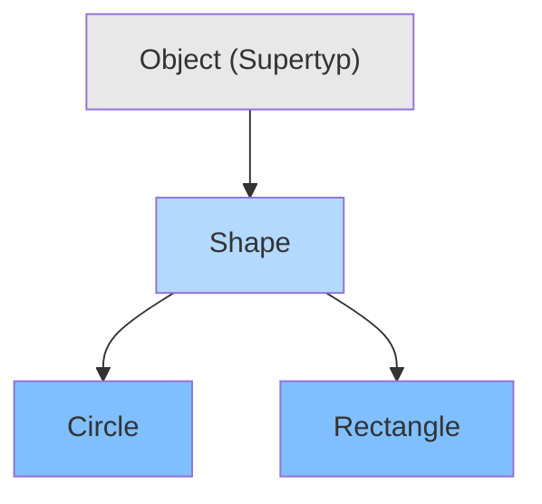
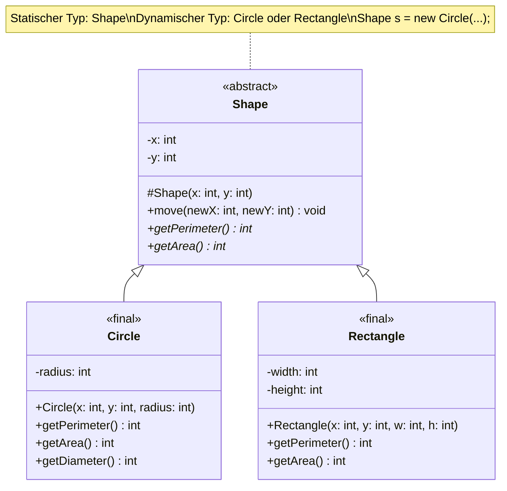
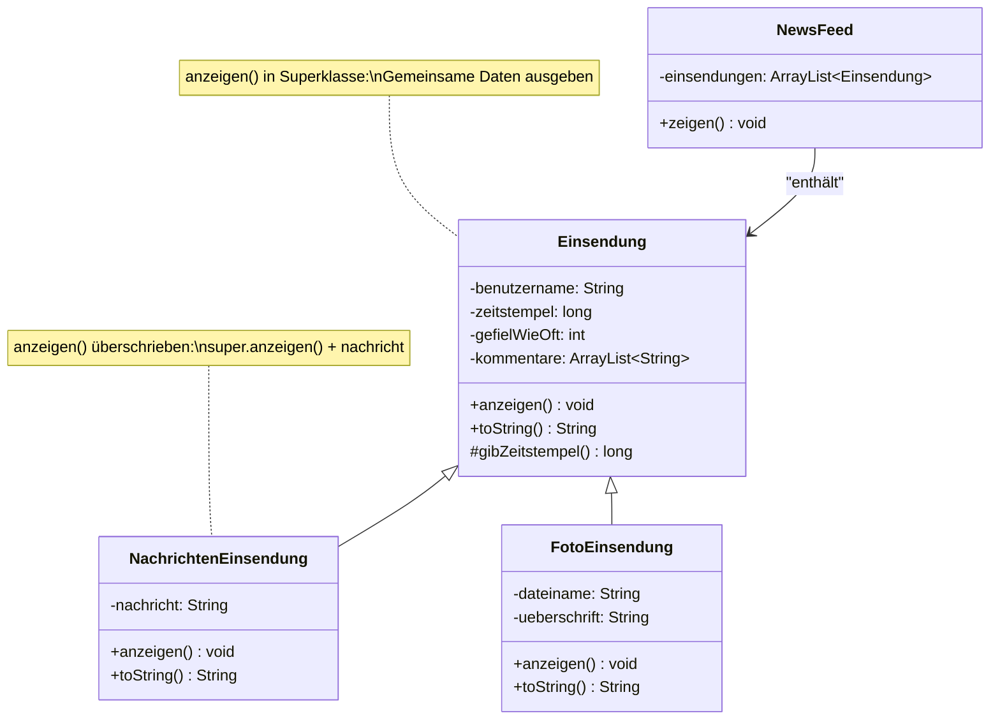
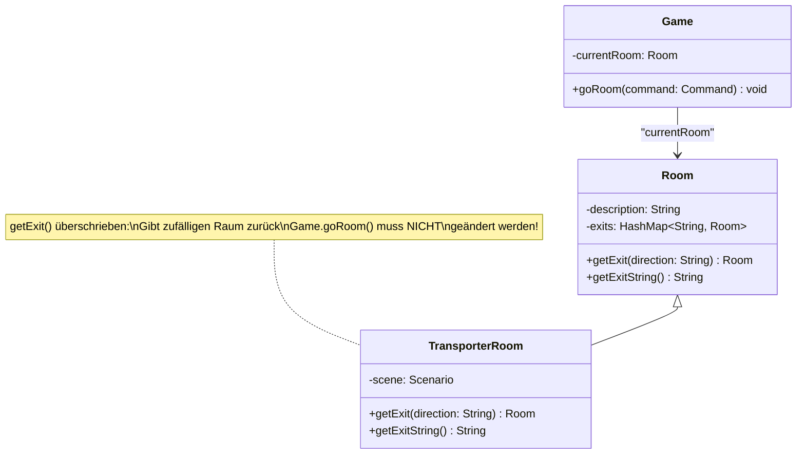
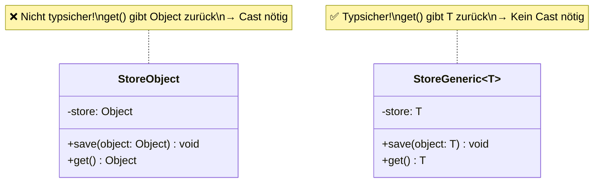

# 📘 OOP – SW06: Polymorphie & Unit Testing

> **Modul:** Objektorientierte Programmierung (OOP) · HSLU  
> **Woche:** SW06 – KW13  
> **Themen:** Polymorphie (O08), Unit Testing (E02), Fehler vermeiden (Kapitel 9), Mehr über Vererbung (Kapitel 11)  
> **Quellen:** `O08_IP_Polymorphie.pdf`, `E02_IP_UnitTesting.pdf`, `U06_EX_PolymorphieUnitTesting.pdf`, `Kapitel 09 - Fehler vermeiden.pdf`, `Kapitel 11 - Mehr ueber Vererbung.pdf`, `OFWJ-chapter09.zip`, `OFWJ-chapter11.zip` (+ Solutions)

---

## 🎯 Lernziele

### Aus O08 – Polymorphie
- Den Begriff **Polymorphismus** anhand von Beispielen erklären können
- Die Technik des **Überladens** (overloading) und des **Überschreibens** (overriding) von Methoden kennen und unterscheiden
- Mit dem Konzept des **Subtyping** vertraut sein
- Zwischen **statischem** und **dynamischem** Typ unterscheiden können
- **Generisch implementierte Klassen** (Generics) nutzen können

### Aus E02 – Unit Testing
- Motivation, Sinn und Zweck des **Testens** kennen
- Wissen, was man mit Tests erreichen kann und was **nicht** (Aussagekraft)
- Verschiedene grundlegende **Testarten** und **-verfahren** kennen
- In der IDE einfache und gute **Unit Tests** basierend auf **JUnit 6** implementieren und anwenden
- Die Vorteile von **Test First** kennen

### Aus Kapitel 9 – Fehler vermeiden
- **Modultests** (Unit Tests) verstehen und automatisieren
- **Regressionstests** mit JUnit durchführen
- **Debugging-Techniken** anwenden: manuelle Ausführung, print-Anweisungen, Debugger
- **Positives** und **negatives** Testen unterscheiden

### Aus Kapitel 11 – Mehr über Vererbung
- **Statischen** und **dynamischen** Typ unterscheiden
- **Dynamische Methodensuche** (method lookup) verstehen
- Methoden mit `super`-Aufrufen **überschreiben**
- `toString()`, `equals()`, `hashCode()` korrekt implementieren
- Den **`protected`**-Zugriffsmodifikator verstehen und anwenden
- Den **`instanceof`**-Operator kennen

---

## 📖 Wichtigste Begriffe

| Begriff (DE) | Begriff (EN) | Definition |
|---|---|---|
| **Polymorphie** | Polymorphism | Vielgestaltigkeit – eines der vier OOP-Grundprinzipien. Objekte verschiedener Typen reagieren unterschiedlich auf dieselbe Nachricht. |
| **Überladen** | Overloading | Mehrere Methoden **gleichen Namens** in einer Klasse mit **unterschiedlichen Parameterlisten**. Compile-Time-Polymorphie. |
| **Überschreiben** | Overriding | Methode der Superklasse wird in Subklasse **mit identischer Signatur** neu implementiert. Runtime-Polymorphie. |
| **Statischer Typ** | Static Type | Der **deklarierte** Typ einer Variable im Quelltext. Wird zur **Compile-Zeit** geprüft. |
| **Dynamischer Typ** | Dynamic Type | Der **tatsächliche** Typ des Objekts, auf das eine Variable zur **Laufzeit** verweist. |
| **Subtyping** | Subtyping | Typ einer Subklasse ist Subtyp des Superklassentyps → Objekte der Subklasse können an Supertyp-Stellen verwendet werden. |
| **Upcasting** | Upcasting | Cast vom Subtyp zum Supertyp (automatisch, implizit, immer sicher). |
| **Downcasting** | Downcasting | Cast vom Supertyp zum Subtyp (explizit, kann `ClassCastException` auslösen). |
| **Generics** | Generics | Mit Typ parametrisierbare Klassen/Interfaces. Typsicherheit ohne Object+Cast. `<T>` |
| **Diamond-Operator** | Diamond Operator | `<>` – lässt den Typ beim Konstruktor weg, Compiler leitet ihn ab. |
| **Signatur** | Signature | Name einer Methode + Parameterliste (Typen und Reihenfolge, ohne Namen). |
| **`@Override`** | Override Annotation | Optionale, aber empfohlene Annotation, die dem Compiler signalisiert, dass eine Methode bewusst überschrieben wird. |
| **`instanceof`** | instanceof | Operator zur Prüfung des dynamischen Typs: `obj instanceof Klasse`. |
| **Dynamische Methodensuche** | Method Lookup / Dispatch | Mechanismus, der zur Laufzeit die richtige Methode basierend auf dem dynamischen Typ findet. |
| **Methodenpolymorphie** | Method Polymorphism | Derselbe Methodenaufruf führt je nach dynamischem Typ zu verschiedenen Implementierungen. |
| **Unit Test** | Unit Test | Automatisierter Test einer einzelnen Methode/Klasse (einer «Einheit»). |
| **JUnit** | JUnit | Populärstes Test-Framework für Java (aktuell: JUnit 6 Jupiter). |
| **Assertion** | Assertion/Zusicherung | Prüfung eines erwarteten Werts gegen den tatsächlichen Wert (`assertEquals`, `assertTrue`, ...). |
| **Regressionstest** | Regression Test | Wiederholung bereits erfolgreicher Tests nach Codeänderungen. |
| **Test First** | Test First / TDD | Testfälle **vor** der Implementation schreiben (aus XP). |
| **Code Coverage** | Code Coverage | Metrik: Welcher Anteil des Codes wurde durch Tests ausgeführt? |
| **Testgerüst** | Test Fixture | Vordefinierte Menge von Testobjekten als Grundlage für Tests. |
| **`protected`** | protected | Zugriffsstufe: sichtbar für die Klasse selbst und alle (direkten/indirekten) Subklassen. |
| **Referenzgleichheit** | Reference Equality | `==` prüft, ob zwei Variablen auf **dasselbe** Objekt zeigen. |
| **Inhaltsgleichheit** | Content Equality | `equals()` prüft, ob zwei Objekte inhaltlich gleich sind (überschreibbar). |

---

## 📐 Konzepte & Prinzipien

### 1. Polymorphie – Überblick

Polymorphie = **Vielgestaltigkeit** – ein zentrales OOP-Prinzip. Es gibt drei Ausprägungen:

| Art | Mechanismus | Zeitpunkt | Beispiel |
|---|---|---|---|
| **Überladen** (Overloading) | Gleicher Methodenname, unterschiedliche Parameter | Compile-Zeit | `max(int, int)` / `max(float, float)` |
| **Überschreiben** (Overriding) | Gleiche Signatur, andere Implementation in Subklasse | Laufzeit | `toString()` in eigener Klasse |
| **Generics** | Typ-Parameterisierung | Compile-Zeit | `StoreGeneric<Temperatur>` |

> 💡 **Zusammenhang mit den 4 OOP-Grundprinzipien:** Polymorphie ermöglicht flexibleren Code, weniger Verzweigungen und leichtere Erweiterbarkeit. Sie baut direkt auf **Vererbung** (Overriding, Subtyping) und **Abstraktion** (gleiche Schnittstelle, verschiedene Implementierungen) auf. **Kapselung** bleibt gewahrt, weil der Aufrufer den dynamischen Typ nicht kennen muss.

---

### 2. Überladen (Overloading) von Methoden

**Definition:** Mehrere Methoden mit **gleichem Namen** aber **unterschiedlicher Parameterliste** (Signatur) in derselben Klasse.

**Regeln:**
- Die **Signatur** besteht aus: Methodenname + Anzahl, Typen und Reihenfolge der Parameter
- Der **Rückgabetyp** gehört **NICHT** zur Signatur!
- Der Compiler wählt die Methode anhand der Argumente aus (Compile-Zeit)

**Empfehlungen laut O08:**
- Möglichst **klar unterscheidbare** Signaturen wählen
- Nicht zu viele Parameter
- Bei unterschiedlicher Parameterzahl: Die eigentliche Implementation in der Methode mit **maximaler Parameterzahl** → kürzere Methoden rufen mit Defaultwerten auf → **keine Coderedundanz!**

**Schlechtes Beispiel:**
```java
// ❌ Schwer unterscheidbar: int und long sind ähnlich
foo(int a, int b) { … }
foo(long a, int b) { … }
```

---

### 3. Überladen von Konstruktoren

Identisch wie bei Methoden, aber: Aufruf eines anderen Konstruktors der **gleichen Klasse** erfolgt mit **`this(...)`**, nicht mit dem Klassennamen.

```java
public class Person {
    public Person(final int id, final String name) {
        // Haupt-Konstruktor mit maximaler Parameterzahl
        this.id = id;
        this.name = name;
    }

    public Person(final int id) {
        this(id, "unbekannt"); // Aufruf des Haupt-Konstruktors mit Default-Wert
    }
}
```

> ⚠️ **Prüfungsrelevant:** `this(...)` für Konstruktor-Überladung in **derselben** Klasse, `super(...)` für den Konstruktor der **Superklasse**!

---

### 4. Überschreiben (Overriding) von Methoden

**Definition:** Eine Methode der Superklasse wird in der Subklasse mit **identischer Signatur** (identischem Header) **neu implementiert**.

**Kontext:** Immer bei Vererbung oder Interface-Implementation.

**Regeln:**
- `final`-Methoden können **nicht** überschrieben werden
- `@Override`-Annotation ist optional, aber **dringend empfohlen** (Compiler-Check!)
- Über `super.methode(…)` kann die Implementation der Superklasse aufgerufen werden
- Konstruktoren können **NICHT** überschrieben werden (unterschiedliche Klassennamen → unterschiedliche Signaturen)

**Wichtig – `super(...)` bei Konstruktoren:**
- Musste bis Java 21 **zwingend erstes Statement** sein
- Seit **Java 25**: «Flexible Constructor Bodies» erlauben Ausnahmen (Prologue vor super)
- Fehlt das `super()`-Statement, versucht der Compiler es **automatisch einzufügen** → nur wenn die Superklasse einen Default-Konstruktor hat

---

### 5. Statischer und Dynamischer Typ

| Eigenschaft | Statischer Typ | Dynamischer Typ |
|---|---|---|
| **Definition** | Deklarierter Typ der Variable | Tatsächlicher Typ des Objekts zur Laufzeit |
| **Festlegung** | Im Quelltext (Compile-Zeit) | Durch Zuweisung (Laufzeit) |
| **Prüfung durch** | Compiler | JVM |
| **Relevant für** | Typüberprüfung, verfügbare Methoden | Methodensuche (welche Methode wird ausgeführt) |

```java
Object object = new Circle(); // Statischer Typ: Object, Dynamischer Typ: Circle
Shape shape = new Rectangle(…); // Statischer Typ: Shape, Dynamischer Typ: Rectangle
```

> 🔑 **Kernregel:** Die **Typüberprüfung** berücksichtigt den **statischen Typ**, aber zur **Laufzeit** werden die Methoden des **dynamischen Typs** ausgeführt!

---

### 6. Upcasting und Downcasting



| Casting-Art | Richtung | Syntax | Sicherheit |
|---|---|---|---|
| **Upcasting** | Subtyp → Supertyp ↑ | Automatisch/implizit | ✅ Immer sicher |
| **Downcasting** | Supertyp → Subtyp ↓ | Explizit: `(Typ) variable` | ⚠️ Kann `ClassCastException` auslösen |

```java
// Upcasting – automatisch, implizit
Shape shape1 = new Rectangle(…);            // ✅ Immer OK
Shape shape2 = (Shape) new Rectangle(…);     // ✅ Explizit, aber unnötig

// Gegeben: Object object = new Rectangle(…);
// Downcasting – muss explizit sein
Shape shape = (Shape) object;       // ✅ OK (Rectangle ist ein Shape)
Rectangle rect = (Rectangle) object; // ✅ OK (dynamischer Typ ist Rectangle)
Circle circle = (Circle) object;     // ❌ ClassCastException! (Rectangle ist kein Circle)

// Sicher dowcasten mit instanceof
if (object instanceof Circle) {
    Circle c = (Circle) object;
    // c sicher verwenden
}
```

---

### 7. Dynamische Methodensuche (Method Lookup)

Die JVM sucht die Methode **vom dynamischen Typ aufwärts** durch die Vererbungshierarchie:

1. Auf die Variable zugreifen
2. Das referenzierte Objekt finden
3. Die Klasse des Objekts ermitteln (dynamischer Typ)
4. In dieser Klasse nach der Methode suchen
5. Wenn nicht gefunden → Superklasse durchsuchen → weiter bis `Object`
6. Erste gefundene Methode wird ausgeführt

> ⚠️ **Überschreibende Methoden in Subklassen haben Vorrang!** Da die Suche beim dynamischen Typ (unten) startet, wird die spezialisierte Version zuerst gefunden.

```java
// Beispiel: shape1 ist statisch Shape, dynamisch Circle
Shape shape1 = new Circle(…);
shape1.toString(); // → Sucht in Circle, dann Shape, dann Object
                   // → Findet toString() in Circle (falls überschrieben)
```

---

### 8. `super`-Aufrufe in Methoden

Im Gegensatz zu `super()` in Konstruktoren:
- Der **Methodenname** muss explizit genannt werden: `super.methodenName(parameter)`
- Der Aufruf kann an **jeder beliebigen Stelle** in der Methode erfolgen (nicht nur erste Zeile)
- Der Aufruf ist **optional** – ohne `super`-Aufruf wird die Superklassen-Version **komplett verdeckt**

```java
// Subklasse NachrichtenEinsendung überschreibt anzeigen()
@Override
public void anzeigen() {
    super.anzeigen(); // Zuerst gemeinsame Daten aus Superklasse ausgeben
    System.out.println(this.nachricht); // Dann spezifische Daten
}
```

---

### 9. Generics (Parametrisierte Klassen)

**Problem:** Ohne Generics müsste man entweder:
- Für jeden Typ eine eigene Speicher-Klasse schreiben (Code-Redundanz!)
- `Object` als universellen Typ verwenden (unsicher, Downcasting nötig!)

**Lösung:** Generics – Klassen werden mit Typ parametrisiert:

```java
// Generische Klasse – T ist der Typ-Parameter
public final class StoreGeneric<T> {
    private T store;
    
    public void save(final T object) {
        this.store = object;
    }
    
    public T get() {
        return this.store;
    }
}

// Verwendung – Typ wird beim Einsatz festgelegt
StoreGeneric<Temperatur> tempStore = new StoreGeneric<>(); // Diamond-Operator <>
tempStore.save(new Temperatur(…));
Temperatur t = tempStore.get(); // Kein Cast nötig! Typsicher!
```

> 💡 **Tipp zum Verständnis:** Stell dir ein «Search & Replace» vor – ersetze `T` durch den konkreten Typ (z.B. `Temperatur`).

---

### 10. `toString()` – String-Repräsentation von Objekten

Jede Klasse erbt von `Object` die Methode `String toString()`. Die Default-Implementation gibt nur Klassenname + Hashcode aus → **sinnlos**.

**Best Practice:** `toString()` in jeder Klasse überschreiben!

```java
@Override
public String toString() {
    return "Temperatur[kelvin=" + this.kelvin + "]";
}
```

**Besonderheit bei `System.out.println()`:** Wenn das Argument kein String ist, wird automatisch `toString()` aufgerufen:
```java
System.out.println(einsendung);          // Ruft automatisch toString() auf
System.out.println(einsendung.toString()); // Identisch, aber redundant
```

---

### 11. `equals()` und `hashCode()` korrekt überschreiben

**Referenzgleichheit** vs. **Inhaltsgleichheit:**

| Vergleich | Operator/Methode | Prüft |
|---|---|---|
| Referenzgleichheit | `==` | Zeigen beide Variablen auf **dasselbe** Objekt? |
| Inhaltsgleichheit | `.equals()` | Sind zwei Objekte **inhaltlich** gleich? |

```java
@Override
public boolean equals(Object obj) {
    if (this == obj) {
        return true; // Referenzgleichheit → immer inhaltlich gleich
    }
    if (!(obj instanceof Student)) {
        return false; // Unterschiedlicher Typ → nicht gleich
    }
    Student anderer = (Student) obj; // Downcasting
    return name.equals(anderer.name) &&
           matrikelnummer.equals(anderer.matrikelnummer) &&
           scheine == anderer.scheine;
}
```

**Regel:** Wer `equals()` überschreibt, **MUSS** auch `hashCode()` überschreiben!
```java
@Override
public int hashCode() {
    int ergebnis = 17;
    ergebnis = 37 * ergebnis + zaehler;
    ergebnis = 37 * ergebnis + name.hashCode();
    return ergebnis;
}
```

---

### 12. `protected` – Zugriffsstufe zwischen `private` und `public`

| Zugriff von | `private` | `protected` | `public` |
|---|---|---|---|
| **Eigene Klasse** | ✅ | ✅ | ✅ |
| **Subklassen** | ❌ | ✅ | ✅ |
| **Andere Klassen** | ❌ | ❌ | ✅ |

**Empfehlung:** Datenfelder **nie** `protected` machen (schwächt Kapselung). Stattdessen `protected` **Getter/Setter** verwenden!

---

### 13. Unit Testing – Fundamentale Grundlagen

#### Warum testen?
- **Qualität** = Übereinstimmung mit Anforderungen + Einhaltung von Qualitätskriterien
- **Automatisiertes** Testen spart langfristig enorm viel Zeit
- Tests sind das **Sicherheitsnetz** für Refactoring!

#### Testarten

| Testart | Was wird getestet? | Umfang |
|---|---|---|
| **Unit Test** | Einzelne Methode/Klasse | Klein, schnell, automatisierbar |
| **Integrationstest** | Mehrere Klassen im Zusammenspiel | Aufwändiger |
| **Systemtest** | Gesamtes System | Klassisches Testen, erst spät möglich |
| **Blackbox-Test** | Test ohne Kenntnis der Implementation | Nur Schnittstelle |
| **Whitebox-Test** | Test mit Kenntnis der Implementation | Innere Struktur bekannt |

#### Positives vs. Negatives Testen

| Art | Beschreibung | Beispiel |
|---|---|---|
| **Positiv** | Testen, ob erwartete Funktionen korrekt arbeiten | Gültige Bewertung hinzufügen → `true` |
| **Negativ** | Testen, ob fehlerhafte Eingaben kontrolliert abgefangen werden | Ungültige Bewertung → `false` |

> ⚠️ **Häufiger Anfängerfehler:** Nur positive Tests! Negatives Testen ist **genauso wichtig!**

#### Testdaten-Auswahl (Celsius → Kelvin Beispiel)

| Kategorie | Eingabe | Erwartung |
|---|---|---|
| **Normalfall** | 20.0f | 293.15f |
| **Normalfall** | 0.0f | 273.15f |
| **Normalfall** | -10.0f | 263.15f |
| **Sonderfall** (zulässig) | -273.15f | 0.0f |
| **Ausnahmefall** | -273.16f | Fehler (unzulässig) |
| **Ausnahmefall** | Float.MAX_VALUE | Bereichsüberlauf |

---

### 14. JUnit 6 (Jupiter) – Framework

#### F.I.R.S.T. Prinzipien für gute Tests

| Buchstabe | Prinzip | Bedeutung |
|---|---|---|
| **F** | Fast | Tests sollen schnell sein |
| **I** | Independent | Tests sind voneinander unabhängig |
| **R** | Repeatable | In jeder Umgebung lauffähig |
| **S** | Self-Validating | Automatische Verifikation (Assert) |
| **T** | Timely | Tests rechtzeitig schreiben – **vor** dem Code! |

#### Triple-A-Pattern (Arrange, Act, Assert)

```java
@Test
void testGetQuadrantInOne() {
    // Arrange – Testobjekte erstellen
    final Point point = new Point(4, 5);
    
    // Act – Methode aufrufen
    final int quadrant = point.getQuadrant();
    
    // Assert – Ergebnis prüfen
    assertEquals(1, quadrant);
}
```

---

### 15. Test First Methodik

1. **Schnittstelle** (Interface/Methodenkopf) definieren
2. **Testfälle** schreiben (mit JUnit) – Tests failen zunächst!
3. **Schrittweise** implementieren – Tests werden «grüner»
4. Bei neuentdeckten Sonderfällen: **Erst Testfall schreiben, dann implementieren!**

> 💡 **Vorteile:** Man denkt beim Schreiben der Tests unmittelbar an die Implementation, Sonderfälle fallen einem auf, und kaum ist die Klasse fertig, kann sie sofort getestet werden.

---

## ☕ Java-Syntax & Sprachkonstrukte

### Übersicht aller relevanten Elemente

| Element | Kontext | Beispiel |
|---|---|---|
| `@Override` | Annotation zum Überschreiben | `@Override public String toString()` |
| `@Test` | JUnit: Markiert Testmethode | `@Test void testAdd()` |
| `@Disabled` | JUnit: Test temporär deaktiviert | `@Test @Disabled("TODO") void test()` |
| `@BeforeEach` | JUnit: Vor jedem Test ausführen | `@BeforeEach void setUp()` |
| `@BeforeAll` | JUnit: Einmal vor allen Tests (statisch) | `@BeforeAll static void init()` |
| `@AfterEach` | JUnit: Nach jedem Test | `@AfterEach void tearDown()` |
| `super(...)` | Konstruktor der Superklasse aufrufen | `super(name);` |
| `super.method()` | Überschriebene Methode der Superklasse aufrufen | `super.anzeigen();` |
| `this(...)` | Überladenen Konstruktor der eigenen Klasse aufrufen | `this(id, "default");` |
| `instanceof` | Dynamischen Typ prüfen | `if (obj instanceof Circle)` |
| `(Type)` | Expliziter Cast (Downcasting) | `Circle c = (Circle) shape;` |
| `<T>` | Generics – Typ-Parameter | `class Store<T> { T value; }` |
| `<>` | Diamond-Operator | `new ArrayList<>()` |
| `protected` | Zugriff für Subklassen | `protected String getName()` |
| `assertEquals(...)` | JUnit: Wert-Vergleich | `assertEquals(42, result)` |
| `assertTrue(...)` | JUnit: Boolean-Prüfung | `assertTrue(list.isEmpty())` |
| `assertFalse(...)` | JUnit: Boolean-Prüfung (false) | `assertFalse(result)` |
| `assertNull(...)` | JUnit: Null-Prüfung | `assertNull(store.get())` |
| `assertNotNull(...)` | JUnit: Nicht-Null-Prüfung | `assertNotNull(obj)` |
| `assertThrows(...)` | JUnit: Exception erwarten | `assertThrows(IAE.class, () -> …)` |

### JUnit-Import und Namenskonventionen

```java
// Import für JUnit 6 (Jupiter)
import org.junit.jupiter.api.Test;
import org.junit.jupiter.api.BeforeEach;
import static org.junit.jupiter.api.Assertions.*;

// ⚠️ NICHT JUnit 4: import org.junit.Test; (anderer Package!)
```

**Namenskonventionen:**
- Testklasse: `DemoTest` für Klasse `Demo` (Suffix `Test`)
- Testmethode: `testFoo()` oder `testFooWithNegativeInput()` (Prefix `test`)
- Testklassen liegen in `/src/test/java/` (nicht `/src/main/java/`!)
- Testmethoden haben **keine Parameter** und keinen Rückgabewert (`void`)

### Häufige Fehlerquellen

| Fehler | Ursache | Lösung |
|---|---|---|
| Overloading statt Overriding | Parameter unterschiedlich → neue Methode statt Override | `@Override` verwenden → Compiler prüft! |
| `ClassCastException` | Falscher Downcast zur Laufzeit | `instanceof` vor Cast prüfen |
| `NullPointerException` | Objekt nicht initialisiert | Datenfelder im Konstruktor initialisieren |
| `foo(int a, int b)` vs. `foo(long a, int b)` | Schlechte Überladung, schwer unterscheidbar | Klar unterscheidbare Signaturen wählen |
| JUnit 4 statt JUnit 6 Import | Verwechslung der Paketnamen | `org.junit.jupiter.api.*` verwenden |
| Alle Asserts in einer Testmethode | Erster Fehler stoppt die Methode | Viele kleine Testmethoden schreiben |
| `equals()` ohne `hashCode()` | Vertrag gebrochen → HashMap/HashSet funktioniert nicht | Beide immer zusammen überschreiben |
| `toString()` nicht überschrieben | Nur `Klasse@Hashcode` statt sinnvoller Ausgabe | In jeder Klasse `toString()` überschreiben |

---

## 📊 Vergleiche & Klassifizierungen

### Overloading vs. Overriding

| Aspekt | Überladen (Overloading) | Überschreiben (Overriding) |
|---|---|---|
| **Wo?** | Innerhalb **einer** Klasse | Zwischen **Super-** und **Subklasse** |
| **Name** | Gleich | Gleich |
| **Parameter** | **Unterschiedlich** (verschiedene Signatur) | **Identisch** (gleiche Signatur) |
| **Rückgabetyp** | Darf beliebig sein | Muss gleich/kovariant sein |
| **Zeitpunkt** | **Compile-Zeit** (statische Bindung) | **Laufzeit** (dynamische Bindung) |
| **Annotation** | Keine | `@Override` empfohlen |
| **Schlüsselwort** | – | `super.methode()` für Superklasse |
| **Konstruktoren?** | ✅ Ja (`this(...)` zum Verketten) | ❌ Nein (unterschiedliche Namen) |

### Statischer vs. Dynamischer Typ

| Aspekt | Statischer Typ | Dynamischer Typ |
|---|---|---|
| **Festlegung** | Deklaration im Code | Zuweisung zur Laufzeit |
| **Änderbar?** | Nein (fix im Code) | Ja (durch neue Zuweisung) |
| **Compiler nutzt** | ✅ Für Typprüfung | ❌ |
| **JVM nutzt** | ❌ | ✅ Für Methodensuche |
| **Zugängliche Methoden** | Nur die des statischen Typs | Alle des dynamischen Typs (aber Compiler sieht sie nicht!) |

### Upcasting vs. Downcasting

| Aspekt | Upcasting | Downcasting |
|---|---|---|
| **Richtung** | Subtyp → Supertyp ↑ | Supertyp → Subtyp ↓ |
| **Syntax** | Implizit (automatisch) | Explizit `(Typ) variable` |
| **Sicherheit** | ✅ Immer sicher | ⚠️ Kann `ClassCastException` werfen |
| **Analogie primitiv** | `int → long` (implizit) | `long → int` (explizit, Genauigkeitsverlust) |
| **Prüfung** | Nicht nötig | Mit `instanceof` prüfen! |

### Store ohne vs. mit Generics

| Aspekt | `StoreObject` (ohne Generics) | `StoreGeneric<T>` (mit Generics) |
|---|---|---|
| **Typ bei save()** | `Object` – alles geht | `T` – nur parametrisierter Typ |
| **Typ bei get()** | `Object` – Cast nötig! | `T` – kein Cast nötig! |
| **Typsicherheit** | ❌ Fehler erst zur Laufzeit | ✅ Fehler zur Compile-Zeit |
| **Flexibilität** | ✅ Jedes Objekt | ✅ Jedes Objekt (pro Instanz) |

### Zugriffsmodifikatoren im Vergleich

| Modifikator | Eigene Klasse | Subklasse | Selbes Package | Andere Klassen |
|---|---|---|---|---|
| `private` | ✅ | ❌ | ❌ | ❌ |
| (default/package) | ✅ | ❌* | ✅ | ❌ |
| `protected` | ✅ | ✅ | ✅ | ❌ |
| `public` | ✅ | ✅ | ✅ | ✅ |

*Subklasse im selben Package: ✅

---

## 💻 Code-Beispiele (Java)

### Beispiel 1: Überladen von Methoden (Polymorphie)

```java
/**
 * Demonstration von Method Overloading.
 * Gleicher Methodenname, unterschiedliche Parameterlisten.
 */
public class MathUtils {
    
    // Überladung 1: max für int
    public int max(int a, int b) {
        return (a >= b) ? a : b;
    }
    
    // Überladung 2: max für float
    public float max(float a, float b) {
        return (a >= b) ? a : b;
    }
    
    // Überladung mit optionalem Parameter (Delegation an Haupt-Methode)
    private int count = 0;
    
    // Haupt-Methode mit maximaler Parameterzahl
    public int increment(int increment) {
        this.count += increment;
        return this.count;
    }
    
    // Überladung: Default-Inkrement = 1 → delegiert an Haupt-Methode
    public int increment() {
        return this.increment(1); // Keine Coderedundanz!
    }
}
```

---

### Beispiel 2: Überladen von Konstruktoren mit `this(...)`

```java
public class Point {
    private int x;
    private int y;
    
    // Haupt-Konstruktor
    public Point(final int x, final int y) {
        this.x = x;
        this.y = y;
    }
    
    // Copy-Konstruktor – delegiert an Haupt-Konstruktor
    public Point(final Point point) {
        this(point.getX(), point.getY()); // this(...) statt Coderedundanz!
    }
    
    // Default-Konstruktor – Punkt am Ursprung
    public Point() {
        this(0, 0); // Delegation an Haupt-Konstruktor
    }
    
    public int getX() { return this.x; }
    public int getY() { return this.y; }
}
```

---

### Beispiel 3: Überschreiben von `toString()` und `super`-Aufruf

```java
// Abstrakte Basisklasse
public abstract class Element {
    private final String name;
    private final String symbol;
    
    protected Element(final String name, final String symbol) {
        this.name = name;
        this.symbol = symbol;
    }
    
    // toString() überschreiben – sinnvolle String-Repräsentation
    @Override
    public String toString() {
        return "Element[name=" + this.name + ", symbol=" + this.symbol + "]";
    }
}

// Konkrete Subklasse mit erweitertem toString()
public final class Quecksilber extends Element {
    
    public Quecksilber() {
        super("Quecksilber", "Hg");
    }
    
    @Override
    public String toString() {
        // super.toString() aufrufen und erweitern → keine Coderedundanz!
        return super.toString() + " - ⚠️ GIFTIG!";
    }
}
```

---

### Beispiel 4: Subtyping, statischer/dynamischer Typ und Casting

```java
// Gegeben: Shape (abstrakt) ← Circle, Rectangle
public class SubtypingDemo {
    
    public static void main(String[] args) {
        // Subtyping: Shape-Variable hält Circle/Rectangle
        Shape shape1 = new Circle(0, 0, 5);     // Statisch: Shape, Dynamisch: Circle
        Shape shape2 = new Rectangle(0, 0, 3, 4); // Statisch: Shape, Dynamisch: Rectangle
        
        // Polymorphie: Gleicher Aufruf, verschiedene Ergebnisse
        System.out.println(shape1.getArea()); // → Circle.getArea()
        System.out.println(shape2.getArea()); // → Rectangle.getArea()
        
        // ❌ Fehler: shape1.getDiameter() → Compiler kennt nur Shape-Methoden!
        // shape1.getDiameter(); // Compilerfehler!
        
        // ✅ Lösung: Downcast mit instanceof-Prüfung
        if (shape1 instanceof Circle) {
            Circle circle = (Circle) shape1;
            System.out.println(circle.getDiameter()); // Jetzt OK!
        }
        
        // Upcasting – automatisch
        Object obj = shape1; // Circle → Shape → Object (alles implizit)
    }
}
```

---

### Beispiel 5: Generics verwenden

```java
// Generische Klasse (vereinfacht)
public final class StoreGeneric<T> {
    private T store;
    
    public void save(final T object) {
        this.store = object;
    }
    
    public T get() {
        return this.store;
    }
}

// Verwendung – typsicher und ohne Cast
public class GenericDemo {
    public static void main(String[] args) {
        // Store für Temperatur
        StoreGeneric<Temperatur> tempStore = new StoreGeneric<>();
        tempStore.save(new Temperatur(293.15f));
        Temperatur t = tempStore.get(); // Kein Cast nötig!
        
        // Store für String
        StoreGeneric<String> stringStore = new StoreGeneric<>();
        stringStore.save("Hallo Welt");
        String s = stringStore.get(); // Typsicher!
        
        // ❌ Compilerfehler: Falscher Typ
        // tempStore.save("Text"); // String ist keine Temperatur!
    }
}
```

---

### Beispiel 6: JUnit-Tests für Point-Klasse

```java
import org.junit.jupiter.api.Test;
import org.junit.jupiter.api.BeforeEach;
import static org.junit.jupiter.api.Assertions.*;

/**
 * Unit-Tests für die Klasse Point.
 * Demonstriert Triple-A-Pattern und assert*()-Methoden.
 */
class PointTest {
    
    private Point point;
    
    @BeforeEach
    void setUp() {
        point = new Point(4, 5); // Testgerüst (Fixture)
    }
    
    @Test
    void testGetQuadrantInOne() {
        // Arrange: point ist bei (4, 5) – 1. Quadrant
        // Act & Assert:
        assertEquals(1, point.getQuadrant());
    }
    
    @Test
    void testGetQuadrantInTwo() {
        Point p = new Point(-3, 5);
        assertEquals(2, p.getQuadrant());
    }
    
    @Test
    void testGetQuadrantOnAxis() {
        // Sonderfall: Punkt auf der Achse
        Point origin = new Point(0, 0);
        assertEquals(0, origin.getQuadrant()); // Oder definiertes Verhalten prüfen
    }
    
    @Test
    void testMoveRelativeWithInts() {
        point.moveRelative(1, -2);
        assertEquals(5, point.getX());
        assertEquals(3, point.getY());
    }
    
    @Test
    void testMoveRelativeWithPoint() {
        // Überladene Methode mit Point als Parameter
        Point vector = new Point(10, 20);
        point.moveRelative(vector);
        assertEquals(14, point.getX());
        assertEquals(25, point.getY());
    }
    
    @Test
    void testCopyConstructor() {
        Point copy = new Point(point); // Copy-Konstruktor
        assertEquals(point.getX(), copy.getX());
        assertEquals(point.getY(), copy.getY());
        assertNotSame(point, copy); // ≠ dasselbe Objekt!
    }
}
```

---

### Beispiel 7: Test-First mit Calculator (aus U06)

```java
// Schritt 1: Interface definieren
public interface Calculator {
    /**
     * Addiert zwei Summanden.
     * @param a erster Summand
     * @param b zweiter Summand
     * @return die Summe von a und b
     */
    int addition(int a, int b);
}
```

```java
// Schritt 2: Leere Implementation
public class CalculatorImpl implements Calculator {
    @Override
    public int addition(int a, int b) {
        return 0; // Noch nicht implementiert!
    }
}
```

```java
// Schritt 3: Tests ZUERST schreiben
import org.junit.jupiter.api.Test;
import static org.junit.jupiter.api.Assertions.*;

class CalculatorTest {
    
    // Polymorphie: Interface-Typ für die Variable!
    private final Calculator calc = new CalculatorImpl();
    
    @Test
    void testAdditionPositive() {
        assertEquals(5, calc.addition(2, 3));
    }
    
    @Test
    void testAdditionWithZero() {
        assertEquals(0, calc.addition(0, 0)); // Sonderfall: 0 + 0
        assertEquals(7, calc.addition(7, 0)); // Neutrales Element
    }
    
    @Test
    void testAdditionNegative() {
        assertEquals(-5, calc.addition(-2, -3));
    }
    
    @Test
    void testAdditionMixed() {
        assertEquals(1, calc.addition(-2, 3));
    }
    
    @Test
    void testAdditionOverflow() {
        // ⚠️ Ausnahmefall: Überlauf bei int!
        // Was passiert bei Integer.MAX_VALUE + 1?
        int result = calc.addition(Integer.MAX_VALUE, 1);
        // → Ergibt negativen Wert wegen Überlauf!
        // Je nach Spezifikation: Erwartung definieren
    }
}
```

```java
// Schritt 4: Implementation ergänzen
public class CalculatorImpl implements Calculator {
    @Override
    public int addition(int a, int b) {
        return a + b; // Korrekte Implementation
    }
}
```

> ⚠️ **Überraschung aus der Übung:** `Integer.MAX_VALUE + 1` ergibt einen Überlauf! Gute Tests decken solche Randfälle auf.

---

### Beispiel 8: TeleporterRoom – Elegante Lösung mit Polymorphie (Kap. 11)

```java
/**
 * Ein TransporterRoom "beamt" den Spieler in einen zufälligen Raum.
 * Elegante Lösung: Keine Änderung an Game oder Room nötig!
 * Die Methode getExit() wird überschrieben.
 */
public class TransporterRoom extends Room {
    private Scenario scene;
    
    public TransporterRoom(String description, Scenario scene) {
        super(description);
        this.scene = scene;
    }
    
    /**
     * Beschreibung der Ausgänge. Da dies ein Transporter-Raum ist,
     * sieht man keine klaren Ausgänge.
     */
    @Override
    public String getExitString() {
        return "You feel quite dizzy. Something is strange.\n" +
               "You cannot really see the exits...";
    }
    
    /**
     * Gibt einen zufälligen Raum zurück, unabhängig von der Richtung.
     * Der Spieler wird "teleportiert".
     */
    @Override
    public Room getExit(String direction) {
        return scene.getRandomRoom(); // Polymorphie in Aktion!
    }
}
```

> 🔑 **Design-Lektion:** Weder `Game` noch `Room` mussten geändert werden! Durch Vererbung und Überschreiben von `getExit()` funktioniert alles automatisch → **Open/Closed Principle**.

---

### Beispiel 9: `equals()` und `hashCode()` korrekt implementieren

```java
public class Student {
    private String name;
    private String matrikelnummer;
    private int scheine;
    
    @Override
    public boolean equals(Object obj) {
        // 1. Referenzgleichheit prüfen (Effizienz)
        if (this == obj) {
            return true;
        }
        // 2. Typprüfung mit instanceof
        if (!(obj instanceof Student)) {
            return false;
        }
        // 3. Downcast und Felder vergleichen
        Student anderer = (Student) obj;
        return name.equals(anderer.name) &&
               matrikelnummer.equals(anderer.matrikelnummer) &&
               scheine == anderer.scheine;
    }
    
    @Override
    public int hashCode() {
        int ergebnis = 17;
        ergebnis = 37 * ergebnis + name.hashCode();
        ergebnis = 37 * ergebnis + matrikelnummer.hashCode();
        ergebnis = 37 * ergebnis + scheine;
        return ergebnis;
    }
    
    // ⚠️ toString() auch gleich überschreiben!
    @Override
    public String toString() {
        return "Student[" + name + ", " + matrikelnummer + "]";
    }
}
```

---

## 📋 UML-Diagramme

### Polymorphie: Shape-Hierarchie mit Subtyping



### Netzwerk V3: Überschreiben von `anzeigen()` / `toString()`



### TeleporterRoom: Polymorphie ohne Codeanpassung



### Generics: StoreGeneric\<T\>



---

## ✏️ Übungsaufgaben-Zusammenfassung

### Teil 1: Polymorphie (U06, Aufgaben 1.3 a–l)

| Nr. | Thema / Konzept | Lösungsansatz | Stolpersteine |
|---|---|---|---|
| **a** | `moveRelative(int x, int y)` implementieren | `this.x += x; this.y += y;` | Keine – einfache Addition |
| **b** | `moveRelative(Point p)` überladen | Aufruf von `moveRelative(p.getX(), p.getY())` | Delegation statt Coderedundanz! |
| **c** | Überladung mit Polarkoordinaten `(double angle, double magnitude)` | Math.cos/sin verwenden | Schlechte Überladung? `(double, double)` ist nicht eindeutig genug! |
| **d** | Copy-Konstruktor `Point(Point point)` | `this(point.getX(), point.getY())` | `this(...)` verwenden, nicht `super()`! |
| **e** | Überschreibung in Element-Hierarchie studieren | Code aus SW05 reviewen | Abstrakte Methoden werden «überschrieben» (implementiert) |
| **f** | `toString()` in Element überschreiben | `@Override public String toString()` mit Elementinfos | API-Doku von `Object.toString()` lesen |
| **g** | `toString()` in Quecksilber mit «GIFTIG»-Hinweis | `super.toString() + " GIFTIG"` | `super.toString()` verwenden → keine Redundanz! |
| **h** | Shape-Variablen mit Circle/Rectangle zuweisen | `Shape s = new Circle(…);` | Funktioniert dank Subtyping (Upcasting) |
| **i** | `move(x,y)` über Shape-Variable aufrufen | Ja, `move()` ist auf Shape definiert | Nur Shape-Methoden sind sichtbar |
| **j** | `getDiameter()` über Shape-Variable aufrufen | Downcast nötig: `((Circle) shape).getDiameter()` | Compiler kennt nur statischen Typ! |
| **k** | Statischer vs. dynamischer Typ erklären | Statisch: Shape, Dynamisch: Circle | Kernkonzept – prüfungsrelevant! |
| **l** | Subtyping mit Interfaces (Switchable, Named) | `Switchable s = new Lamp();` | Funktioniert genau wie bei Klassen! |

### Teil 2: Unit Testing (U06, Aufgaben 2.3 a–e)

| Nr. | Thema / Konzept | Lösungsansatz | Stolpersteine |
|---|---|---|---|
| **a** | Einfache Funktion identifizieren (z.B. `max(x,y)`) | Klasse aus SW03 wiederverwenden | Trivialer Code → Fokus auf Testing |
| **b** | JUnit-Testcase generieren lassen | IDE generiert Codegerüst für Testklasse | Gerüst ist leer – muss ausgefüllt werden! |
| **c** | 3 Testfälle für `max(x,y)` | `a > b`, `a < b`, `a == b` | Nicht alle Asserts in eine Methode packen! |
| **d** | Tests in IDE ausführen, absichtlich scheitern lassen | Fehler in Impl einbauen → Failure studieren | Unterschied: Failure (Assertion) vs. Error (Exception) |
| **e** | Ab sofort fortlaufend Tests schreiben! | Für jede neue Methode: Tests → Test First | Investition zahlt sich mittelfristig aus |

### Teil 3: Test First mit Calculator (U06, Aufgaben 3.3 a–g)

| Nr. | Thema / Konzept | Lösungsansatz | Stolpersteine |
|---|---|---|---|
| **a** | Schnittstelle der `addition()`-Methode überlegen | `int addition(int a, int b)` | Rückgabetype und Parameter definieren |
| **b** | Java-Interface codieren | `interface Calculator { int addition(int a, int b); }` | JavaDoc-Dokumentation nicht vergessen! |
| **c** | Leere Implementation erstellen | `class CalculatorImpl implements Calculator` | Noch NICHT implementieren! |
| **d** | Testfälle schreiben (Test First!) | Normalfälle, Sonderfälle (0+0), Ausnahmefälle | Interface-Typ für Variable → Polymorphie! |
| **e** | Tests ausführen → alle rot | Erwartet! Implementation ist noch leer | Nicht frustrieren – das ist der Plan! |
| **f** | Schrittweise implementieren | Erst `return 0;`, dann `return a + b;` | Tests werden schrittweise grün |
| **g** | Vergleich mit anderen Studierenden | **Integer-Overflow testen!** | `Integer.MAX_VALUE + 1` → Negativer Wert! |

---

## ⚠️ Prüfungsrelevante Hinweise

### Typische Programmieraufgaben

1. **Methoden überladen** mit verschiedenen Parameterlisten und dabei Delegation verwenden (keine Coderedundanz!)
2. **toString() überschreiben** in einer Klassenhierarchie mit `super.toString()` + spezifische Daten
3. **Statischer/dynamischer Typ bestimmen** – welche Methode wird aufgerufen?
4. **Casting-Aufgaben** – welche Casts sind erlaubt, welche werfen Exceptions?
5. **JUnit-Tests schreiben** für eine gegebene Klasse (Triple-A-Pattern)
6. **equals()/hashCode()** korrekt implementieren

### Häufige Fehlerquellen und Fallstricke

- **`toString()` vergessen** → sinnlose Ausgabe `Klasse@HashCode` statt nützlicher Infos
- **`@Override` vergessen** → Methode wird nicht wirklich überschrieben (z.B. falscher Parametername)
- **Alles in einen Test packen** → Erster Fehler blockiert alle nachfolgenden Assertions
- **JUnit 4 statt JUnit 6 Import** → `@Test` aus falschem Package → Test läuft nicht
- **`equals()` ohne `hashCode()`** → HashMap und HashSet funktionieren nicht korrekt
- **Getter für Subklassen-spezifische Methoden** über Supertyp aufrufen → Compilerfehler (nur Methoden des statischen Typs sichtbar!)
- **Integer-Overflow** bei Additionen nicht beachten (Prüfungstrick!)

### Refactoring-Tipps

- **Überladene Methoden:** Delegation von einfachen zu komplexen Methoden → eine Implementation!
- **toString():** In jeder Klasse sinnvoll überschreiben → erleichtert Debugging und Logging
- **Object-Typ ersetzen durch Generics** → Typ-Sicherheit ohne Casts
- **instanceof + Cast** → Hinweis auf fehlendes Polymorphie-Design. Besser: Methode in Superklasse definieren und in Subklassen überschreiben!
- **Test First** → Tests als «Spezifikation» verstehen, nicht als nachträgliche Pflichterfüllung

### Design-Patterns und Best Practices

- **Triple-A-Pattern** (Arrange-Act-Assert) für jeden Testfall
- **F.I.R.S.T.-Prinzipien** für gute Unit Tests
- **Open/Closed Principle** (am TransporterRoom-Beispiel): Neues Verhalten durch neue Klassen hinzufügen statt bestehende zu ändern
- **Favor Composition over Inheritance** (FCoI) → im Zweifelsfall Komposition (Wiederholung SW05)
- **Testgerüst** (Test Fixture) mit `@BeforeEach` für gemeinsame Setup-Logik

### Wichtige Klassen aus der Java-Standardbibliothek

| Klasse / Interface | Package | Relevanz für SW06 |
|---|---|---|
| `Object` | `java.lang` | `toString()`, `equals()`, `hashCode()` |
| `String` | `java.lang` | `equals()` statt `==` für Vergleich! |
| `ArrayList<E>` | `java.util` | Generische Sammlung – Typparameter `<E>` |
| `HashMap<K,V>` | `java.util` | Generisch – benötigt korrektes `equals()`/`hashCode()` |
| `Assertions` | `org.junit.jupiter.api` | `assertEquals()`, `assertTrue()`, `assertThrows()` etc. |
| `@Test` | `org.junit.jupiter.api` | Markiert eine Testmethode |

---

## 🔗 Verbindung zu vorherigen/folgenden Wochen

### Rückbezug auf vorherige Wochen

| Woche | Konzept | Bezug zu SW06 |
|---|---|---|
| **SW01–02** | Objekte, Klassen, Methoden | Grundlage für alles – Methoden werden jetzt überladen/überschrieben |
| **SW03** | Sammlungen, ArrayList, Schleifen | ArrayList wird jetzt generisch (`<T>`) verwendet; `max()`-Funktion für Testing |
| **SW04** | Interfaces, Datenkapselung | Interfaces + Subtyping = Polymorphie; Point-Klasse wird erweitert |
| **SW05** | Vererbung, `extends`, `super()`, Subtyping | **Direkter Aufbau:** Überschreiben, dynamische Methodensuche, protected |

### Vorausschau auf kommende Wochen

| Woche | Thema | Verbindung |
|---|---|---|
| **SW07** | Vererbung (vertieft) | Vertiefung von Vererbungshierarchien, mehr Überschreiben |
| **SW08** | Polymorphismus (vertieft) | Dynamische Typen, polymorphe Methodenaufrufe – baut direkt auf SW06 auf |
| **SW09** | Abstrakte Klassen & Interfaces | Abstrakte Methoden erzwingen Überschreiben; Generics + Interfaces |
| **SW10** | Fehlerbehandlung (Exceptions) | `assertThrows()` in JUnit; try-catch als Alternative zu Rückgabewerten |
| **SW11** | Generics & Collections | Generics werden vertieft, eigene generische Klassen schreiben |
| **SW12** | Entwurfsmuster | Observer/Strategy nutzen Polymorphie intensiv |

> 🔑 **SW06 ist die Brücke:** Von der grundlegenden Vererbung (SW05) hin zur **vollen Nutzung** von Polymorphie in den Folgewochen. Überladen, Überschreiben, Subtyping und dynamische Methodensuche sind **zentrale Konzepte**, die ab jetzt ständig gebraucht werden!

> 💡 **Unit Testing** begleitet ab hier jede Übung – ab SW06 werden Tests erwartet und in der MEP bewertet!
