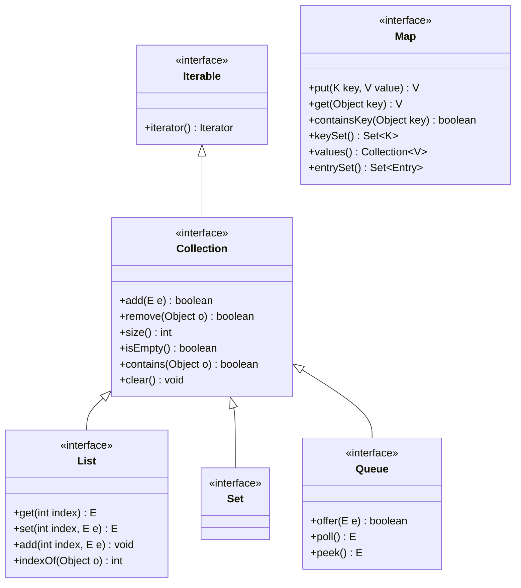
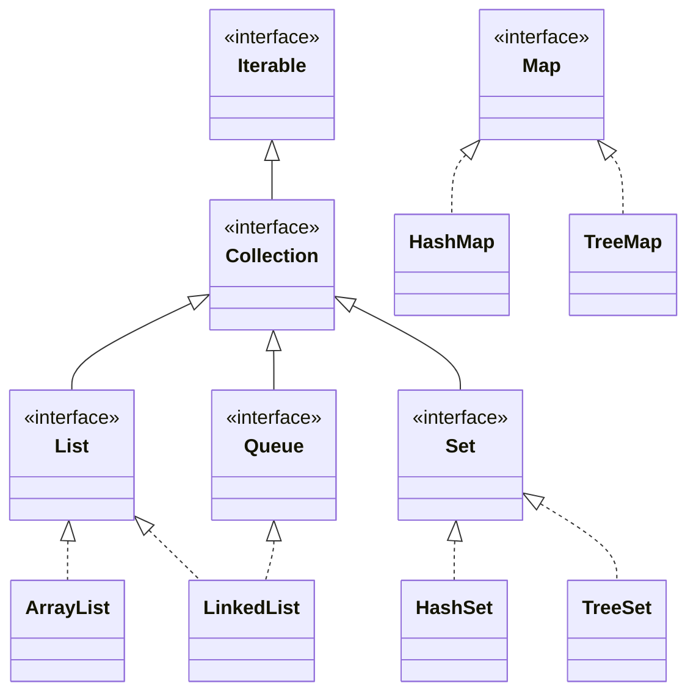

# 📘 OOP – SW07: Collections & Equals / Compare

> **Modul:** Objektorientierte Programmierung (OOP) · HSLU
> **Woche:** SW07 – KW14
> **Themen:** Collections (D01, Kapitel 4 + 6), Equals / Hashcode / Compare (O09)
> **Quellen:** `D01_IP_Collections.pdf`, `O09_IP_Equals_Compare.pdf`, Buch Kapitel 4 (Sammlungen von Objekten) + 6 (Bessere Struktur mit Map, Set & Co.)
> **Praktikum:** Equals / Hashcode / Compare (K1)
> **Prüfungen:** Test 1, Bilat 1

---

## 🎯 Lernziele

### Aus D01 – Collections
- Den Unterschied zwischen **Arrays** und **Collections** kennen
- Das **Java Collections Framework** (JCF) und seine Hierarchie verstehen
- Die wichtigsten Interfaces kennen: `Collection`, `List`, `Set`, `Map`, `Queue`
- Konkrete Implementierungen auswählen können: `ArrayList`, `LinkedList`, `HashSet`, `TreeSet`, `HashMap`, `TreeMap`
- Die **`for-each`-Schleife** (Enhanced for-Loop) und **Iteratoren** korrekt verwenden
- Generics (`<E>`, `<K, V>`) in Collections anwenden können
- Wrapper-Klassen und **Autoboxing/Unboxing** verstehen

### Aus O09 – Equals / Compare
- Die Methode `equals()` korrekt überschreiben können
- Den **Vertrag von `equals()`** kennen (reflexiv, symmetrisch, transitiv, konsistent, null)
- Den Zusammenhang zwischen `equals()` und `hashCode()` verstehen
- `hashCode()` korrekt überschreiben können
- Das Interface `Comparable<T>` implementieren können (natürliche Ordnung)
- Das Interface `Comparator<T>` als externe Ordnung einsetzen können
- Den Unterschied zwischen `Comparable` und `Comparator` kennen

---

## 📖 Wichtigste Begriffe

| Begriff | Definition |
|---|---|
| **Collection** | Oberbegriff für Datenstrukturen, die eine Gruppe von Objekten speichern und verwalten (im Gegensatz zu Arrays: dynamische Grösse, nur Objekte) |
| **List** | Geordnete Sammlung mit Index-Zugriff. Duplikate erlaubt. (z.B. `ArrayList`, `LinkedList`) |
| **Set** | Ungeordnete Sammlung **ohne Duplikate**. (z.B. `HashSet`, `TreeSet`) |
| **Map** | Speichert **Schlüssel-Wert-Paare** (Key-Value). Kein Duplikat bei Schlüsseln. (z.B. `HashMap`, `TreeMap`) |
| **Queue** | FIFO-Prinzip (First In, First Out). (z.B. `LinkedList`, `PriorityQueue`) |
| **Iterator** | Objekt zum sequentiellen Durchlaufen einer Collection. Methoden: `hasNext()`, `next()`, `remove()` |
| **Generics** | Typparameter (`<E>`, `<K, V>`), die Collections typsicher machen. Vermeidet Casts und Laufzeitfehler |
| **Autoboxing** | Automatische Konvertierung von primitiven Typen zu Wrapper-Objekten (`int` → `Integer`) |
| **Unboxing** | Automatische Konvertierung von Wrapper-Objekten zu primitiven Typen (`Integer` → `int`) |
| **Wrapper-Klasse** | Objekt-Hülle für primitive Typen: `Integer`, `Double`, `Boolean`, `Character` etc. |
| **`equals()`** | Methode aus `Object`, die inhaltliche Gleichheit zweier Objekte prüft (muss überschrieben werden!) |
| **`hashCode()`** | Methode aus `Object`, die einen ganzzahligen Hashwert für ein Objekt liefert. Muss konsistent mit `equals()` sein |
| **`Comparable<T>`** | Interface für die **natürliche Ordnung** einer Klasse. Methode: `compareTo(T o)` |
| **`Comparator<T>`** | Interface für eine **externe, alternative Ordnung**. Methode: `compare(T o1, T o2)` |
| **Diamond-Operator** | `<>` – Kurzform bei Instanziierung: `new ArrayList<>()` statt `new ArrayList<String>()` |

---

## 🧠 Konzepte & Theorie

### 1. Java Collections Framework – Überblick

Das JCF ist eine einheitliche Architektur zur Darstellung und Manipulation von Sammlungen.



> ⚠️ **`Map` ist KEIN Sub-Interface von `Collection`!** Maps haben eine eigene Hierarchie.

---

### 2. Arrays vs. Collections

| Aspekt | Array | Collection (z.B. `ArrayList`) |
|---|---|---|
| **Grösse** | Fest (zur Erstellungszeit) | Dynamisch (wächst/schrumpft automatisch) |
| **Typen** | Primitive + Objekte | **Nur Objekte** (Autoboxing für primitive) |
| **Syntax** | `String[] arr = new String[10];` | `List<String> list = new ArrayList<>();` |
| **Zugriff** | `arr[i]` | `list.get(i)` |
| **Länge** | `arr.length` (Attribut!) | `list.size()` (Methode!) |
| **Typprüfung** | Zur Laufzeit | Zur Kompilierzeit (Generics) |
| **Flexibilität** | Gering | Hoch (Einfügen, Löschen, Suchen) |

---

### 3. Die wichtigsten Collection-Typen

#### `ArrayList<E>` – Die Standard-Liste
- **Intern:** Array, das bei Bedarf vergrössert wird
- **Zugriff per Index:** Sehr schnell – O(1)
- **Einfügen/Löschen in der Mitte:** Langsam – O(n) (Elemente müssen verschoben werden)
- **Verwendung:** Standard-Wahl für die meisten Listen-Anwendungen

```java
List<String> namen = new ArrayList<>();
namen.add("Alice");
namen.add("Bob");
namen.add("Charlie");

// Zugriff per Index
String erster = namen.get(0);    // "Alice"

// Grösse
int anzahl = namen.size();       // 3

// Element entfernen
namen.remove("Bob");             // entfernt "Bob"
namen.remove(0);                 // entfernt Element an Index 0
```

#### `LinkedList<E>` – Verkettete Liste
- **Intern:** Doppelt verkettete Knoten
- **Einfügen/Löschen am Anfang/Ende:** Sehr schnell – O(1)
- **Zugriff per Index:** Langsam – O(n) (muss durchlaufen werden)
- **Implementiert auch `Queue`** (FIFO)

```java
LinkedList<String> queue = new LinkedList<>();
queue.offer("Erster");     // Hinten einfügen
queue.offer("Zweiter");
String kopf = queue.poll(); // Vorne entnehmen: "Erster"
```

#### `HashSet<E>` – Menge ohne Duplikate
- **Intern:** Hashtabelle
- **Keine Reihenfolge** garantiert
- **Keine Duplikate:** `add()` gibt `false` zurück, wenn Element schon existiert
- **Schnelle Suche:** O(1) für `contains()`, `add()`, `remove()`
- **Benötigt korrekte `equals()` und `hashCode()`!**

```java
Set<String> farben = new HashSet<>();
farben.add("Rot");
farben.add("Blau");
farben.add("Rot");        // false! Duplikat wird ignoriert
System.out.println(farben.size()); // 2
```

#### `TreeSet<E>` – Sortierte Menge
- **Intern:** Rot-Schwarz-Baum (balancierter Binärbaum)
- **Automatisch sortiert** (natürliche Ordnung oder `Comparator`)
- **Keine Duplikate**
- **Elemente müssen `Comparable` sein** oder ein `Comparator` muss angegeben werden!

```java
Set<String> sortiert = new TreeSet<>();
sortiert.add("Charlie");
sortiert.add("Alice");
sortiert.add("Bob");
// Iteration: Alice, Bob, Charlie (alphabetisch!)
```

#### `HashMap<K, V>` – Schlüssel-Wert-Zuordnung
- **Schneller Zugriff** per Schlüssel: O(1)
- **Keine Reihenfolge** garantiert
- **Schlüssel müssen `equals()` und `hashCode()` korrekt implementieren!**

```java
Map<String, Integer> alter = new HashMap<>();
alter.put("Alice", 25);
alter.put("Bob", 30);

int aliceAlter = alter.get("Alice");  // 25
boolean hatBob = alter.containsKey("Bob"); // true

// Alle Schlüssel durchlaufen
for (String name : alter.keySet()) {
    System.out.println(name + ": " + alter.get(name));
}

// Alle Einträge durchlaufen (effizienter!)
for (Map.Entry<String, Integer> entry : alter.entrySet()) {
    System.out.println(entry.getKey() + ": " + entry.getValue());
}
```

#### `TreeMap<K, V>` – Sortierte Map
- **Automatisch nach Schlüssel sortiert**
- **Schlüssel müssen `Comparable` sein** oder `Comparator` angeben

---

### 4. Iterieren über Collections

#### for-each-Schleife (Enhanced for-Loop)
```java
List<String> namen = new ArrayList<>();
namen.add("Alice");
namen.add("Bob");

// Einfachste Art zu iterieren
for (String name : namen) {
    System.out.println(name);
}
```

> ⚠️ **Während einer `for-each`-Schleife darf die Collection NICHT verändert werden!** (Kein `add()`, `remove()` → `ConcurrentModificationException`)

#### Iterator (wenn Elemente während Iteration entfernt werden sollen)
```java
Iterator<String> it = namen.iterator();
while (it.hasNext()) {
    String name = it.next();
    if (name.equals("Bob")) {
        it.remove();  // Sicheres Entfernen während Iteration!
    }
}
```

#### Klassische for-Schleife (mit Index)
```java
for (int i = 0; i < namen.size(); i++) {
    System.out.println(namen.get(i));
}
```

---

### 5. Generics (Typparameter)

Generics machen Collections **typsicher** zur Kompilierzeit:

```java
// OHNE Generics (veraltet, unsicher!)
ArrayList liste = new ArrayList();
liste.add("Hallo");
liste.add(42);          // Kein Fehler zur Kompilierzeit!
String s = (String) liste.get(1); // ClassCastException zur LAUFZEIT!

// MIT Generics (sicher!)
ArrayList<String> liste = new ArrayList<>();
liste.add("Hallo");
// liste.add(42);       // Kompilierfehler! Nur Strings erlaubt.
String s = liste.get(0); // Kein Cast nötig!
```

> 💡 **Diamond-Operator `<>`**: Ab Java 7 muss der Typ rechts nicht wiederholt werden:
> `List<String> l = new ArrayList<>();`

---

### 6. Wrapper-Klassen & Autoboxing

Collections speichern nur Objekte, keine primitiven Typen:

| Primitiver Typ | Wrapper-Klasse |
|---|---|
| `int` | `Integer` |
| `double` | `Double` |
| `boolean` | `Boolean` |
| `char` | `Character` |
| `long` | `Long` |
| `float` | `Float` |

```java
// Autoboxing: int → Integer (automatisch)
List<Integer> zahlen = new ArrayList<>();
zahlen.add(42);           // int 42 wird automatisch zu Integer.valueOf(42)

// Unboxing: Integer → int (automatisch)
int wert = zahlen.get(0); // Integer wird automatisch zu int
```

> ⚠️ **Vorsicht bei `null`:** Unboxing von `null` führt zu `NullPointerException`!
> ```java
> Integer n = null;
> int x = n;  // NullPointerException!
> ```

---

## 📐 Equals, HashCode & Compare

### 7. `equals()` – Inhaltliche Gleichheit

#### Das Problem
```java
String s1 = new String("Hallo");
String s2 = new String("Hallo");

s1 == s2;      // false! Vergleicht Referenzen (verschiedene Objekte im Speicher)
s1.equals(s2); // true!  Vergleicht den Inhalt
```

- **`==`** vergleicht **Referenzen** (sind es dieselben Objekte im Speicher?)
- **`equals()`** vergleicht **Inhalt** (sind die Objekte logisch gleich?)

#### Default-Implementierung in `Object`
```java
// In java.lang.Object:
public boolean equals(Object obj) {
    return (this == obj);  // Identisch mit ==  !!!
}
```
→ Muss **überschrieben** werden, um inhaltlichen Vergleich zu ermöglichen!

#### Der Vertrag von `equals()` (Contract)

| Eigenschaft | Bedeutung | Beispiel |
|---|---|---|
| **Reflexiv** | `x.equals(x)` ist immer `true` | Ein Objekt ist sich selbst gleich |
| **Symmetrisch** | `x.equals(y) == y.equals(x)` | Wenn A gleich B, dann B gleich A |
| **Transitiv** | Wenn `x.equals(y)` und `y.equals(z)`, dann `x.equals(z)` | A=B und B=C → A=C |
| **Konsistent** | Mehrmaliger Aufruf liefert dasselbe Ergebnis (bei unverändertem Zustand) | Keine Zufallselemente! |
| **Null-Sicherheit** | `x.equals(null)` ist immer `false` | Niemals `NullPointerException` werfen |

#### Korrekte Implementierung von `equals()` – Schritt für Schritt

```java
public class Person {
    private String name;
    private int alter;

    @Override
    public boolean equals(Object obj) {
        // 1. Referenzvergleich (Performance-Optimierung)
        if (this == obj) {
            return true;
        }
        // 2. Null-Check und Typprüfung
        if (obj == null || getClass() != obj.getClass()) {
            return false;
        }
        // 3. Cast und Feldvergleich
        Person other = (Person) obj;
        return this.alter == other.alter
            && Objects.equals(this.name, other.name);
    }
}
```

> ⚠️ **Häufige Fehler:**
> - `equals(Person other)` statt `equals(Object obj)` → Das ist **Überladung**, nicht **Überschreibung**!
> - `instanceof` statt `getClass()` → Kann Symmetrie verletzen bei Vererbung!
> - `this.name.equals(other.name)` → NullPointerException wenn `name == null`! → Besser: `Objects.equals()`

---

### 8. `hashCode()` – Der Hashwert

#### Der Vertrag (untrennbar mit `equals()` verbunden!)

> **Goldene Regel:**
> Wenn `a.equals(b)` → dann **MUSS** `a.hashCode() == b.hashCode()`
> Wenn `a.hashCode() != b.hashCode()` → dann **MUSS** `!a.equals(b)`
> Umgekehrt: Gleicher Hashwert bedeutet **NICHT** zwingend Gleichheit (Hash-Kollision)

**Konsequenz:** Wer `equals()` überschreibt, **MUSS** auch `hashCode()` überschreiben!

#### Korrekte Implementierung

```java
@Override
public int hashCode() {
    return Objects.hash(name, alter);
}
```

Oder manuell:
```java
@Override
public int hashCode() {
    int result = 17;
    result = 31 * result + alter;
    result = 31 * result + (name != null ? name.hashCode() : 0);
    return result;
}
```

> 💡 `Objects.hash(...)` ist die einfachste und empfohlene Variante ab Java 7.

#### Warum ist das wichtig?

`HashSet`, `HashMap` etc. verwenden `hashCode()` zum Speichern und Finden:

```
put("Alice", 25)
  → hashCode("Alice") = 63462368
  → Bucket-Index = 63462368 % arraySize
  → Speichert den Eintrag in diesem Bucket

get("Alice")
  → hashCode("Alice") = 63462368
  → Sucht im gleichen Bucket
  → Vergleicht mit equals() bei Hash-Kollision
```

Ohne korrekten `hashCode()` findet eine `HashMap`/`HashSet` Objekte **nicht wieder**!

```java
// FALSCH: equals() überschrieben, hashCode() NICHT
Person p1 = new Person("Alice", 25);
Person p2 = new Person("Alice", 25);

Set<Person> set = new HashSet<>();
set.add(p1);
set.contains(p2);  // false!!! Obwohl p1.equals(p2) == true
                    // Weil hashCode() verschieden → anderer Bucket!
```

---

### 9. `Comparable<T>` – Natürliche Ordnung

Definiert die **Standard-Sortierreihenfolge** einer Klasse.

```java
public class Person implements Comparable<Person> {
    private String name;
    private int alter;

    @Override
    public int compareTo(Person other) {
        // Primär nach Name sortieren
        int result = this.name.compareTo(other.name);
        if (result != 0) {
            return result;
        }
        // Sekundär nach Alter
        return Integer.compare(this.alter, other.alter);
    }
}
```

#### Rückgabewert von `compareTo()`

| Rückgabe | Bedeutung |
|---|---|
| **< 0** (negativ) | `this` kommt **vor** `other` |
| **0** | `this` und `other` sind **gleich** (bzgl. Sortierung) |
| **> 0** (positiv) | `this` kommt **nach** `other` |

> ⚠️ **Niemals subtrahieren** für int-Vergleiche: `return this.alter - other.alter;` → Kann bei grossen Zahlen zu **Integer-Overflow** führen! Besser: `Integer.compare(this.alter, other.alter)`

#### Verwendung
```java
List<Person> personen = new ArrayList<>();
personen.add(new Person("Charlie", 30));
personen.add(new Person("Alice", 25));
personen.add(new Person("Bob", 35));

Collections.sort(personen);
// → Alice, Bob, Charlie (natürliche Ordnung nach Name)

// Oder mit TreeSet (automatisch sortiert):
Set<Person> sortiert = new TreeSet<>(personen);
```

---

### 10. `Comparator<T>` – Externe / Alternative Ordnung

Ermöglicht **verschiedene Sortierungen** ohne die Klasse zu verändern:

```java
// Comparator als eigene Klasse
public class PersonAlterComparator implements Comparator<Person> {
    @Override
    public int compare(Person p1, Person p2) {
        return Integer.compare(p1.getAlter(), p2.getAlter());
    }
}

// Verwendung:
Collections.sort(personen, new PersonAlterComparator());
```

#### Kurzschreibweisen (ab Java 8)

```java
// Anonyme Klasse
Collections.sort(personen, new Comparator<Person>() {
    @Override
    public int compare(Person p1, Person p2) {
        return Integer.compare(p1.getAlter(), p2.getAlter());
    }
});

// Lambda-Ausdruck (kürzeste Form)
Collections.sort(personen, (p1, p2) -> Integer.compare(p1.getAlter(), p2.getAlter()));

// Methoden-Referenz mit Comparator.comparing()
personen.sort(Comparator.comparing(Person::getAlter));

// Mehrstufig sortieren
personen.sort(Comparator.comparing(Person::getName)
                        .thenComparing(Person::getAlter));
```

---

### 11. `Comparable` vs. `Comparator`

| Aspekt | `Comparable<T>` | `Comparator<T>` |
|---|---|---|
| **Package** | `java.lang` | `java.util` |
| **Methode** | `compareTo(T o)` | `compare(T o1, T o2)` |
| **Wo implementiert** | **In der Klasse selbst** | **Extern** (eigene Klasse oder Lambda) |
| **Anzahl Ordnungen** | **Eine** (natürliche Ordnung) | **Beliebig viele** |
| **Klasse verändern nötig?** | Ja | Nein |
| **Verwendung** | `Collections.sort(list)` | `Collections.sort(list, comparator)` |
| **Typisches Beispiel** | `String`, `Integer` (haben natürliche Ordnung) | Sortierung nach verschiedenen Kriterien |

---

## 📊 Vergleiche & Klassifizierungen

### Welche Collection wann?

| Situation | Collection | Begründung |
|---|---|---|
| Geordnete Liste mit Index-Zugriff | `ArrayList` | Schneller Zugriff per Index |
| Häufiges Einfügen/Löschen am Anfang/Ende | `LinkedList` | O(1) für diese Operationen |
| Keine Duplikate, Reihenfolge egal | `HashSet` | Schnellste Set-Implementierung |
| Keine Duplikate, sortiert | `TreeSet` | Automatisch sortiert |
| Schlüssel-Wert-Zuordnung | `HashMap` | Schnellster Zugriff per Key |
| Schlüssel-Wert-Zuordnung, sortiert | `TreeMap` | Sortiert nach Keys |
| FIFO-Warteschlange | `LinkedList` (als `Queue`) | Implementiert `Queue`-Interface |

---

## 💻 Code-Beispiele (Java)

### Beispiel 1: Telefonbuch mit `HashMap`

```java
public class Telefonbuch {
    private Map<String, String> eintraege;

    public Telefonbuch() {
        this.eintraege = new HashMap<>();
    }

    public void eintragen(String name, String nummer) {
        eintraege.put(name, nummer);
    }

    public String suchen(String name) {
        return eintraege.get(name); // null wenn nicht gefunden
    }

    public void alleAnzeigen() {
        for (Map.Entry<String, String> eintrag : eintraege.entrySet()) {
            System.out.println(eintrag.getKey() + ": " + eintrag.getValue());
        }
    }

    public Set<String> alleNamen() {
        return eintraege.keySet();
    }
}
```

### Beispiel 2: Vollständige Klasse mit `equals`, `hashCode`, `Comparable`

```java
import java.util.Objects;

public class Student implements Comparable<Student> {
    private final String name;
    private final int matrikelNr;

    public Student(String name, int matrikelNr) {
        this.name = name;
        this.matrikelNr = matrikelNr;
    }

    public String getName() { return name; }
    public int getMatrikelNr() { return matrikelNr; }

    // --- equals ---
    @Override
    public boolean equals(Object obj) {
        if (this == obj) return true;
        if (obj == null || getClass() != obj.getClass()) return false;
        Student other = (Student) obj;
        return this.matrikelNr == other.matrikelNr
            && Objects.equals(this.name, other.name);
    }

    // --- hashCode (MUSS mit equals konsistent sein!) ---
    @Override
    public int hashCode() {
        return Objects.hash(name, matrikelNr);
    }

    // --- compareTo (natürliche Ordnung: nach Name) ---
    @Override
    public int compareTo(Student other) {
        int result = this.name.compareTo(other.name);
        if (result != 0) return result;
        return Integer.compare(this.matrikelNr, other.matrikelNr);
    }

    // --- toString (für lesbare Ausgabe) ---
    @Override
    public String toString() {
        return name + " (" + matrikelNr + ")";
    }
}
```

### Beispiel 3: Verwendung in Collections

```java
// ArrayList
List<Student> studenten = new ArrayList<>();
studenten.add(new Student("Charlie", 1003));
studenten.add(new Student("Alice", 1001));
studenten.add(new Student("Bob", 1002));

// Sortieren (nutzt compareTo)
Collections.sort(studenten);
// → Alice(1001), Bob(1002), Charlie(1003)

// Sortieren mit Comparator (nach Matrikelnummer absteigend)
studenten.sort(Comparator.comparingInt(Student::getMatrikelNr).reversed());
// → Charlie(1003), Bob(1002), Alice(1001)

// HashSet (nutzt equals + hashCode)
Set<Student> set = new HashSet<>(studenten);
Student suche = new Student("Alice", 1001);
System.out.println(set.contains(suche)); // true! Weil equals + hashCode korrekt

// HashMap
Map<Student, String> noten = new HashMap<>();
noten.put(new Student("Alice", 1001), "5.5");
System.out.println(noten.get(new Student("Alice", 1001))); // "5.5" (funktioniert!)
```

---

## 📋 UML-Diagramme

### Collections Framework Hierarchie (vereinfacht)



---

## ⚠️ Prüfungsrelevante Hinweise

### Typische Prüfungsfragen

1. **«Implementieren Sie `equals()` und `hashCode()` für die Klasse X.»**
   - Schema: Referenzvergleich → Null/Typ-Check → Cast → Feldvergleich
   - `hashCode()` mit `Objects.hash(...)`
   - **BEIDE müssen überschrieben werden!**

2. **«Was passiert wenn `equals()` überschrieben wird, aber `hashCode()` nicht?»**
   - `HashSet`/`HashMap` funktionieren nicht korrekt
   - Gleiche Objekte landen in verschiedenen Buckets
   - `contains()` findet Objekte nicht

3. **«Erklären Sie den Unterschied zwischen `==` und `equals()`.»**
   - `==`: Referenzvergleich (selbes Objekt im Speicher?)
   - `equals()`: Inhaltlicher Vergleich (logisch gleich?)

4. **«Wann `Comparable`, wann `Comparator`?»**
   - `Comparable`: Eine natürliche Ordnung, in der Klasse selbst
   - `Comparator`: Externe/alternative Ordnungen, ohne Klasse zu ändern

5. **«Welche Collection verwenden Sie für...?»**
   - Duplikate entfernen → `HashSet`
   - Sortierte, eindeutige Elemente → `TreeSet`
   - Key-Value-Zuordnung → `HashMap`
   - Geordnete Liste → `ArrayList`

### Häufige Fehler

| Fehler | Korrektur |
|---|---|
| `equals(Person p)` statt `equals(Object obj)` | Parameter muss `Object` sein → sonst Überladung statt Überschreibung! |
| `equals()` ohne `hashCode()` | **Immer beide** zusammen überschreiben! |
| `this.name.equals(other.name)` bei möglichem `null` | `Objects.equals(this.name, other.name)` verwenden |
| `return this.alter - other.alter` in `compareTo` | `Integer.compare(this.alter, other.alter)` → kein Overflow-Risiko |
| Collection in `for-each` verändern | `Iterator.remove()` verwenden oder `removeIf()` |
| `instanceof` in `equals()` | `getClass()` verwenden → sicherer bei Vererbung |
| Primitive Typen in Collections | Wrapper-Klassen verwenden: `List<Integer>` statt `List<int>` |

---

## 🧪 Checkliste für Test 1 & Bilat 1

### Themen aus SW03–SW07 (alle prüfungsrelevant!)

- [ ] **SW03:** Selektion (`if`, `switch`, `switch`-Expression), Iteration (`while`, `do-while`, `for`), Objektinteraktion
- [ ] **SW04:** Interfaces vs. abstrakte Klassen, Datenkapselung, Information Hiding, Zugriffsmodifizierer, JavaDoc
- [ ] **SW05:** Vererbung (`extends`, `super`), Substitution, polymorphe Variablen, Cast-Operator, `Object`-Klasse
- [ ] **SW06:** Polymorphie (Overloading vs. Overriding), statischer vs. dynamischer Typ, Generics, Unit Testing (JUnit)
- [ ] **SW07:** Collections Framework, `ArrayList`, `HashSet`, `HashMap`, `equals()`/`hashCode()`, `Comparable`/`Comparator`

### Bilat-Vorbereitung (mündlich)
- Können Sie `equals()` und `hashCode()` korrekt an der Tafel implementieren?
- Können Sie erklären, warum `hashCode()` konsistent mit `equals()` sein muss?
- Können Sie die richtige Collection für ein gegebenes Problem auswählen und begründen?
- Können Sie den Unterschied zwischen `Comparable` und `Comparator` mit Beispiel erklären?

---

## 🔗 Verbindungen zu vorherigen/folgenden Wochen

| Woche | Verbindung |
|---|---|
| **SW03** | `for`/`for-each`-Schleifen → Iterieren über Collections |
| **SW04** | Interfaces → `Comparable<T>`, `Comparator<T>` sind Interfaces! |
| **SW05** | Vererbung → `Object` als Superklasse liefert `equals()`, `hashCode()`, `toString()` |
| **SW06** | Polymorphie → Collections arbeiten polymorph mit Generics; Overriding von `equals()` |
| **SW09** | D02 Collections Einsatz → Vertiefung und praktische Anwendung |
| **SW13** | Lambdas → Comparators als Lambda-Ausdrücke |
