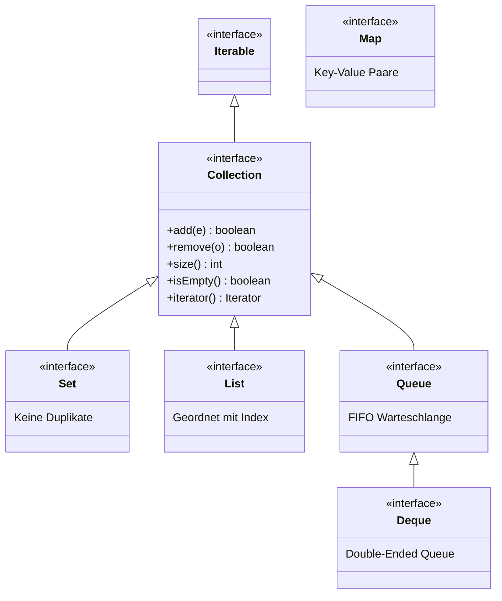

# 📘 OOP – SW09: Arrays, Enumerationen, static/final & Collections-Einsatz

> **Modul:** Objektorientierte Programmierung (OOP) · HSLU
> **Woche:** SW09 – KW16
> **Themen:** Arrays (Kapitel 7), Enumerationen & static/final (O10), Collections-Einsatz (D02)
> **Quellen:** `Kapitel 07 - Sammlungen mit fester Größe – Arrays.pdf`, `O10_IP_Enumerationen.pdf`, `D02_IP_CollectionsEinsatz.pdf`, `U08_EX_CollectionsEnumsStatic.pdf`
> **Übungen:** U08 – Collections, Enums & Static

---

## 🎯 Lernziele

### Aus Kapitel 7 – Arrays
- Arrays als Sammlungen fester Grösse verstehen und einsetzen
- Array-Variablen deklarieren und Array-Objekte erzeugen
- Auf Array-Elemente über Indizes zugreifen
- Die **for-Schleife** (klassisch) korrekt einsetzen und von der for-each-Schleife unterscheiden
- Das Attribut `length` eines Arrays kennen und nutzen
- Den **Konditionaloperator** `? :` einsetzen können
- Mehrdimensionale Arrays (2D) verstehen (fortgeschritten)

### Aus O10 – Enumerationen, static, final
- Das Schlüsselwort `final` in verschiedenen Kontexten korrekt einsetzen (Variablen, Methoden, Klassen)
- **Statische Elemente** (Attribute und Methoden) verstehen und anwenden
- **Enumerationen** (`enum`) definieren und einsetzen
- Die `main()`-Methode als statischen Einstiegspunkt verstehen

### Aus D02 – Collections-Einsatz
- Ausgewählte Datenstrukturen und ihre Semantik kennen
- Das **Iterator-Konzept** verstehen und anwenden
- Iteratoren auf verschiedenen Datenstrukturen einsetzen
- Datenstrukturen praktisch nutzen und einfache Operationen durchführen

---

## 📖 Wichtigste Begriffe

| Begriff | Definition |
|---|---|
| **Array** | Sammlung mit **fester Grösse**. Anzahl Elemente wird bei Erzeugung festgelegt und kann nicht geändert werden |
| **Index** | Ganzzahliger Wert zum Zugriff auf ein Array-Element. Beginnt bei **0**, endet bei `length - 1` |
| **`length`** | Datenfeld (kein Methodenaufruf!) eines Arrays, das die feste Grösse enthält |
| **for-Schleife** | Klassische Schleife: `for(Init; Bedingung; Update) { ... }` – ideal für Index-basierte Iteration |
| **Konditionaloperator** | Ternärer Operator `Bedingung ? Wert1 : Wert2` – wählt einen von zwei Werten |
| **`final`** | Macht Elemente unveränderlich: Variablen (einmal zuweisbar), Methoden (nicht überschreibbar), Klassen (nicht spezialisierbar) |
| **`static`** | Gehört zur **Klasse**, nicht zu einer Instanz. Existiert genau einmal, ohne Objekt zugänglich |
| **Konstante** | `static final`-Attribut. Konvention: `GROSS_BUCHSTABEN`. Unveränderlich, klassenweit |
| **Enumeration (`enum`)** | Eigener Datentyp mit einer festen Menge benannter Konstanten. Typsicher! |
| **Iterator** | Design-Pattern zum sequentiellen Durchlaufen einer Collection, unabhängig von der Implementierung |
| **Set** | Collection ohne Duplikate (basiert auf `equals()`) |
| **Queue** | Warteschlange: FIFO (First In, First Out) |
| **Deque** | Double-Ended Queue: kann als Queue (FIFO) oder Stack (FILO) verwendet werden |
| **Map** | Schlüssel-Wert-Paare. Schlüssel einmalig, Werte dürfen doppelt vorkommen |

---

## 🧠 Konzepte & Theorie

### 1. Arrays – Sammlungen fester Grösse

Arrays sind die älteste Sammlungsstruktur in Java mit spezieller Syntax.

#### Vorteile gegenüber flexiblen Collections
| Aspekt | Array | ArrayList |
|---|---|---|
| **Grösse** | Fest (bei Erzeugung) | Dynamisch |
| **Performance** | Schnellerer Zugriff | Etwas langsamer |
| **Primitive Typen** | ✅ Direkt speicherbar | ❌ Nur Objekte (Autoboxing) |
| **Syntax** | `arr[i]` | `list.get(i)` |
| **Länge** | `arr.length` (Attribut!) | `list.size()` (Methode!) |

#### Array-Deklaration
```java
int[] zahlen;           // Array-Variable für int-Werte
String[] namen;         // Array-Variable für Strings
Person[] leute;         // Array-Variable für Person-Objekte
```

#### Array-Erzeugung
```java
zahlen = new int[24];           // Array mit 24 int-Plätzen (alle 0)
namen = new String[10];         // Array mit 10 String-Plätzen (alle null)
leute = new Person[5];          // Array mit 5 Person-Plätzen (alle null)
```

> ⚠️ **Wichtig:** `new String[10]` erzeugt **KEINE** 10 Strings! Es erzeugt nur den Behälter für 10 Strings. Alle Plätze sind initial `null`.

#### Array-Zugriff über Index
```java
namen[0] = "Alice";                  // Schreiben (Index 0)
String erster = namen[0];            // Lesen (Index 0)
System.out.println(namen[5]);        // Lesen (Index 5)
namen[namen.length - 1] = "Letzter"; // Letztes Element
```

> ⚠️ **Fallstrick:** Indizes beginnen bei **0** und enden bei **length - 1**!
> `namen[10]` bei einem Array der Grösse 10 → **ArrayIndexOutOfBoundsException**!

#### Array-Initialisierer
```java
int[] primzahlen = { 2, 3, 5, 7, 11, 13 };  // Kurzform
int[] tabelle = new int[] { 0, 1, 0, 0, 1, 0, 0, 1 };  // Explizit
```

---

### 2. Die for-Schleife (klassisch)

Die for-Schleife ist ideal für **bestimmte Iteration** (Anzahl Durchläufe bekannt).

#### Allgemeine Form
```java
for (Initialisierung; Bedingung; Aktion_nach_Rumpf) {
    // Anweisungen
}
```

#### Typisches Muster für Array-Iteration
```java
for (int i = 0; i < array.length; i++) {
    System.out.println(array[i]);
}
```

#### Äquivalent als while-Schleife
```java
int i = 0;
while (i < array.length) {
    System.out.println(array[i]);
    i++;
}
```

#### for-Schleife vs. for-each-Schleife

| Aspekt | for-Schleife | for-each-Schleife |
|---|---|---|
| **Syntax** | `for(int i=0; i<a.length; i++)` | `for(Typ x : sammlung)` |
| **Schleifenzähler** | ✅ Ja (`i`) | ❌ Nein |
| **Index-Zugriff** | ✅ `array[i]` | ❌ Nicht direkt |
| **Einsatzgebiet** | Arrays, bestimmte Iteration | Alle Collections & Arrays |
| **Elemente entfernen** | Mit Iterator möglich | ❌ `ConcurrentModificationException` |

#### Welche Schleife wann?

| Situation | Empfohlene Schleife |
|---|---|
| Alle Elemente einer Collection durchlaufen | **for-each** |
| Index wird benötigt | **for** |
| Anzahl Durchläufe bekannt | **for** |
| Anzahl Durchläufe unbekannt | **while** |
| Elemente während Iteration entfernen | **for + Iterator** |

---

### 3. Der Konditionaloperator `? :`

Ternärer Operator – wählt zwischen zwei Werten basierend auf einer Bedingung.

```java
// Allgemeine Form:
Ergebnis = Bedingung ? WertWennTrue : WertWennFalse;

// Beispiel:
String anzeige = (wert < 10) ? "0" + wert : "" + wert;

// Statt:
String anzeige;
if (wert < 10) {
    anzeige = "0" + wert;
} else {
    anzeige = "" + wert;
}
```

---

### 4. Das `final`-Keyword

`final` macht Dinge **unveränderlich** – die genaue Bedeutung hängt vom Kontext ab.

#### Übersicht aller Kontexte

| Kontext | Wirkung | Beispiel |
|---|---|---|
| **Lokale Variable** | Wert nur einmal zuweisbar | `final int x = 5;` |
| **Parameter** | Parameterwert nicht überschreibbar | `void set(final float c)` |
| **Attribut** | Wert nur einmal zuweisbar (im Konstruktor) | `private final String uid;` |
| **Methode** | Kann in Subklassen **nicht** überschrieben werden | `public final double get()` |
| **Klasse** | Kann **nicht** spezialisiert (extended) werden | `public final class Temp` |

#### Final Attribute → Immutable Objects
```java
public final class Temperatur {
    private final float kelvin;  // Nur im Konstruktor setzbar!
    
    public Temperatur(float celsius) {
        this.kelvin = celsius + KELVIN_OFFSET;
    }
    
    public float getCelsius() {
        return this.kelvin - KELVIN_OFFSET;
    }
    // Kein Setter! → Objekt ist unveränderlich (immutable)
}
```

#### Empfehlungen
- ✅ `final` bei Klassen: Entweder **bewusst für Vererbung entworfen** ODER `final` → nie dazwischen!
- ✅ `final` bei Methoden: `equals()`, `hashCode()`, einfache Getter/Setter → finalisieren
- ✅ `final` bei Attributen: Für unveränderliche Daten (z.B. ID, Konfiguration)
- 💡 Philosophie: **Lieber zu viel final als zu wenig** (analog zu private: so verschlossen wie möglich)

---

### 5. Das `static`-Keyword

`static` bedeutet: gehört zur **Klasse**, nicht zu einer Instanz.

#### Statische Attribute (Klassenvariablen)
```java
public class Person {
    private static int counter = 0;  // Existiert genau EINMAL
    private final int id;
    
    public Person() {
        this.id = Person.counter++;  // Zugriff über Klassenname
    }
}
```

#### Statische Konstanten (`static final`)
```java
public class Temperatur {
    public static final float KELVIN_OFFSET = 273.15f;  // GROSSBUCHSTABEN!
    
    // Zugriff: Temperatur.KELVIN_OFFSET
}
```

#### Statische Methoden (Klassenmethoden)
```java
public class Temperatur {
    public static float convertCelsiusToKelvin(float celsius) {
        return celsius + KELVIN_OFFSET;
    }
    // Zugriff: Temperatur.convertCelsiusToKelvin(20.0f)
}
```

> 💡 Statische Methoden sind **zustandslos** – sie haben keinen Zugriff auf `this` oder Instanz-Attribute!

#### Die `main()`-Methode
```java
public static void main(String[] args) {
    // Einstiegspunkt der JVM – muss static sein,
    // weil beim Start noch KEIN Objekt existiert!
}
```

---

### 6. Enumerationen (`enum`)

Enumerationen definieren einen **eigenen Typ** mit einer **festen Menge** benannter Konstanten.

#### Einfache Enumeration
```java
public enum Season {
    SPRING, SUMMER, AUTUMN, WINTER;
}

// Verwendung:
Season current = Season.AUTUMN;
```

#### Enumeration mit Attributen und Methoden
```java
public enum AggregateState {
    SOLID("fest"),
    LIQUID("flüssig"),
    GAS("gasförmig");
    
    private final String germanName;
    
    private AggregateState(final String germanName) {
        this.germanName = germanName;
    }
    
    public String getGermanName() {
        return this.germanName;
    }
}
```

#### Enum in switch-Statements
```java
switch (state) {
    case SOLID:
        System.out.println("Feststoff");
        break;
    case LIQUID:
        System.out.println("Flüssigkeit");
        break;
    case GAS:
        System.out.println("Gas");
        break;
}
```

#### Enum-Eigenschaften

| Eigenschaft | Beschreibung |
|---|---|
| **Typsicher** | Kompilierfehler bei falschem Typ (Hauptvorteil!) |
| **Implizit `final`** | Kann nicht spezialisiert werden |
| **Implizit `static`** | Enum-Werte sind statische Konstanten |
| **Privater Konstruktor** | Automatisch instanziiert, nicht von aussen erzeugbar |
| **`ordinal()`** | Gibt Index zurück – **NIEMALS für Persistenz verwenden!** |
| **`name()` / `valueOf()`** | String-Repräsentation → sicher für Persistenz |

> ⚠️ **Anti-Pattern:** `public static final int` Konstanten auf Klassen statt Enums → Kein Typschutz!

#### UML-Darstellung
```
<<enum>>
AggregateState
───────────────────
+ <<enum constant>> SOLID
+ <<enum constant>> LIQUID
+ <<enum constant>> GAS
───────────────────
- germanName : String
───────────────────
+ getGermanName() : String
```

---

### 7. Collections-Einsatz (Vertiefung D02)

#### Collection-Interfaces im Überblick



#### Set – Keine Duplikate
```java
Set<String> farben = new HashSet<>();
farben.add("Rot");
farben.add("Blau");
farben.add("Rot");  // false! Duplikat ignoriert
// farben.size() == 2
```

#### Queue – FIFO-Warteschlange
```java
Queue<String> queue = new ArrayDeque<>();
queue.offer("Erster");     // Hinten einfügen
queue.offer("Zweiter");
String kopf = queue.poll(); // "Erster" (vorne entnehmen)
```

#### Deque als Stack (FILO)
```java
Deque<String> stack = new ArrayDeque<>();
stack.push("Unten");       // Oben drauflegen
stack.push("Mitte");
stack.push("Oben");
String top = stack.pop();  // "Oben" (oben wegnehmen)
```

#### Map – Schlüssel-Wert-Paare
```java
Map<String, Integer> alter = new HashMap<>();
alter.put("Alice", 25);
alter.put("Bob", 30);
alter.put("Alice", 26);   // Überschreibt den alten Wert!
// alter.get("Alice") == 26
```

#### Iterator-Pattern
```java
// Explizit mit Iterator
Iterator<String> it = namen.iterator();
while (it.hasNext()) {
    String name = it.next();
    if (name.equals("Bob")) {
        it.remove();  // Sicheres Entfernen!
    }
}

// Vereinfacht als for-each (Compiler übersetzt zu Iterator)
for (String name : namen) {
    System.out.println(name);
    // KEIN add/remove hier! → ConcurrentModificationException
}
```

#### Collections-Utility-Methoden
```java
List<Integer> zahlen = new ArrayList<>(List.of(5, 2, 8, 1, 9));

Collections.sort(zahlen);                    // Aufsteigend sortieren
Collections.sort(zahlen, Collections.reverseOrder()); // Absteigend
Integer max = Collections.max(zahlen);       // Maximum
Integer min = Collections.min(zahlen);       // Minimum
int freq = Collections.frequency(zahlen, 5); // Häufigkeit von 5
```

---

## 💻 Code-Beispiele (Java)

### Beispiel 1: Weblog-Auswertung mit Array

```java
public class ProtokollAuswerter {
    private int[] zugriffeInStunde;
    private LogdateiLeser leser;

    public ProtokollAuswerter() {
        zugriffeInStunde = new int[24]; // 24 Stunden
        leser = new LogdateiLeser();
    }

    public void analysiereStundendaten() {
        while (leser.hasNext()) {
            Logeintrag eintrag = leser.next();
            int stunde = eintrag.gibStunde();
            zugriffeInStunde[stunde]++;  // Zähler erhöhen
        }
    }

    public void stundendatenAusgeben() {
        for (int stunde = 0; stunde < zugriffeInStunde.length; stunde++) {
            System.out.println(stunde + ": " + zugriffeInStunde[stunde]);
        }
    }

    public int anzahlZugriffe() {
        int gesamt = 0;
        for (int zugriffe : zugriffeInStunde) {
            gesamt += zugriffe;
        }
        return gesamt;
    }
}
```

### Beispiel 2: Enumeration mit Aggregatzuständen

```java
public enum AggregateState {
    SOLID("fest"), LIQUID("flüssig"), GAS("gasförmig");
    
    private final String name;
    
    private AggregateState(final String name) {
        this.name = name;
    }
    
    public String getName() { return this.name; }
}

public class Element {
    private final String symbol;
    private final float meltingPoint;
    private final float boilingPoint;
    
    public Element(String symbol, float meltingPoint, float boilingPoint) {
        this.symbol = symbol;
        this.meltingPoint = meltingPoint;
        this.boilingPoint = boilingPoint;
    }
    
    public AggregateState getStateAt(float tempCelsius) {
        if (tempCelsius < meltingPoint) return AggregateState.SOLID;
        if (tempCelsius < boilingPoint) return AggregateState.LIQUID;
        return AggregateState.GAS;
    }
}
```

### Beispiel 3: TemperaturVerlauf mit Collections

```java
public class TemperaturVerlauf {
    private final List<Temperatur> verlauf = new ArrayList<>();
    
    public void add(Temperatur t) { verlauf.add(t); }
    public void clear() { verlauf.clear(); }
    public int getCount() { return verlauf.size(); }
    
    public Temperatur getMax() {
        if (verlauf.isEmpty()) return null;
        return Collections.max(verlauf);
    }
    
    public Temperatur getMin() {
        if (verlauf.isEmpty()) return null;
        return Collections.min(verlauf);
    }
    
    public float getAverage() {
        if (verlauf.isEmpty()) return 0f;
        float sum = 0f;
        Iterator<Temperatur> it = verlauf.iterator();
        while (it.hasNext()) {
            sum += it.next().getCelsius();
        }
        return sum / verlauf.size();
    }
}
```

---

## ✏️ Übungsaufgaben-Zusammenfassung (U08)

### Teil 1: final & static

| Aufgabe | Thema | Kern |
|---|---|---|
| **a)** | Temperatur-Klasse kopieren | Regression-Tests ausführen |
| **c)** | Konstante extrahieren | `public static final float KELVIN_OFFSET = 273.15f;` |
| **d-f)** | Statische Konvertierungsmethoden | `convertCelsiusToKelvin()`, `convertKelvinToCelsius()` |
| **g)** | Klasse finalisieren | `public final class Temperatur` |
| **h)** | Vererbungsstrategie | Shape abstrakt, Circle/Rectangle → `final`? |

### Teil 2: Collections-Einsatz

| Aufgabe | Thema | Kern |
|---|---|---|
| **a)** | TemperaturVerlauf entwerfen | UML-Diagramm, passende Datenstruktur wählen |
| **b)** | Implementieren | Interface-basierte Deklaration, Unit Tests |
| **c)** | Maximum finden | `Collections.max()` nutzen |
| **d)** | Minimum finden | `Collections.min()` nutzen |
| **e)** | Durchschnitt berechnen | Iterator-Pattern einsetzen |
| **f)** | Datenstruktur tauschen | ArrayList → HashSet → alles muss funktionieren! |
| **g)** | Edge Cases testen | Leere Collection testen (null-Handling) |

### Teil 3: Enumerationen

| Aufgabe | Thema | Kern |
|---|---|---|
| **a)** | AggregateState enum | `SOLID, LIQUID, GAS` |
| **b)** | Element erweitern | `getStateAt(float temp)` basierend auf Schmelz-/Siedepunkt |
| **c)** | Ausgabe mit switch | "Blei ist fest bei 20°C" |
| **d)** | Enum mit Attributen | Deutsche Namen: "fest", "flüssig", "gasförmig" |
| **e)** | Vereinfachte Ausgabe | `state.getGermanName()` statt switch |
| **f)** | EnumMap (optional) | Spezielle Map mit Enum als Schlüssel |

---

## 📊 Vergleiche & Klassifizierungen

### Array vs. ArrayList vs. Set vs. Map

| Aspekt | Array | ArrayList | HashSet | HashMap |
|---|---|---|---|---|
| **Grösse** | Fest | Dynamisch | Dynamisch | Dynamisch |
| **Duplikate** | ✅ | ✅ | ❌ | Keys: ❌ |
| **Reihenfolge** | Index | Index | Keine | Keine |
| **Primitive** | ✅ | ❌ (Autoboxing) | ❌ | ❌ |
| **Zugriff** | `a[i]` O(1) | `get(i)` O(1) | `contains()` O(1) | `get(key)` O(1) |
| **Suche** | O(n) | O(n) | O(1) | O(1) |

### static vs. non-static

| Aspekt | `static` | Nicht-`static` |
|---|---|---|
| **Gehört zu** | Klasse | Instanz (Objekt) |
| **Zugriff** | `Klassenname.methode()` | `objekt.methode()` |
| **`this` verfügbar?** | ❌ Nein | ✅ Ja |
| **Instanz nötig?** | ❌ Nein | ✅ Ja |
| **Beispiel** | `Math.sqrt(4)` | `person.getName()` |

---

## ⚠️ Prüfungsrelevante Hinweise

### Typische Prüfungsfragen

1. **«Deklarieren und erzeugen Sie ein Array für 12 Monatswerte.»**
   ```java
   double[] monatswerte = new double[12];
   ```

2. **«Was passiert bei `array[array.length]`?»**
   - `ArrayIndexOutOfBoundsException`! Gültig: 0 bis `length - 1`

3. **«Schreiben Sie eine for-Schleife, die das Maximum in einem Array findet.»**
   ```java
   int max = array[0];
   for (int i = 1; i < array.length; i++) {
       if (array[i] > max) max = array[i];
   }
   ```

4. **«Erklären Sie den Unterschied zwischen `final` bei Variablen, Methoden und Klassen.»**
   - Variable: einmal zuweisbar | Methode: nicht überschreibbar | Klasse: nicht spezialisierbar

5. **«Wann `static`, wann nicht?»**
   - `static`: zustandslose Operationen, Konstanten, Utility-Methoden
   - Nicht-`static`: wenn Zugriff auf Instanz-Attribute nötig

6. **«Erstellen Sie eine Enumeration für Wochentage mit deutschem Namen.»**
   - Enum mit String-Attribut, privatem Konstruktor, Getter

### Häufige Fehler

| Fehler | Korrektur |
|---|---|
| `array[array.length]` | Letzter Index ist `array.length - 1` |
| `array.size()` statt `array.length` | Arrays haben `length` (Attribut!), Collections `size()` (Methode!) |
| `for (i = 0; i <= array.length; ...)` | `<` statt `<=` verwenden! |
| `new String[10]` erzeugt 10 Strings | Erzeugt nur den Behälter, Inhalt ist `null` |
| `enum` Werte mit `new` erzeugen | Enum-Werte werden automatisch instanziiert |
| `ordinal()` für Persistenz | **Niemals!** Ändert sich bei Umordnung. `name()` verwenden |
| Collection in for-each verändern | `Iterator.remove()` oder `removeIf()` nutzen |
| `static` Methode greift auf `this` zu | Geht nicht! `static` hat keinen Objekt-Kontext |

---

## 📝 Checkliste für die Prüfungsvorbereitung

- [ ] Kann ich ein Array deklarieren, erzeugen und mit Werten füllen?
- [ ] Kann ich eine for-Schleife für Array-Iteration schreiben?
- [ ] Kenne ich den Unterschied zwischen `length` (Array) und `size()` (Collection)?
- [ ] Kann ich den Konditionaloperator `? :` korrekt einsetzen?
- [ ] Kann ich `final` in allen 5 Kontexten erklären und anwenden?
- [ ] Kann ich `static` Attribute und Methoden definieren und nutzen?
- [ ] Kann ich eine Enumeration mit Attributen und Methoden erstellen?
- [ ] Kann ich die richtige Collection für ein Problem auswählen?
- [ ] Kann ich mit Iteratoren sicher über Collections iterieren?
- [ ] Kann ich `Collections.sort()`, `max()`, `min()` einsetzen?

---

## 🔗 Verbindungen zu vorherigen/folgenden Wochen

| Woche | Verbindung |
|---|---|
| **SW03** | for-Schleife → jetzt vertieft mit Arrays; Kontrollstrukturen als Basis |
| **SW04** | Datenkapselung + `final` → jetzt formalisiert; Interfaces → Enums sind implizit final |
| **SW05** | Vererbung → `final` Klassen/Methoden verhindern Überschreibung |
| **SW06** | Polymorphie → Enums nutzen Polymorphie; Iterator-Pattern |
| **SW07** | Collections Framework → jetzt praktischer Einsatz mit D02 |
| **SW10** | Exceptions & Error Handling → Umgang mit `ArrayIndexOutOfBoundsException` |
