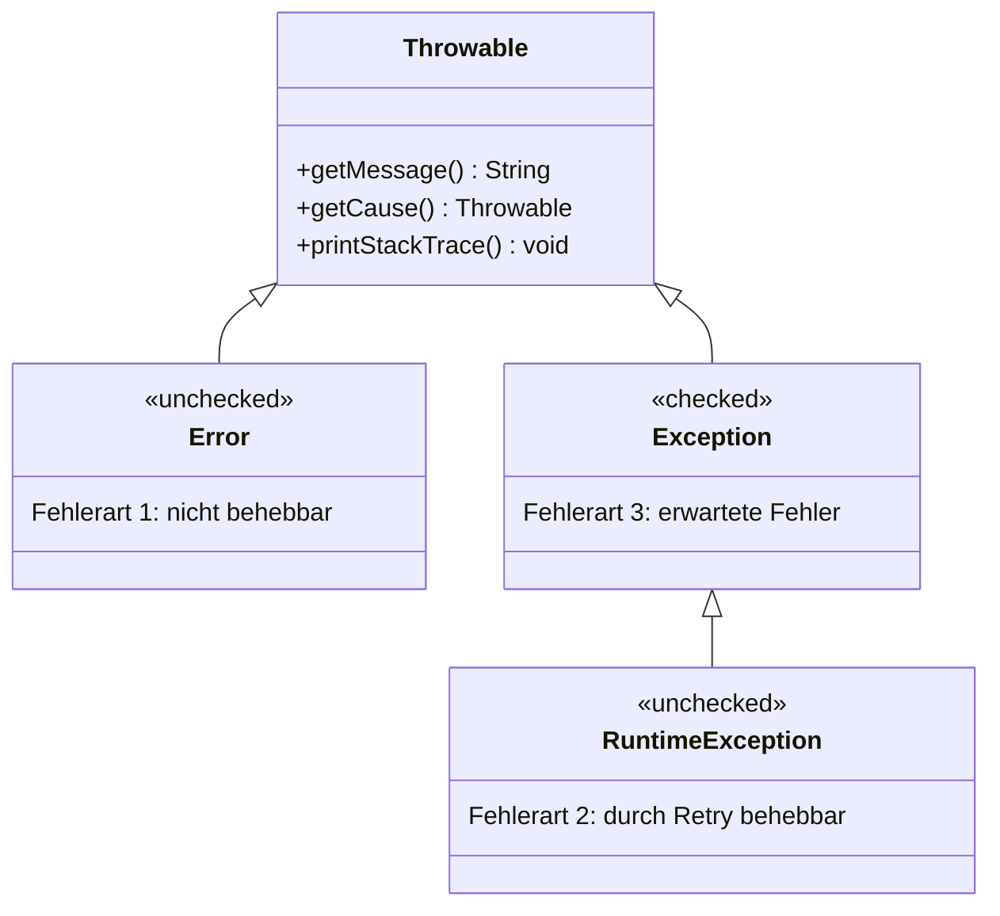

# 📘 OOP – SW10: Exception Handling, Testing & Logging

> **Modul:** Objektorientierte Programmierung (OOP) · HSLU
> **Woche:** SW10 – KW17 (21.04.2026)
> **Themen:** Fehlerbehandlung mit Exceptions (O11), Exception Testing & Logging (E03), Kapitel 14 – Fehlerbehandlung
> **Dozent:** Roland Gisler
> **Quellen:** `O11_IP_Exceptionhandling.pdf`, `E03_IP_ExceptionTestingLogging.pdf`, `U09_EX_ExceptionsLogging.pdf`, `Kapitel 14 - Fehlerbehandlung.pdf`
> **Übungen:** U09 – Exceptions & Logging

---

## 🎯 Lernziele

### Aus O11 – Exception Handling
- Verschiedene Techniken zur **Fehlerbehandlung** kennen
- Fehlersituationen **abhängig vom Kontext** beurteilen können
- Das **Konzept der Ausnahmebehandlung** (Exceptions) verstehen
- In Java Exceptions **definieren**, **behandeln** und **selbst auslösen**

### Aus E03 – Exception Testing & Logging
- Exception-Behandlung in Unit-Tests testen
- Logging-Frameworks (typisch Log4j/SLF4J) korrekt einsetzen
- Verschiedene Log-Level kennen und anwenden

---

## 📖 Wichtigste Begriffe

| Begriff | Definition |
|---|---|
| **Exception** | Laufzeit-Ausnahme, die einen aussergewöhnlichen Zustand signalisiert |
| **Error** | Schwere, nicht behebbare Fehler (z.B. `OutOfMemoryError`) |
| **Throwable** | Gemeinsame Basisklasse aller Exceptions und Errors – **niemals direkt verwenden!** |
| **Checked Exception** | Erbt von `Exception` (nicht `RuntimeException`). Behandlung **zwingend** (Compiler zwingt dich) |
| **Unchecked Exception** | Erbt von `RuntimeException` oder `Error`. Behandlung **optional** |
| **`throw`** | Schlüsselwort zum **Auslösen** einer Exception (`throw new FooException(...)`) |
| **`throws`** | Schlüsselwort im Methodenkopf: deklariert, dass die Methode eine Checked Exception **weiterreicht** |
| **`try`** | Markiert einen Block, in dem Exceptions erwartet werden |
| **`catch`** | Behandelt einen spezifischen Exception-Typ |
| **`finally`** | Optionaler Block, der **immer** ausgeführt wird (z.B. für Aufräumarbeiten) |
| **Rethrowing** | Eine gefangene Exception wird neu geworfen (oft als andere, höher-abstrahierte Exception) |
| **Stacktrace** | Konsolen-Ausgabe mit Klasse, Methode, Datei + Zeile der Fehler-Entstehung |
| **Quelle** | Ort, an dem die Exception geworfen wird (`throw`) |
| **Senke** | Ort, an dem die Exception behandelt wird (`catch`) – meist **andere Methode/Klasse!** |

---

## 🧠 Konzepte & Theorie

### 1. Was ist überhaupt ein Fehler?

> 💡 **Kerneinsicht:** Der gleiche technische Fehler kann **völlig unterschiedliche Ursachen** haben!

Beispiel: `NullPointerException` kann sein
- Programmierfehler der **aufrufenden** Methode (nicht auf `null` geprüft)
- Programmierfehler der **aufgerufenen** Methode (Objekt nicht erzeugt)
- Eingabedaten-Fehler
- …

→ **Fehlerbeurteilung ist immer stark vom Kontext abhängig!**

### 2. Drei grundlegende Fehler-Kategorien

| # | Kategorie | Beispiel | Behandlung | Java-Basisklasse |
|---|---|---|---|---|
| 1 | **Nicht behebbar** | `OutOfMemoryError` | Sofortiger Programmabbruch | **`Error`** (unchecked) |
| 2 | **Durch Wiederholung behebbar** | `SocketException` | Retry | **`RuntimeException`** (unchecked) |
| 3 | **Durch aktive Korrektur behebbar** | `UnknownHostException` | User fragen, dann retry | **`Exception`** (checked) |

### 3. Grundsatz der Fehlerbehandlung

> 🎯 **So nahe an der Quelle wie möglich, so weit davon entfernt wie nötig behandeln!**
>
> - **Je näher:** mehr Detailinformationen
> - **Je weiter entfernt:** mehr Kontext zur Einordnung

→ Darum ist **Quelle ≠ Senke** (werfen und behandeln oft in **verschiedenen Methoden/Klassen**).

Analogie aus den Folien: Ein*e promovierte*r Ärzt*in mit Herzstillstand kann sich nicht selbst den Defibrillator anlegen – sie braucht eine **andere Ebene**, die helfen kann.

---

### 4. Fehlersignalisierung – zwei Varianten

#### Variante A: Via Rückgabewert (alte Schule)

```java
public int doSomethingBig() {
    int result = doSomethingA();
    if (result != 0) {
        handleErrorA(result);
    } else {
        result = doSomethingB();
        if (result != 0) {
            handleErrorB(result);
        } else {
            result = doSomethingC();
            if (result != 0) {
                handleErrorC(result);
            }
        }
    }
    return result;
}
```

**Probleme:**
- ❌ Code wird extrem unübersichtlich
- ❌ Fehlerbehandlung dominiert die Fachlichkeit
- ❌ Rückgabewert „verschwendet" für Fehlerstatus

#### Variante B: Via Exceptions (modern)

```java
public void doSomethingBig() {
    try {
        doSomethingA();
        doSomethingB();
        doSomethingC();
    } catch (SomeException e) {
        handleError(e);
    }
}
```

→ **Fachlichkeit und Fehlerbehandlung sind klar getrennt!** ✅

---

### 5. Die Exception-Hierarchie in Java



> ⚠️ **Tabu:** `Throwable` direkt verwenden! Immer `Error`, `Exception` oder `RuntimeException` wählen.

> ⚠️ **Prüfungsrelevant:** Für eigene Exceptions **spezialisieren** von:
> - `Exception` → wenn Behandlung erzwungen werden soll (**checked**)
> - `RuntimeException` → wenn Behandlung optional sein soll (**unchecked**)
> - `Error` → **selten**, nur für schwerwiegende Systemfehler

---

### 6. Die 5 Schlüsselwörter (Overview)

```
┌─────────────┐
│   AUSLÖSEN  │
├─────────────┤
│ throw       │ ← wirft eine Exception aus
│ throws      │ ← reicht Exception weiter (im Methodenkopf!)
├─────────────┤
│   BEHANDELN │
├─────────────┤
│ try { }     │ ← Block, in dem Exceptions erwartet werden
│ catch { }   │ ← fängt + behandelt Exception
│ finally { } │ ← wird IMMER ausgeführt (optional)
└─────────────┘
```

> 💡 **Merkhilfe:** `throw` (mit Objekt!) = werfen, `throws` (im Signatur-Kopf!) = deklarieren. Die Verwechslung ist ein Klassiker am Test!

---

### 7. Werfen (Quelle) – Unchecked vs. Checked

#### Unchecked Exception (RuntimeException)

```java
public void throwUncheckedExceptionDemo() {
    LOG.debug("Methode: Anfang");
    if (isSomeFailure()) {
        throw new MyUncheckedDemoException("Was schiefgelaufen");
    }
    LOG.debug("Methode: Ende");  // wird bei Fehler NICHT erreicht
}
```

- `throws`-Deklaration im Methodenkopf **nicht nötig**
- Caller wird **nicht** gezwungen, die Exception zu fangen

#### Checked Exception (Exception)

```java
public void throwCheckedExceptionDemo() throws MyCheckedDemoException {
    //                                    ^^^^^^^ ZWINGEND!
    LOG.debug("Methode: Anfang");
    if (isSomeFailure()) {
        throw new MyCheckedDemoException("Was schiefgelaufen");
    }
    LOG.debug("Methode: Ende");
}
```

- `throws`-Deklaration im Methodenkopf **zwingend**
- Compiler zwingt den Caller zu `try/catch` oder weiteres `throws`

> ⚠️ **Wichtig:** Nach einem `throw` wird die Methode **sofort abgebrochen**. Code nach `throw` wird nicht mehr ausgeführt!

---

### 8. Fangen (Senke) – `try/catch/finally`

```java
public void exceptionCatch() {
    LOG.debug("exceptionCatch: Anfang");
    try {
        LOG.debug(" try-Block: Anfang");
        throwCheckedExceptionDemo("nonumber");   // wirft Exception!
        LOG.debug(" try-Block: Ende");           // NICHT erreicht
    } catch (MyCheckedDemoException mcde) {
        LOG.error(" Exception aufgetreten!", mcde);
    } finally {
        LOG.debug(" finally-Block: IMMER ausgeführt");
    }
    LOG.debug("exceptionCatch: Ende");
}
```

**Ausgabe:**
```
DEBUG - exceptionCatch: Anfang
DEBUG -  try-Block: Anfang
ERROR -  Exception aufgetreten!
DEBUG -  finally-Block: IMMER ausgeführt
DEBUG - exceptionCatch: Ende
```

#### Regeln für `try/catch/finally`

| Regel | Details |
|---|---|
| **try** | Genau **einmal**, mit einem Block |
| **catch** | **Null oder mehrere** Blöcke möglich |
| **finally** | **Optional** (wenn mindestens ein catch da) – aber immer ausgeführt |
| **Ohne catch** | Dann `finally` **zwingend** |
| **Reihenfolge der catch-Blöcke** | **Spezialisierung vor Generalisierung** (sonst Compiler-Fehler!) |
| **Erster Treffer gewinnt** | Nur der **erste zutreffende** `catch`-Block wird ausgeführt |

> ⚠️ **Falle bei mehreren catch-Blöcken:**
> ```java
> } catch (Exception e) { ... }           // zu generell, FÄNGT ALLES
> } catch (FileNotFoundException fnf) { ... }  // wird NIE erreicht!
> ```
> **Korrekt:** `FileNotFoundException` **zuerst**, dann generalisierte `IOException`, zuletzt `Exception`.

---

### 9. Exception weiterleiten

**Unchecked:** Wenn nicht behandelt → **automatisch** weitergereicht.

**Checked:** Wenn nicht behandelt → **explizit** mit `throws` im Signatur-Kopf weiterreichen.

```java
public void methodeA() throws IOException {
    methodeB();  // methodeB wirft IOException
}

public void methodeB() throws IOException {
    throw new IOException("oops");
}
```

In beiden Fällen: **Kommt die Exception ganz oben (z.B. in `main()`) an, ohne je gefangen zu werden → JVM terminiert das Programm und gibt den Stacktrace aus.**

---

### 10. Stacktrace lesen

```
Exception in thread "main" java.lang.NumberFormatException: For input string: "exit"
    at sun.misc.FloatingDecimal.readJavaFormatString(FloatingDecimal.java:2043)
    at sun.misc.FloatingDecimal.parseDouble(FloatingDecimal.java:110)
    at java.lang.Double.parseDouble(Double.java:538)
    at java.lang.Double.valueOf(Double.java:502)
    at ch.hslu.oop.oop11.ConsoleInput.main(ConsoleInput.java:31)   ← DEINE KLASSE!
```

> 🎯 **Lesestrategie:** Von oben nach unten scrollen → **erste `ch.hslu.…` Klasse** ist der Einstiegspunkt in deinen Code. Dort liegt der Fehler (hier: Zeile 31 in `ConsoleInput.main()`).

---

### 11. Wichtige Methoden von `Throwable`

| Methode | Nutzen |
|---|---|
| `getMessage()` | Liefert Fehlermeldung als String |
| `getCause()` | Liefert die **ursprüngliche** Exception (bei verschachtelten Exceptions) |
| `printStackTrace()` | Gibt vollständigen Stacktrace auf die Konsole aus |
| `getStackTrace()` | Liefert Stacktrace als Array für eigene Verarbeitung |

> 💡 Bei eigenen Exception-Klassen **immer** die 4 Konstruktoren überschreiben:
> - `MyException()`
> - `MyException(String message)`
> - `MyException(String message, Throwable cause)` — wichtig für Exception-Chaining!
> - `MyException(Throwable cause)`

---

### 12. Eigene Exception definieren – Muster

```java
/**
 * Wird geworfen, wenn eine Temperatur ausserhalb des gültigen Bereichs liegt.
 */
public class InvalidTemperatureException extends RuntimeException {

    public InvalidTemperatureException() {
        super();
    }

    public InvalidTemperatureException(final String message) {
        super(message);
    }

    public InvalidTemperatureException(final String message, final Throwable cause) {
        super(message, cause);
    }

    public InvalidTemperatureException(final Throwable cause) {
        super(cause);
    }
}
```

Verwendung:
```java
public void setCelsius(final float celsius) {
    if (celsius < -273.15f) {
        throw new InvalidTemperatureException(
            "Temperatur unter absolutem Nullpunkt: " + celsius);
    }
    this.celsius = celsius;
}
```

---

## 📊 Klassifizierung checked vs. unchecked

| Kriterium | Checked (`Exception`) | Unchecked (`RuntimeException`) |
|---|---|---|
| **Behandlung** | Pflicht (vom Compiler erzwungen) | Optional |
| **`throws` im Methodenkopf** | Pflicht | Nicht nötig |
| **Typische Anwendung** | Erwartbare Fehler, die behandelt werden können (`IOException`) | Programmierfehler oder unerwartete Fehler (`NullPointerException`, `IllegalArgumentException`) |
| **Java-Standardbeispiele** | `IOException`, `SQLException`, `FileNotFoundException` | `NullPointerException`, `IllegalArgumentException`, `ArithmeticException` |
| **Entwickler-Philosophie** | "Du **musst** damit umgehen" | "Das **darf** nicht passieren, aber falls doch..." |

---

## 💻 Code-Beispiele

### Beispiel 1: Vollständiges try/catch/finally

```java
public double parseTemperature(final String input) throws InvalidTemperatureException {
    try {
        double celsius = Double.parseDouble(input);
        if (celsius < -273.15) {
            throw new InvalidTemperatureException("Unter absolutem Nullpunkt");
        }
        return celsius;
    } catch (NumberFormatException nfe) {
        LOG.error("Ungueltige Eingabe: " + input, nfe);
        throw new InvalidTemperatureException("Ungueltiges Format: " + input, nfe);
        //                                                                ^^^ Cause!
    } finally {
        LOG.debug("parseTemperature fertig fuer Input: " + input);
    }
}
```

### Beispiel 2: Mehrere catch-Blöcke (richtige Reihenfolge!)

```java
try {
    readFile("config.txt");
} catch (FileNotFoundException fnf) {       // Spezifisch
    LOG.error("Datei fehlt", fnf);
} catch (IOException ioe) {                 // Generischer als oben
    LOG.error("IO-Fehler", ioe);
} catch (Exception e) {                     // Sehr generisch - zuletzt!
    LOG.error("Unerwarteter Fehler", e);
}
```

### Beispiel 3: Multi-Catch (Java 7+)

```java
try {
    doSomething();
} catch (IOException | SQLException e) {  // Beide gleich behandeln
    LOG.error("Externer Fehler", e);
}
```

### Beispiel 4: try-with-resources (Java 7+)

```java
// AutoCloseable-Resourcen werden AUTOMATISCH geschlossen
try (BufferedReader reader = new BufferedReader(new FileReader("file.txt"))) {
    return reader.readLine();
} catch (IOException ioe) {
    LOG.error("Lesefehler", ioe);
    return null;
}
// Reader wird automatisch geschlossen (auch bei Exception!)
```

---

## 📝 Übungsaufgaben-Zusammenfassung (U09)

Aus `U09_EX_ExceptionsLogging.pdf` (Exception-Handling + Logging):

| Aufgabe | Thema | Kernkonzept |
|---|---|---|
| **Temperatur erweitern** | Eigene Exception | `InvalidTemperatureException` für ungültige Werte (< -273.15°C) |
| **Parser mit try/catch** | String → Temperatur | `NumberFormatException` fangen und in eigene Exception verpacken |
| **Logging einbauen** | Log4j / SLF4J | LOG-Levels (trace, debug, info, warn, error) korrekt einsetzen |
| **Unit-Test mit Exceptions** | JUnit | `@Test(expected = Exception.class)` oder `assertThrows(...)` |
| **Exception-Chaining** | getCause() | Tiefere Exceptions mit Kontext anreichern und weiterreichen |

### OFWJ-Chapter 14 Inhalte

Aus `OFWJ-chapter14.zip` / `-solutions.zip`: Code-Beispiele aus dem Lehrbuch zu:
- `Address Book`-Anwendung mit Exception-Handling
- Einlesen/Speichern mit try-with-resources
- Benutzerdefinierte Exceptions

---

## ⚠️ Prüfungsrelevante Hinweise

### Typische Prüfungsfragen

1. **«Unterschied checked vs. unchecked erklären.»**
   - Checked: erbt von `Exception` (nicht `RuntimeException`), Behandlung Pflicht
   - Unchecked: erbt von `RuntimeException` oder `Error`, Behandlung optional

2. **«Wie ist die Reihenfolge von catch-Blöcken?»**
   - Von spezifisch zu generell (vom Blatt zur Wurzel der Hierarchie)
   - Sonst: Compiler-Fehler „unreachable catch block"

3. **«Was ist der Unterschied zwischen `throw` und `throws`?»**
   - `throw` im **Methodenrumpf**: löst Exception aus (`throw new Foo();`)
   - `throws` im **Methodenkopf**: deklariert, dass Exception weitergereicht wird

4. **«Wann wird `finally` ausgeführt?»**
   - **IMMER** – auch bei Exception, auch bei `return` im `try`-Block. Einzige Ausnahme: `System.exit()`.

5. **«Darf man `Throwable` fangen / werfen?»**
   - **Tabu!** Immer `Error`, `Exception` oder `RuntimeException` spezialisieren.

### Häufige Fehlerquellen

| Fehler | Korrektur |
|---|---|
| `catch (Exception e) { }` (leer!) | Das „Totschweigen" von Exceptions ist **extrem schlecht**. Minimum: Loggen! |
| Generelle Exception vor spezifischer im catch | Spezifisch zuerst: `FileNotFoundException` vor `IOException` vor `Exception` |
| Checked Exception ohne `throws` weiterreichen | Compiler-Fehler! Entweder fangen oder `throws` deklarieren |
| Exception für normalen Kontrollfluss | Exceptions sind **teuer** – nicht als `for`-Loop-Abbruch verwenden! |
| `throw new Throwable()` | **Tabu!** `Throwable` niemals direkt verwenden |
| `throw` vs. `throws` verwechseln | `throw` = werfen (Aktion), `throws` = deklarieren (Signatur) |

### Gute Praxis – Empfehlungen (aus O11)

1. ✅ **Exceptions in JavaDoc dokumentieren** – besonders unchecked!
2. ✅ **Nur für echte Ausnahmen** verwenden, nicht für normale Spezialfälle
3. ❌ **Nie leere catch-Blöcke!** (Minimum: loggen)
4. ✅ **Exception-Chaining** nutzen (`new FooException("msg", cause)`)
5. ✅ **Vorhandene Typen wiederverwenden** statt für alles eigene Exceptions
6. ❌ **Keine verschachtelten try/catch** – Code wird unübersichtlich
7. ✅ **Fehlerbehandlung im Unit-Test abdecken!**

---

## 🔗 Verbindung zu anderen Wochen

| Woche | Thema | Verbindung zu SW10 |
|---|---|---|
| **SW01** | OOP Grundlagen | Exceptions sind Objekte wie alle anderen – `new FooException(...)` |
| **SW03** | Selektion/Iteration | Exception-Flow ist eine **alternative Form der Programmsteuerung** (aber nicht missbrauchen!) |
| **SW04** | Datenkapselung, Validation | `setCelsius()` mit Validierung → `InvalidTemperatureException` werfen. **Direkte Anwendung!** |
| **SW05** | Vererbung | Eigene Exceptions spezialisieren von `Exception` oder `RuntimeException` – klassische Vererbung |
| **SW06** | Polymorphie, JUnit | **Polymorphes catch**: `catch (IOException)` fängt alle Subklassen. JUnit `assertThrows()` für Exception-Tests |
| **SW07** | Collections, equals/hashCode | `ConcurrentModificationException` (in for-each) = unchecked RuntimeException |
| **SW08** | Test 1 Review | O10/O11 waren Test 1 Themen – Exception-Grundlagen sind Vorbedingung |
| **SW09** | Arrays, Enums | `ArrayIndexOutOfBoundsException` (unchecked) – Array-Zugriff mit falschem Index. `NullPointerException` bei `null`-Array |
| *(Ausblick SW11)* | **Testing & Logging** | E03 wird vertieft: `assertThrows()`, Log4j/SLF4J Konfiguration, Log-Levels |

---

## 🧠 Merksätze

- **`throw` wirft, `throws` deklariert** – niemals verwechseln!
- **Quelle ≠ Senke:** Werfen und Fangen findet meistens in **verschiedenen Methoden/Klassen** statt.
- **Checked = Compiler zwingt dich**, **Unchecked = Compiler ignoriert's**.
- **`finally` läuft IMMER** – auch bei Exception, auch bei `return`.
- **Spezifisch vor generell** im `catch` – sonst wird's nicht kompiliert!
- **Leere catch-Blöcke sind Todsünde** – Minimum: loggen!
- **Exceptions nicht für Kontrollfluss** – sie sind teuer.
- **`Throwable` ist tabu** – immer spezialisierte Klassen verwenden.
- **Stacktrace von oben lesen** – erste eigene Klasse = Einstiegspunkt.
